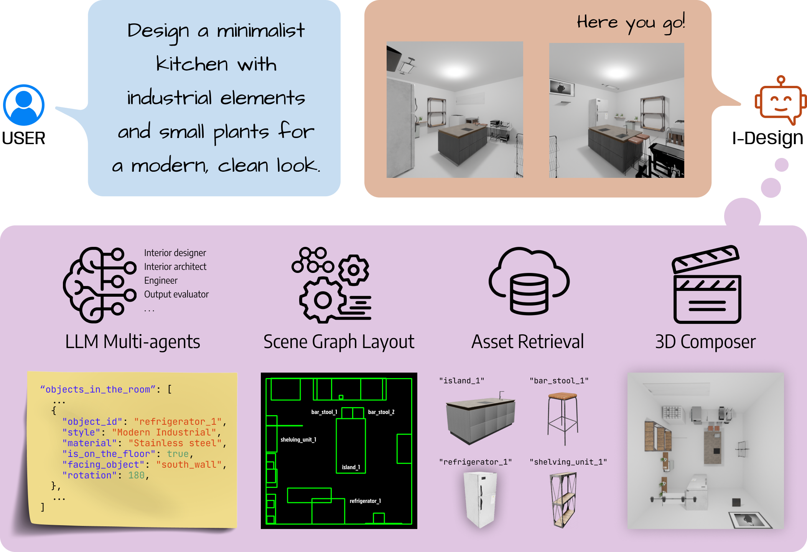
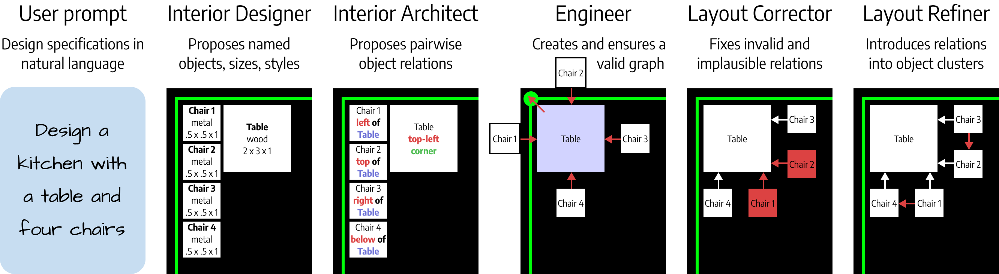
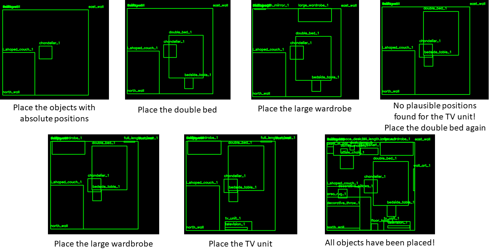
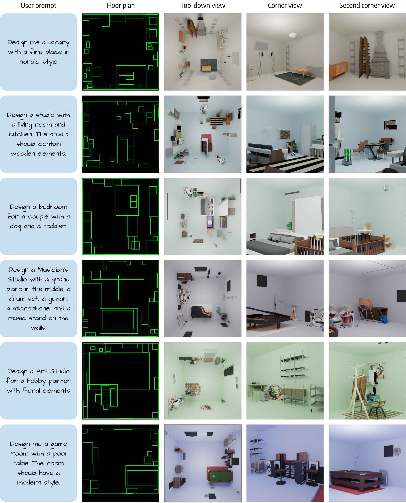
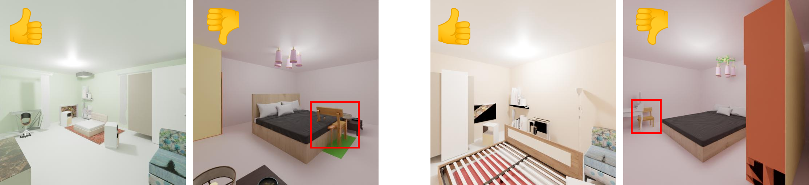
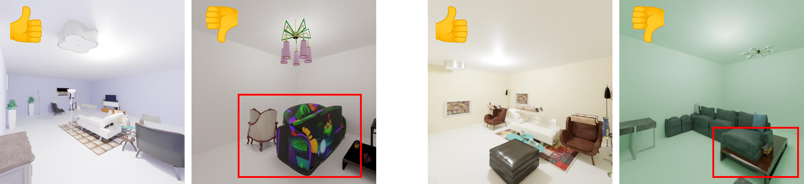
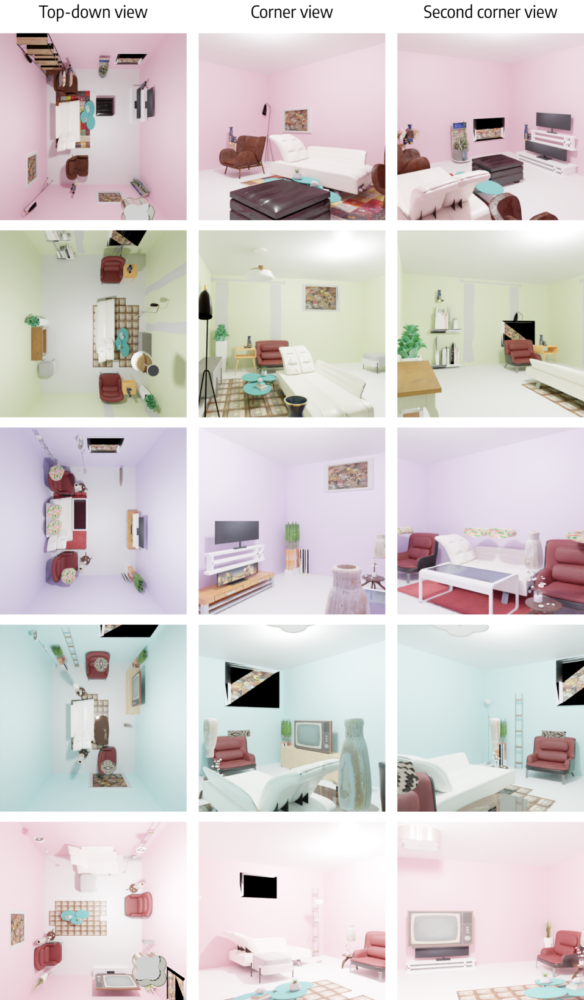
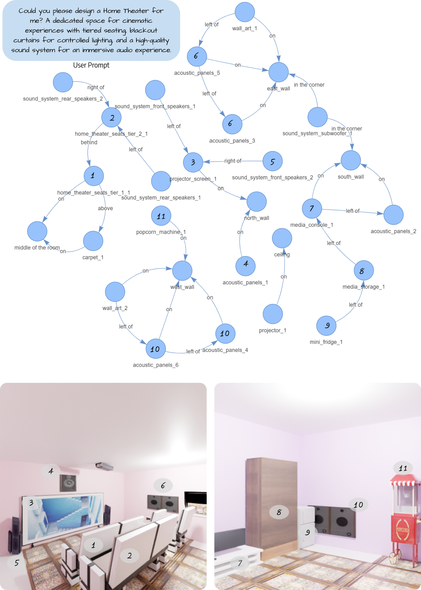

# I-Design：打造个性化空间，您的专属 LLM 室内设计师。

发布时间：2024年04月03日

`Agent` `室内设计` `人工智能`

> I-Design: Personalized LLM Interior Designer

# 摘要

> 室内设计让我们展现自我，活出个性，每个设计方案都彰显着我们独特的品味。但对普通人而言，要将心中的理想与现实空间完美融合，并非易事，这使得室内设计显得遥不可及。为了打破这一局限，我们推出了 I-Design，这位个性化的室内设计师能让用户通过自然语言沟通，轻松实现设计愿景。I-Design 以一支大型语言模型代理团队为核心，它们通过对话和逻辑推理，将用户的文字描述转化为具体的场景图设计，包含对象间的相对关系。接着，高效的放置算法为每个设计元素找到最佳位置。最终，通过整合现有数据库中的资源，将设计以 3D 形式呈现。我们还引入了一种新的评估机制，结合视觉-语言模型，完善整个设计流程。大量实验证明，I-Design 在打造精致 3D 设计方案、捕捉用户抽象概念方面，均超越了传统方法，无论是在细节布局还是概念准确性上，都展现了其独到之处。

> Interior design allows us to be who we are and live how we want - each design is as unique as our distinct personality. However, it is not trivial for non-professionals to express and materialize this since it requires aligning functional and visual expectations with the constraints of physical space; this renders interior design a luxury. To make it more accessible, we present I-Design, a personalized interior designer that allows users to generate and visualize their design goals through natural language communication. I-Design starts with a team of large language model agents that engage in dialogues and logical reasoning with one another, transforming textual user input into feasible scene graph designs with relative object relationships. Subsequently, an effective placement algorithm determines optimal locations for each object within the scene. The final design is then constructed in 3D by retrieving and integrating assets from an existing object database. Additionally, we propose a new evaluation protocol that utilizes a vision-language model and complements the design pipeline. Extensive quantitative and qualitative experiments show that I-Design outperforms existing methods in delivering high-quality 3D design solutions and aligning with abstract concepts that match user input, showcasing its advantages across detailed 3D arrangement and conceptual fidelity.

[Arxiv](https://arxiv.org/abs/2404.02838)