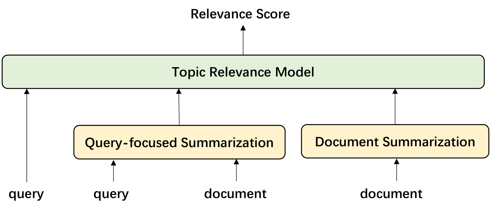
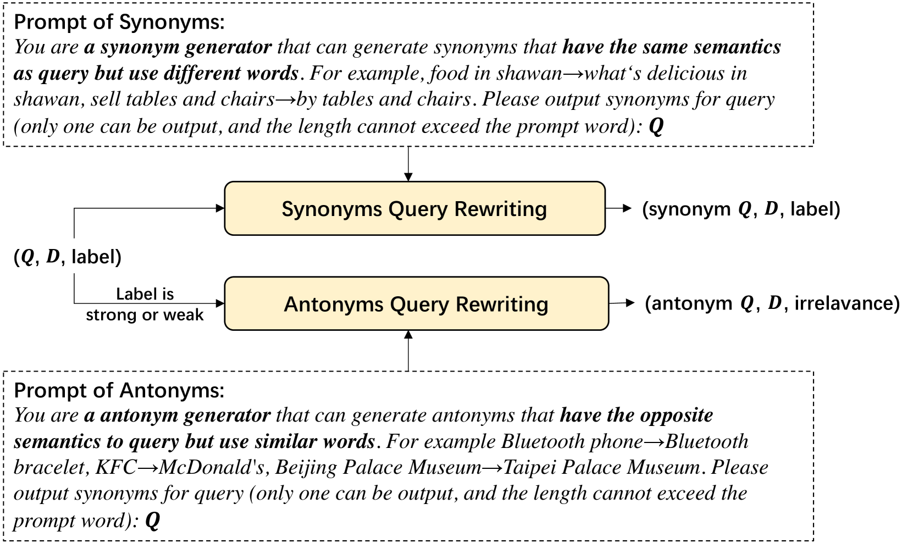

# 通过融合多种结构的摘要技巧以及利用大型语言模型进行数据扩充，我们得以提升主题相关性模型的性能。

发布时间：2024年04月03日

`LLM应用` `社交搜索` `主题相关性建模`

> Improving Topic Relevance Model by Mix-structured Summarization and LLM-based Data Augmentation

# 摘要

> 在社交搜索领域，查询与文档之间的主题相关性至关重要，它直接影响着用户需求与搜索结果的匹配度。例如，在大众点评等平台上，搜索相关性的建模常常遭遇两大难题：一是文档内容冗长且重复信息众多；二是难以获取充足的训练数据，尤其是针对多分类相关性模型。为应对这些问题，我们采取了一种新颖的方法：将查询与基于查询的摘要和去除了查询的文档摘要相结合，作为主题相关性模型的输入，以此让模型更好地把握查询与文档核心主题之间的相关性。接着，我们运用大型语言模型（LLM）的理解和生成能力，基于现有训练数据中的查询和文档内容，重构并生成新的查询，从而创建出新的查询-文档对，用于训练数据的扩充。通过大量离线实验和在线A/B测试验证，这些方法能显著提升相关性建模的效果。

> Topic relevance between query and document is a very important part of social search, which can evaluate the degree of matching between document and user's requirement. In most social search scenarios such as Dianping, modeling search relevance always faces two challenges. One is that many documents in social search are very long and have much redundant information. The other is that the training data for search relevance model is difficult to get, especially for multi-classification relevance model. To tackle above two problems, we first take query concatenated with the query-based summary and the document summary without query as the input of topic relevance model, which can help model learn the relevance degree between query and the core topic of document. Then, we utilize the language understanding and generation abilities of large language model (LLM) to rewrite and generate query from queries and documents in existing training data, which can construct new query-document pairs as training data. Extensive offline experiments and online A/B tests show that the proposed approaches effectively improve the performance of relevance modeling.

[Arxiv](https://arxiv.org/abs/2404.02616)