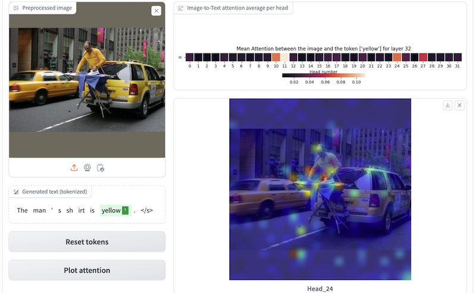
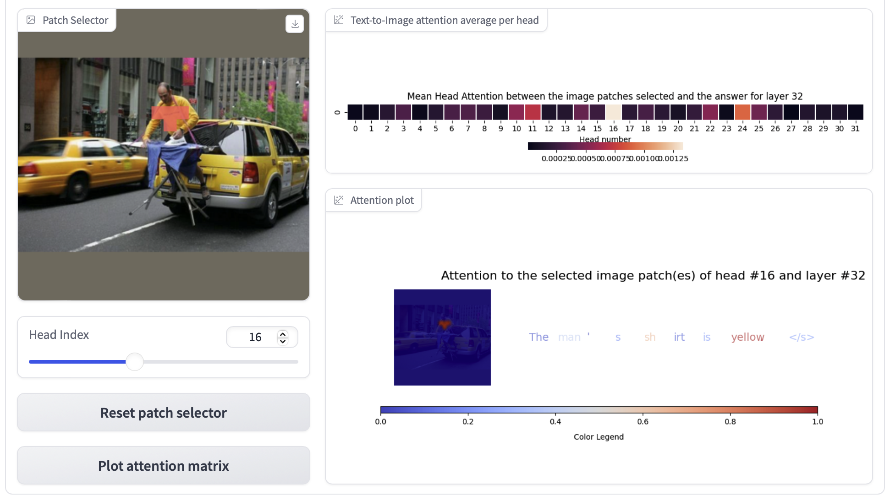
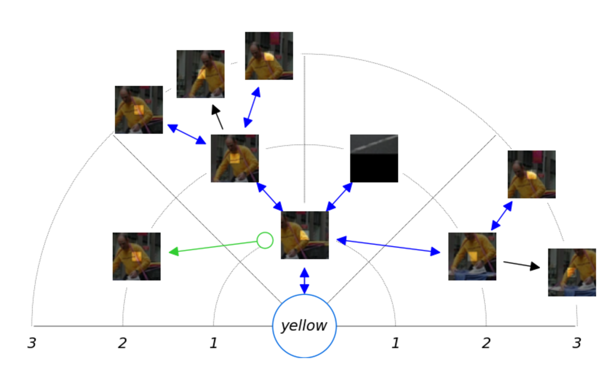
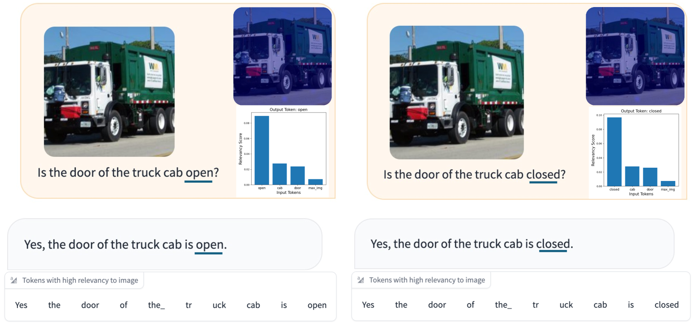

# LVLM-解读：为大型视觉-语言模型打造的可解释性工具

发布时间：2024年04月03日

`LLM应用` `人工智能` `多模态交互`

> LVLM-Intrepret: An Interpretability Tool for Large Vision-Language Models

# 摘要

> 人工智能领域日新月异，多模态大型语言模型成为研究热点。这些融合多样数据输入的模型日益流行，但其内部运作机制仍颇具挑战。尽管解释性工具和机制已取得诸多进展，探索空间依然巨大。本研究带来一款创新交互应用，目标是揭示大型视觉-语言模型的内部秘密。我们设计的界面提升图像区域的解读性，这对生成答案极为关键，同时评估语言模型将其输出与图像实际内容对接的能力。通过此应用，用户可有序探索模型，发现并突破系统局限，推动系统性能提升。最终，我们通过案例分析展示该应用如何助于洞悉热门多模态模型LLaVA的失效原因。

> In the rapidly evolving landscape of artificial intelligence, multi-modal large language models are emerging as a significant area of interest. These models, which combine various forms of data input, are becoming increasingly popular. However, understanding their internal mechanisms remains a complex task. Numerous advancements have been made in the field of explainability tools and mechanisms, yet there is still much to explore. In this work, we present a novel interactive application aimed towards understanding the internal mechanisms of large vision-language models. Our interface is designed to enhance the interpretability of the image patches, which are instrumental in generating an answer, and assess the efficacy of the language model in grounding its output in the image. With our application, a user can systematically investigate the model and uncover system limitations, paving the way for enhancements in system capabilities. Finally, we present a case study of how our application can aid in understanding failure mechanisms in a popular large multi-modal model: LLaVA.

[Arxiv](https://arxiv.org/abs/2404.03118)