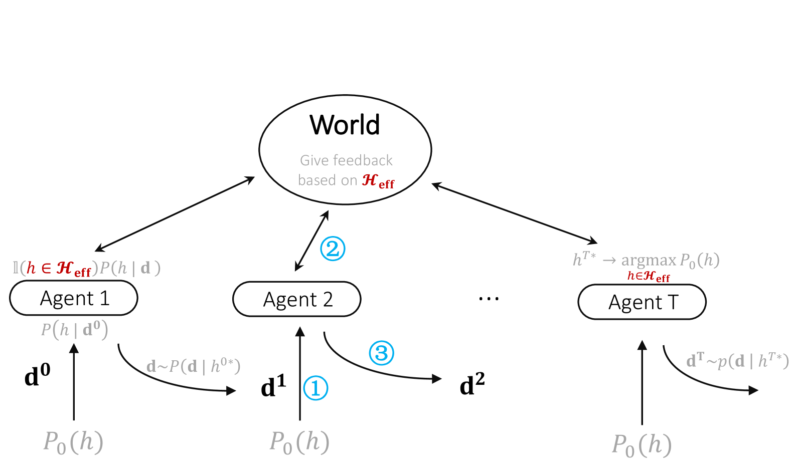

# 语言模型的进化：从迭代学习的角度看

发布时间：2024年04月03日

`LLM理论` `人工智能` `文化演化`

> Language Model Evolution: An Iterated Learning Perspective

# 摘要

> 随着大型语言模型（LLMs）日益普及，模型间的循环互动预计将变得更加频繁。特别是，最新的多轮自我完善方法让LLMs能够创造新的训练样本，用于培育后续模型。同时，包含自动互动的多代理LLM系统也逐渐受到重视。因此，无论是从短期还是长期来看，LLMs都可能主动参与自身的进化过程。本文将LLMs的行为与人类文化演化相提并论，后者多年来一直是认知科学家研究的热点。我们采用迭代学习（IL）的贝叶斯框架，阐释了人类文化演化中细微偏见是如何被放大的，以此来解释LLMs的某些行为特征。文章还概述了贝叶斯-IL框架下代理行为的关键特点，并提出了一些通过不同LLMs实验验证所支持的预测。这一理论框架有助于我们更有效地预测和引导LLMs朝着期望的方向发展。

> With the widespread adoption of Large Language Models (LLMs), the prevalence of iterative interactions among these models is anticipated to increase. Notably, recent advancements in multi-round self-improving methods allow LLMs to generate new examples for training subsequent models. At the same time, multi-agent LLM systems, involving automated interactions among agents, are also increasing in prominence. Thus, in both short and long terms, LLMs may actively engage in an evolutionary process. We draw parallels between the behavior of LLMs and the evolution of human culture, as the latter has been extensively studied by cognitive scientists for decades. Our approach involves leveraging Iterated Learning (IL), a Bayesian framework that elucidates how subtle biases are magnified during human cultural evolution, to explain some behaviors of LLMs. This paper outlines key characteristics of agents' behavior in the Bayesian-IL framework, including predictions that are supported by experimental verification with various LLMs. This theoretical framework could help to more effectively predict and guide the evolution of LLMs in desired directions.

[Arxiv](https://arxiv.org/abs/2404.04286)