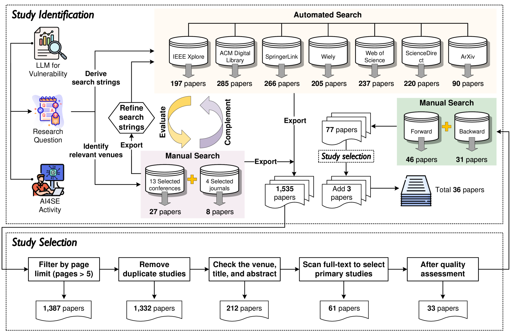
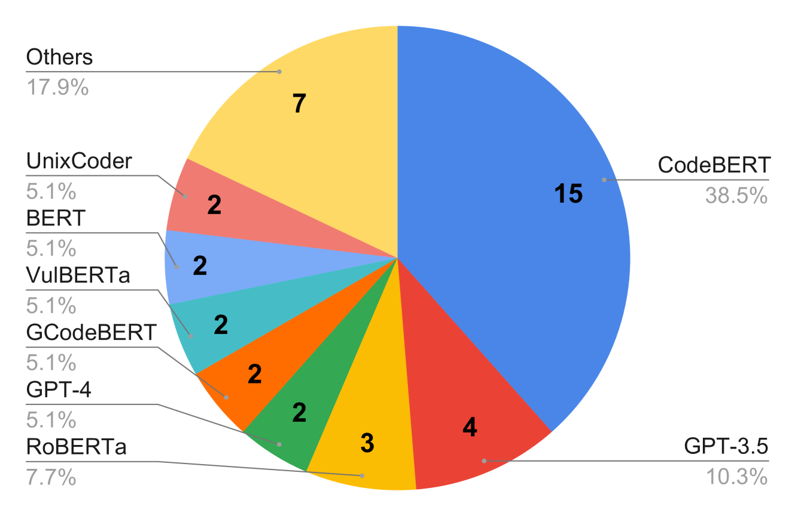
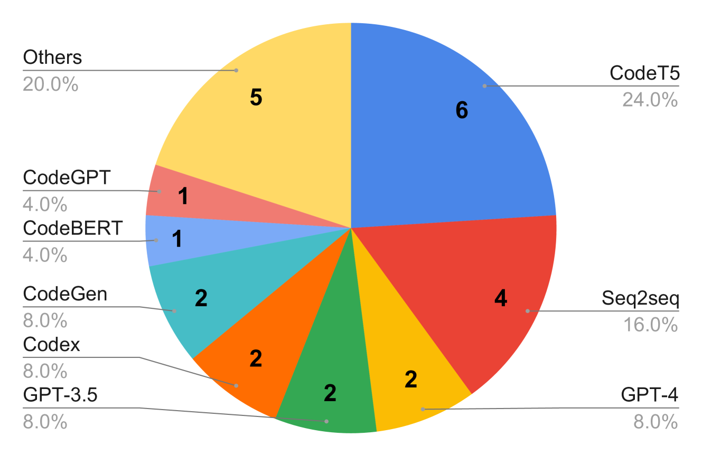
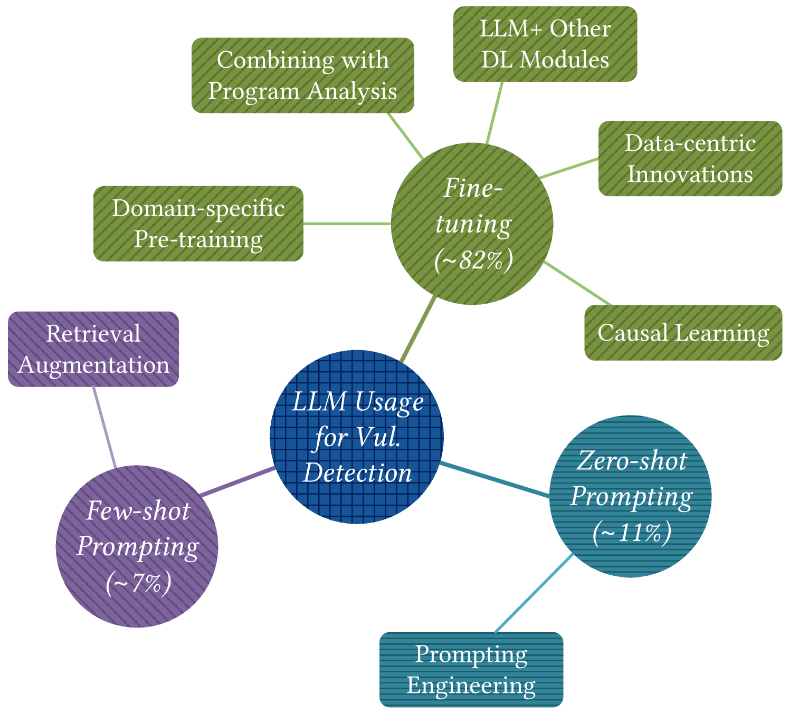
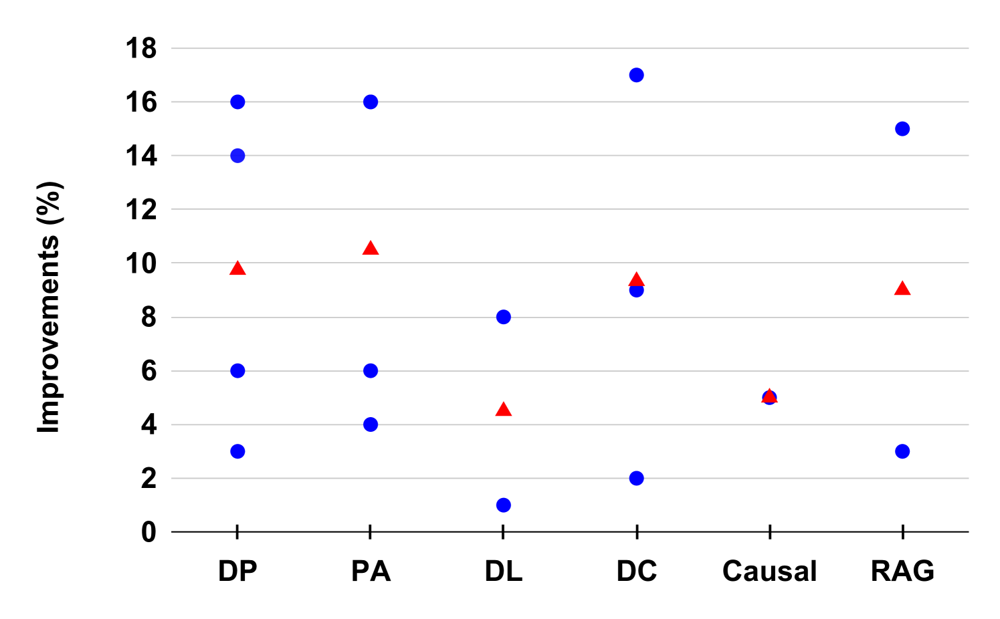
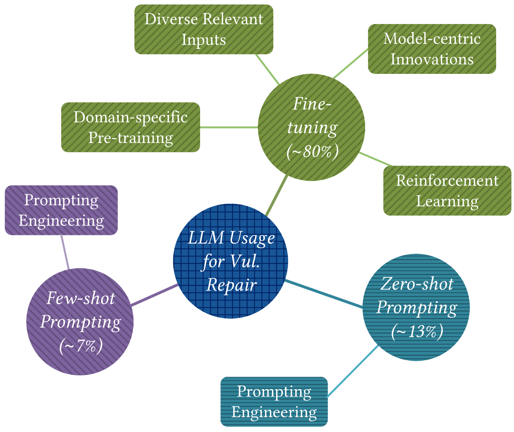
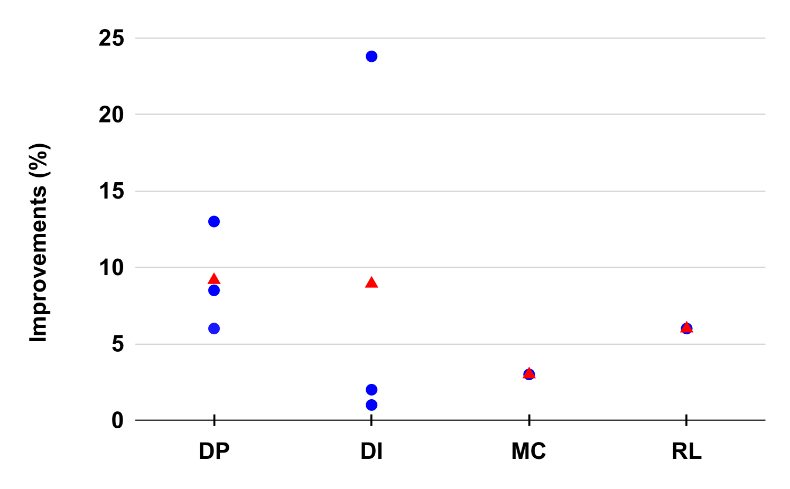

# 大型语言模型在漏洞检测与修复领域的文献综述及发展蓝图

发布时间：2024年04月03日

`LLM应用` `软件工程` `漏洞检测与修复`

> Large Language Model for Vulnerability Detection and Repair: Literature Review and Roadmap

# 摘要

> 大型语言模型（LLMs）的突破性进展促使其在软件工程（SE）领域的多项任务中得到广泛应用，如漏洞检测与修复。尽管LLMs在此领域的应用研究日益增多，但目前尚无综述性研究专注于LLMs在漏洞检测与修复方面的运用。本文旨在填补这一空白，通过系统性地回顾旨在通过LLMs提升漏洞检测与修复能力的文献。本综述涵盖了来自顶级SE、AI和安全领域的会议和期刊的36篇论文，共21个发布平台。我们通过解答三个核心研究问题，旨在（1）梳理相关文献中使用的LLMs，（2）对漏洞检测中的LLM适配技术进行分类，以及（3）对漏洞修复中的LLM适配技术进行分类。根据我们的研究结果，我们指出了现有研究中仍需克服的一系列挑战，并提出了一个路线图，强调了我们认为对未来研究至关重要的潜在机遇。

> The significant advancements in Large Language Models (LLMs) have resulted in their widespread adoption across various tasks within Software Engineering (SE), including vulnerability detection and repair. Numerous recent studies have investigated the application of LLMs to enhance vulnerability detection and repair tasks. Despite the increasing research interest, there is currently no existing survey that focuses on the utilization of LLMs for vulnerability detection and repair. In this paper, we aim to bridge this gap by offering a systematic literature review of approaches aimed at improving vulnerability detection and repair through the utilization of LLMs. The review encompasses research work from leading SE, AI, and Security conferences and journals, covering 36 papers published at 21 distinct venues. By answering three key research questions, we aim to (1) summarize the LLMs employed in the relevant literature, (2) categorize various LLM adaptation techniques in vulnerability detection, and (3) classify various LLM adaptation techniques in vulnerability repair. Based on our findings, we have identified a series of challenges that still need to be tackled considering existing studies. Additionally, we have outlined a roadmap highlighting potential opportunities that we believe are pertinent and crucial for future research endeavors.

[Arxiv](https://arxiv.org/abs/2404.02525)