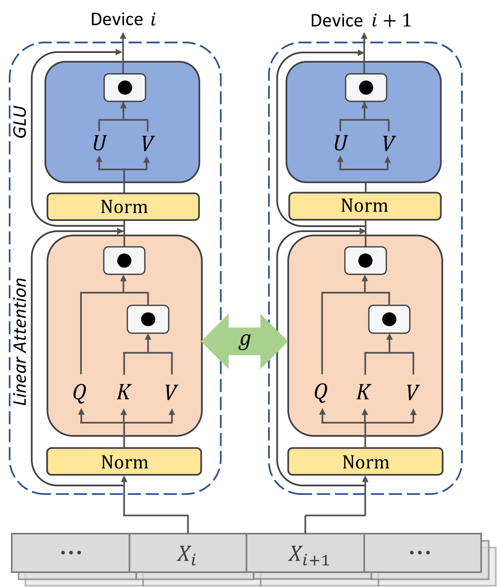
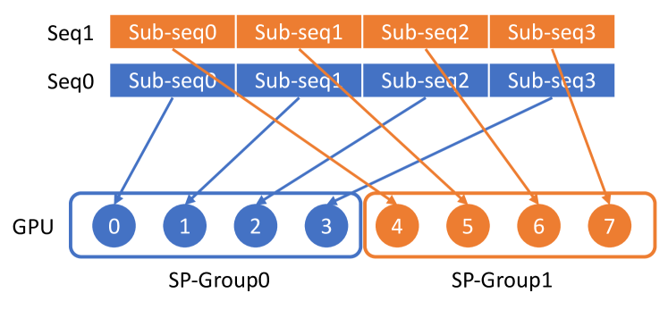
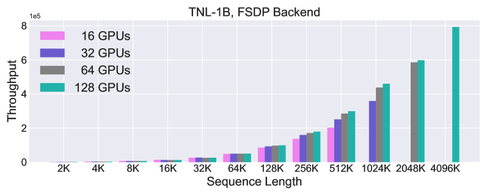
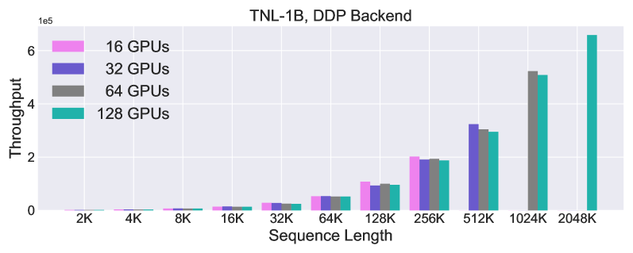
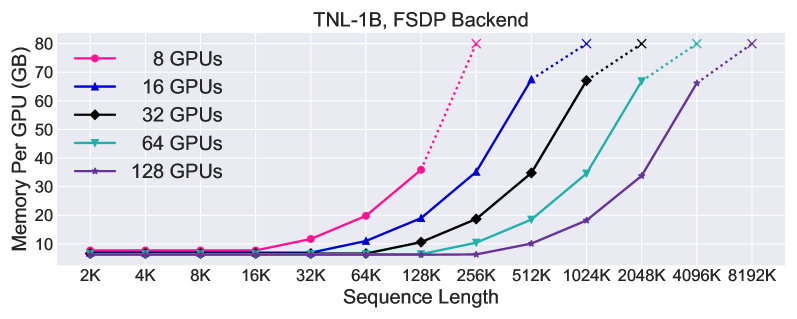
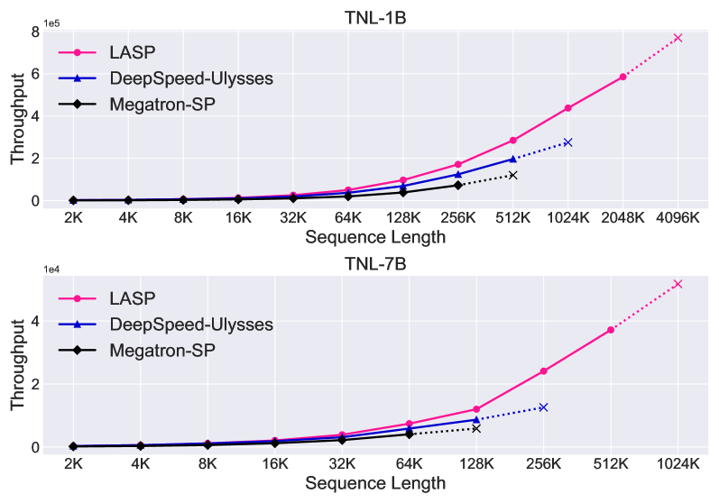

# 通过线性方法实现注意力机制的序列并行处理

发布时间：2024年04月03日

`LLM理论` `云计算` `并行计算`

> Linear Attention Sequence Parallelism

# 摘要

> 序列并行（SP）策略广泛应用于处理超出单个 GPU 内存容量的长序列数据。但是，传统 SP 方法未能充分利用线性注意力的特性，导致在处理基于线性注意力的语言模型时，其并行处理效率和实用性不尽如人意。本文提出了一种新型的高效序列并行方法——线性注意力序列并行（LASP），专为线性注意力模型量身打造。我们创新性地设计了一种点对点通信机制，借助线性注意力的右乘积核技巧，显著降低了通信成本。通过核融合和中间状态缓存技术，我们进一步提升了 LASP 的实际运行效率，使其在 GPU 集群上更具硬件兼容性。同时，我们确保了 LASP 与各种批量数据并行方法的兼容性，这对于在大型集群上进行长序列和大批量数据的分布式训练至关重要。在不同序列长度和 GPU 集群规模的两个线性注意力模型上进行的广泛实验表明，LASP 能够将序列长度扩展至 4096K，使用 128 个 A100 80G GPU 在 1B 模型上运行，比现有 SP 方法提升了 8 倍长度，同时保持显著的速度优势。相关代码已在 https://github.com/OpenNLPLab/LASP 上公开。

> Sequence Parallel (SP) serves as a prevalent strategy to handle long sequences that exceed the memory limit of a single GPU. However, existing SP methods do not take advantage of linear attention features, resulting in sub-optimal parallelism efficiency and usability for linear attention-based language models. In this paper, we introduce Linear Attention Sequence Parallel (LASP), an efficient SP method tailored to linear attention-based language models. Specifically, we design an efficient point-to-point communication mechanism to leverage the right-product kernel trick of linear attention, which sharply decreases the communication overhead of SP. We also enhance the practical efficiency of LASP by performing kernel fusion and intermediate state caching, making the implementation of LASP hardware-friendly on GPU clusters. Furthermore, we meticulously ensure the compatibility of sequence-level LASP with all types of batch-level data parallel methods, which is vital for distributed training on large clusters with long sequences and large batches. We conduct extensive experiments on two linear attention-based models with varying sequence lengths and GPU cluster sizes. LASP scales sequence length up to 4096K using 128 A100 80G GPUs on 1B models, which is 8 times longer than existing SP methods while being significantly faster. The code is available at https://github.com/OpenNLPLab/LASP.

[Arxiv](https://arxiv.org/abs/2404.02882)