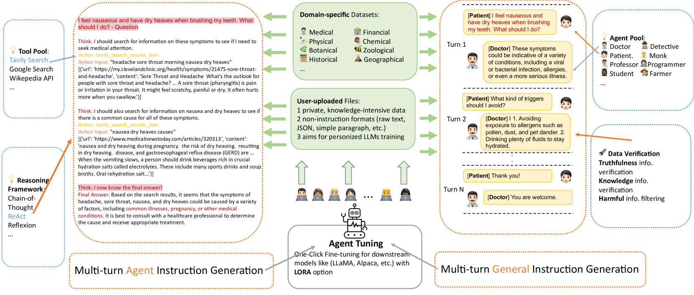
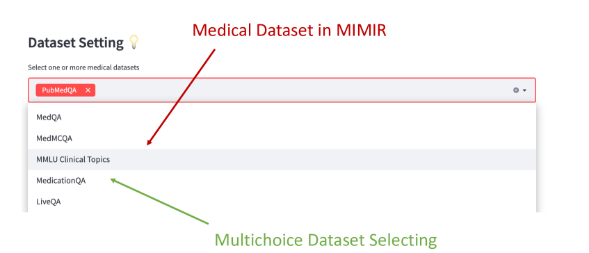
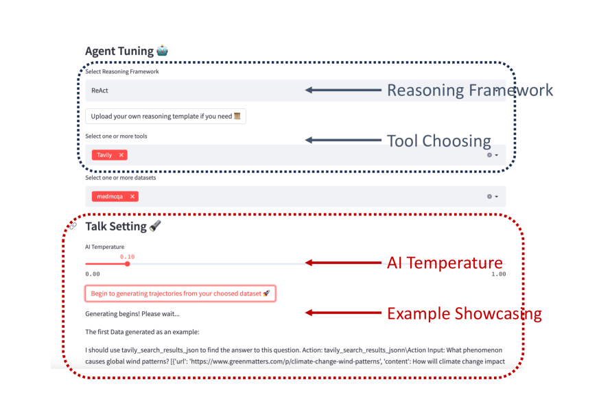
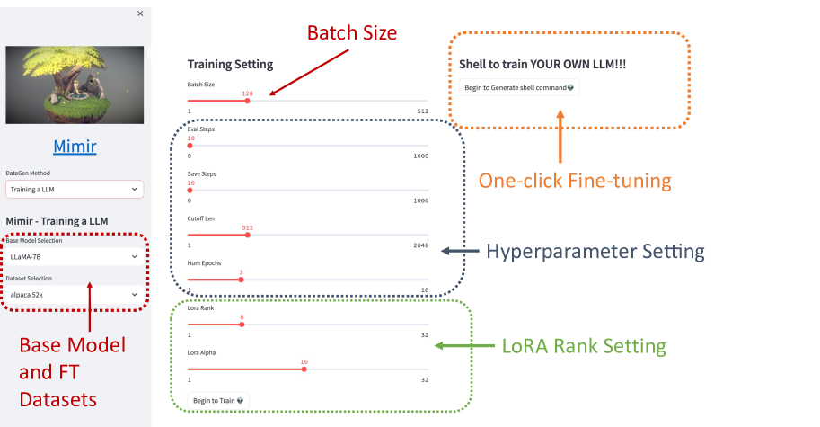
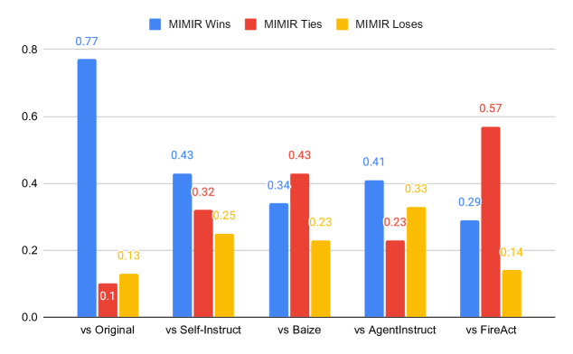

# MIMIR：领域专家专用，打造个性化智能代理的高效平台

发布时间：2024年04月03日

`Agent` `语音代理` `定制化代理调优`

> MIMIR: A Streamlined Platform for Personalized Agent Tuning in Domain Expertise

# 摘要

> 近期，大型语言模型（LLMs）变身为多面手，擅长策划、运用工具和完成各类任务。然而，开源模型如LLaMA在没有针对性调优的情况下，难以与GPT-4的高效性相媲美，特别是因为缺乏足够的代理调优数据集。为此，我们推出了\textsc{Mimir}平台：一个高效的定制化工具流，让用户能够大规模地利用私有知识和合法的公共数据集进行\textbf{定制化代理调优}。\textsc{Mimir}还能基于同一输入创建通用的指令调优数据集，确保打造的语音代理既具备专业技能，又不失广泛能力。该平台集多种功能于一体，从上传个性化文件到一键式代理调优，流程无缝衔接。

> Recently, large language models (LLMs) have evolved into interactive agents, proficient in planning, tool use, and task execution across a wide variety of tasks. However, without specific agent tuning, open-source models like LLaMA currently struggle to match the efficiency of GPT- 4, particularly given the scarcity of agent-tuning datasets for fine-tuning. In response, we introduce \textsc{Mimir}: a streamlined platform offering a customizable pipeline that enables users to leverage both private knowledge and publicly available, legally compliant datasets at scale for \textbf{personalized agent tuning}. Additionally, \textsc{Mimir} supports the generation of general instruction-tuning datasets from the same input. This dual capability ensures that language agents developed through the platform possess both specific agent abilities and general competencies. \textsc{Mimir} integrates these features into a cohesive end-to-end platform, facilitating everything from the uploading of personalized files to one-click agent fine-tuning.

[Arxiv](https://arxiv.org/abs/2404.04285)