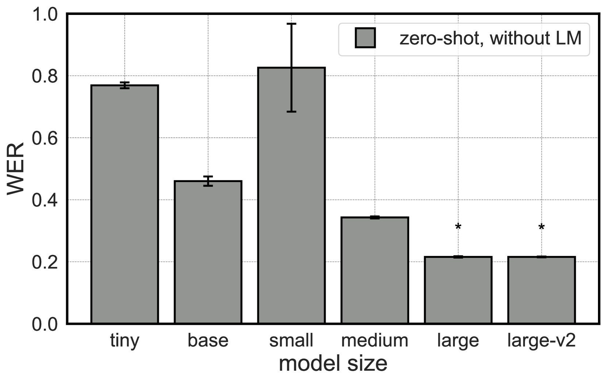
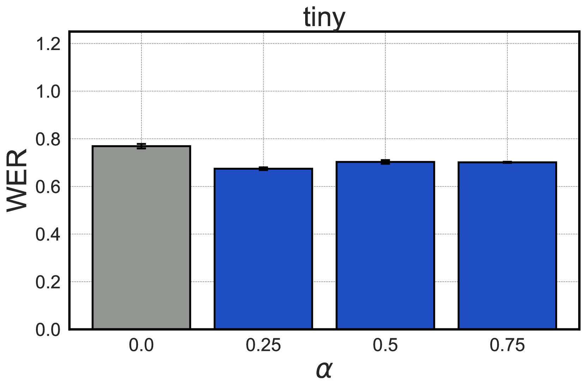
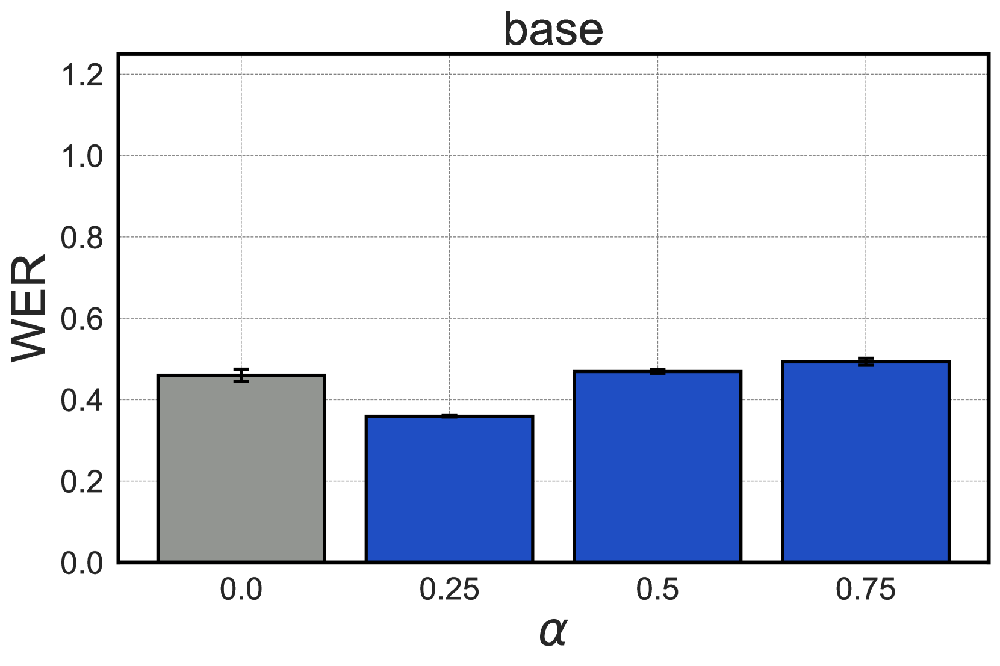
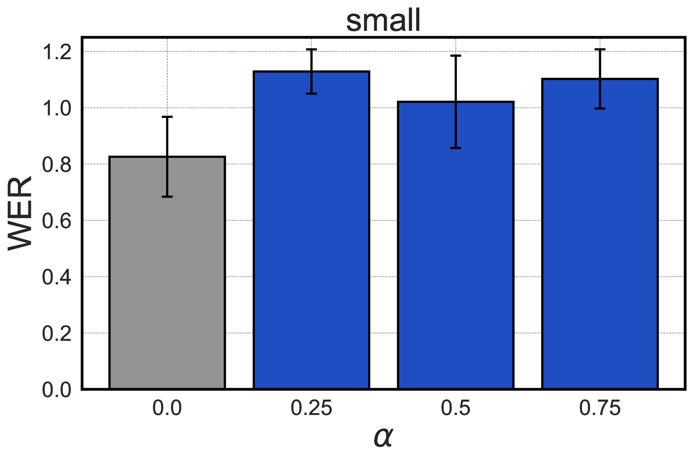
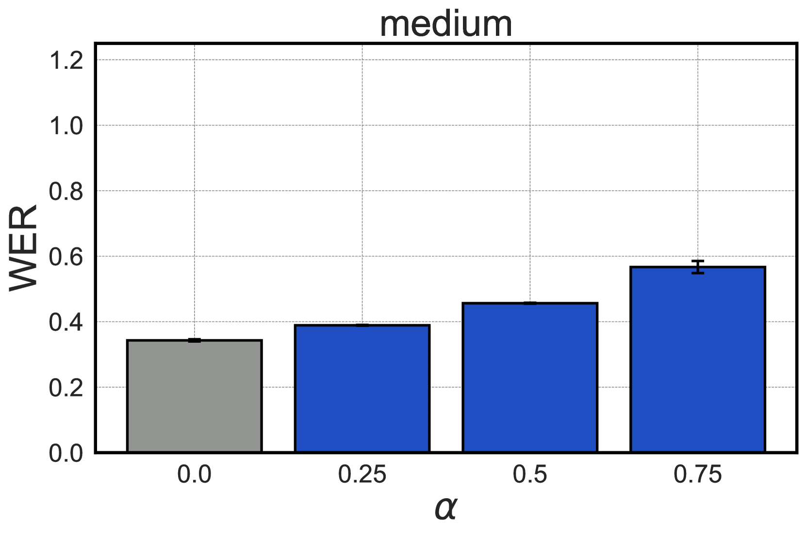
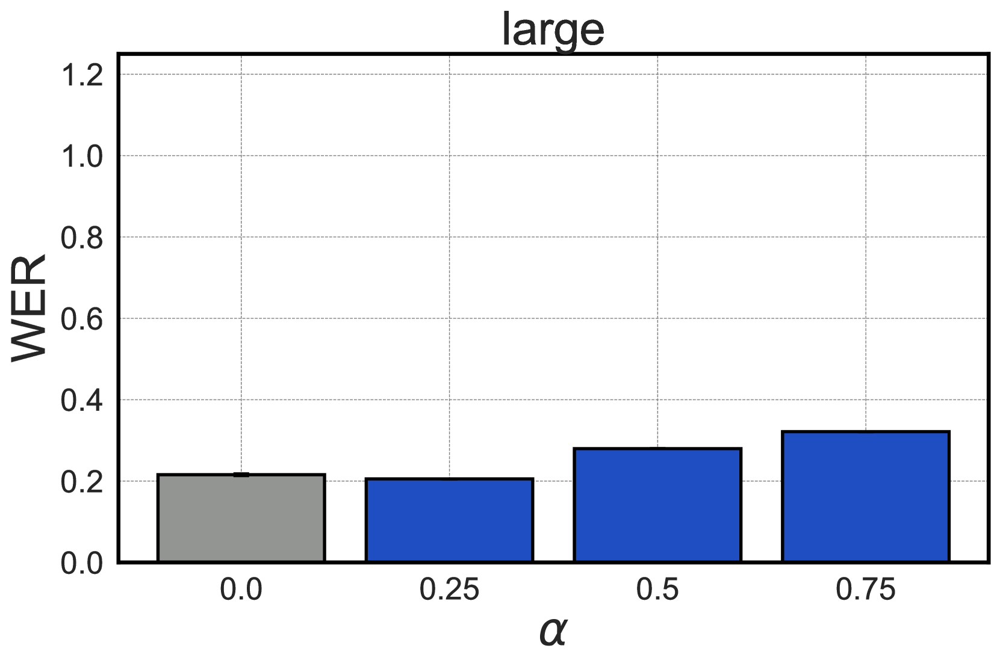
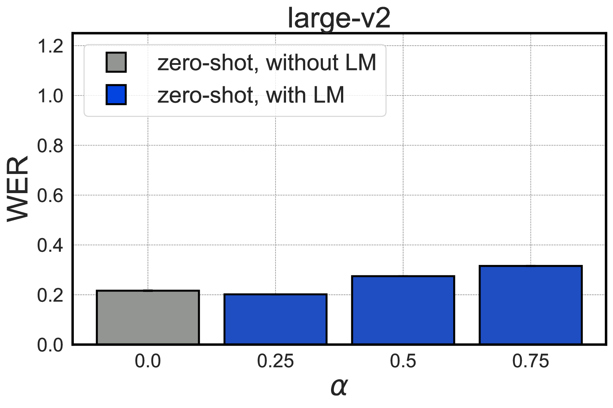
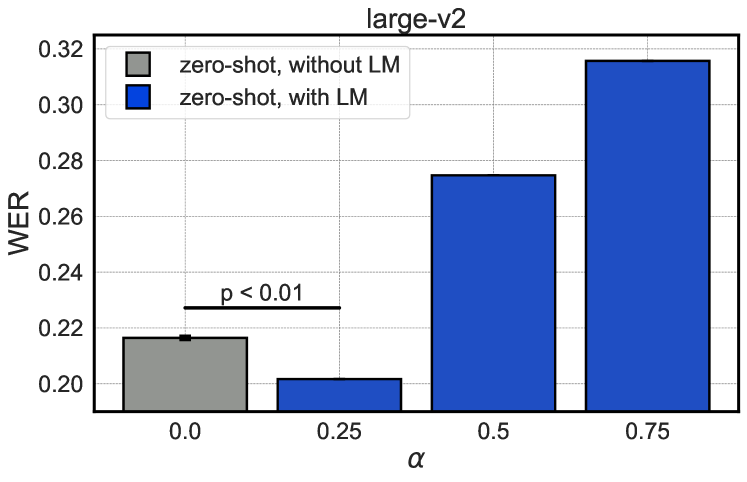
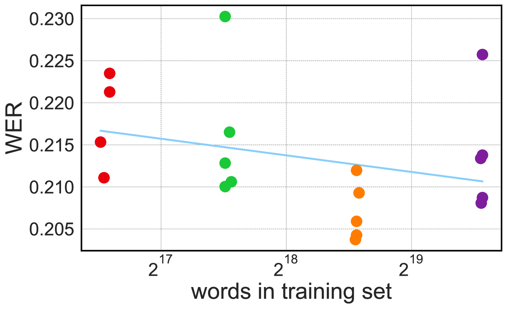
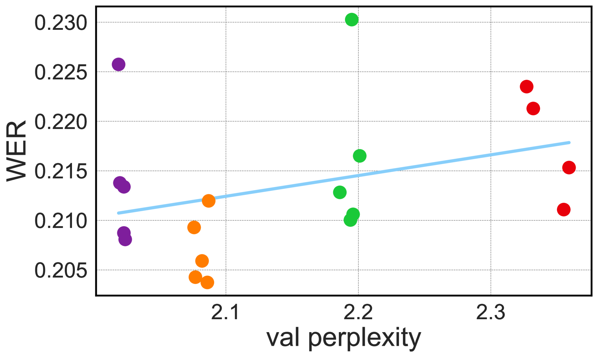

# 借助语言模型，夏威夷语的自动语音识别技术得到提升

发布时间：2024年04月03日

`LLM应用` `语音识别`

> Mai Ho'omāuna i ka 'Ai: Language Models Improve Automatic Speech Recognition in Hawaiian

# 摘要

> 本文探讨了如何通过整合大量独立文本数据至Whisper这一ASR基础模型中，以提升夏威夷语这一低资源语言的语音识别能力。我们针对约150万词的夏威夷语文本训练了一个外部语言模型，并利用该模型对Whisper进行再评分，同时在精心筛选的夏威夷语测试集上计算WER。作为对照，我们还使用了未经外部LM增强的Whisper。实验结果表明，借助夏威夷语LM对ASR结果进行再评分后，WER得到了小幅但显著的提升。这一发现强调了在开发针对边缘语言的ASR系统时，充分利用一切可用资源的重要性。

> In this paper we address the challenge of improving Automatic Speech Recognition (ASR) for a low-resource language, Hawaiian, by incorporating large amounts of independent text data into an ASR foundation model, Whisper. To do this, we train an external language model (LM) on ~1.5M words of Hawaiian text. We then use the LM to rescore Whisper and compute word error rates (WERs) on a manually curated test set of labeled Hawaiian data. As a baseline, we use Whisper without an external LM. Experimental results reveal a small but significant improvement in WER when ASR outputs are rescored with a Hawaiian LM. The results support leveraging all available data in the development of ASR systems for underrepresented languages.

[Arxiv](https://arxiv.org/abs/2404.03073)