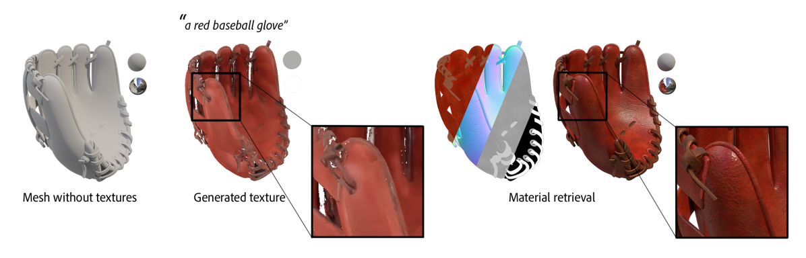
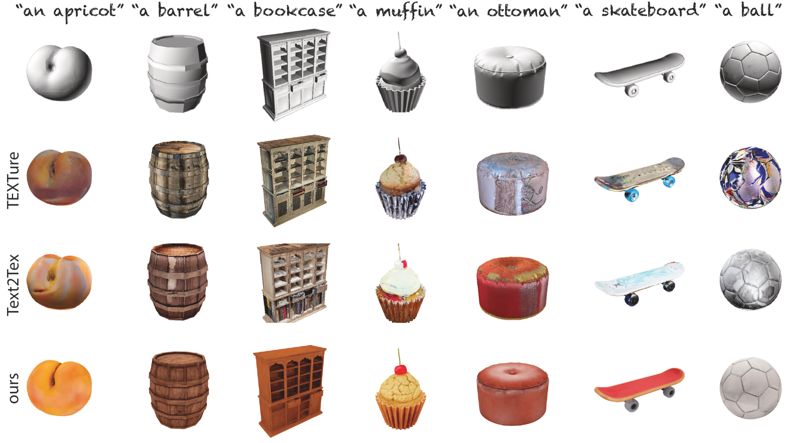
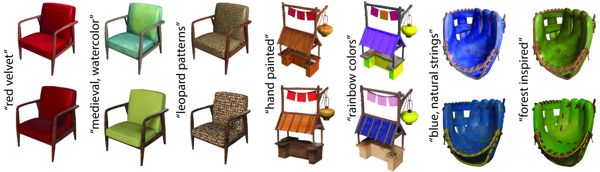
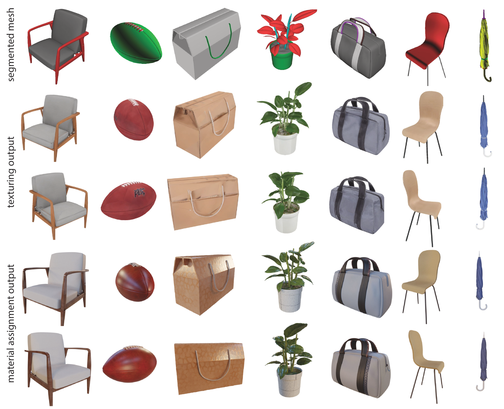
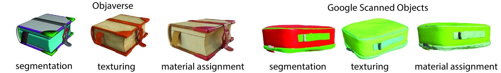

# MatAtlas：通过文本驱动，实现一致的几何纹理和材质赋予

发布时间：2024年04月03日

`RAG` `3D建模` `纹理技术`

> MatAtlas: Text-driven Consistent Geometry Texturing and Material Assignment

# 摘要

> MatAtlas是我们推出的一种创新的文本引导3D模型纹理技术。借助最新的文本到图像生成技术，例如稳定扩散模型，我们为3D模型穿上了文字的外衣。我们巧妙构建了一个基于网格图案扩散的RGB纹理流程，它能够根据模型的深度和边缘信息进行智能调整。通过采用多阶段的纹理优化策略，我们大幅提升了纹理效果的品质和三维真实感。为了解决固定光照问题，我们不止步于RGB色彩，而是尝试为模型赋予参数化材质。依托出色的初始RGB纹理，我们引入了一种基于大型语言模型的创新材质检索技术，让模型不仅易于编辑，还能自由调整光照效果。经过广泛测试，我们的方法在各种几何结构上都展现出卓越的性能，超越了传统技术。我们还通过深入的组件分析，揭示了每个部分的独特贡献。

> We present MatAtlas, a method for consistent text-guided 3D model texturing. Following recent progress we leverage a large scale text-to-image generation model (e.g., Stable Diffusion) as a prior to texture a 3D model. We carefully design an RGB texturing pipeline that leverages a grid pattern diffusion, driven by depth and edges. By proposing a multi-step texture refinement process, we significantly improve the quality and 3D consistency of the texturing output. To further address the problem of baked-in lighting, we move beyond RGB colors and pursue assigning parametric materials to the assets. Given the high-quality initial RGB texture, we propose a novel material retrieval method capitalized on Large Language Models (LLM), enabling editabiliy and relightability. We evaluate our method on a wide variety of geometries and show that our method significantly outperform prior arts. We also analyze the role of each component through a detailed ablation study.

[Arxiv](https://arxiv.org/abs/2404.02899)