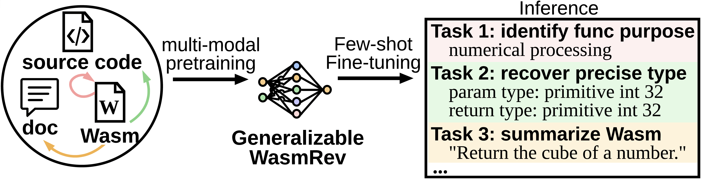
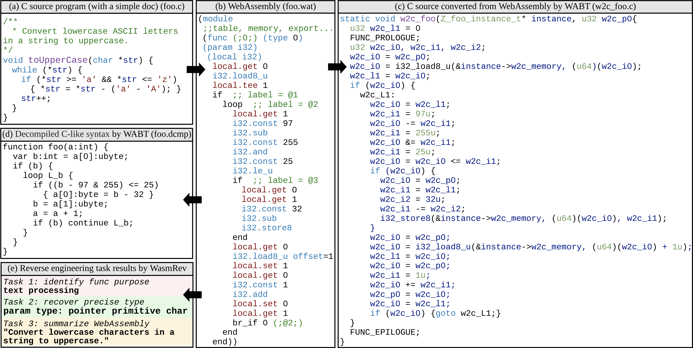
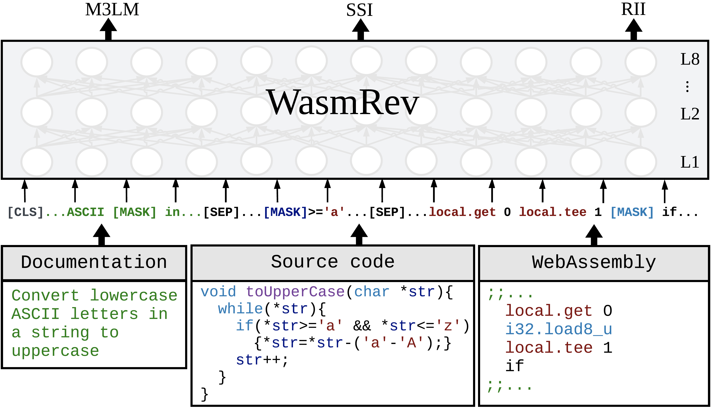
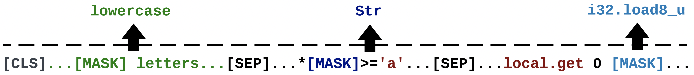
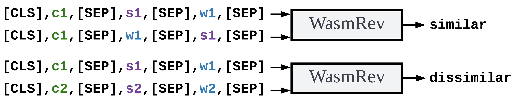
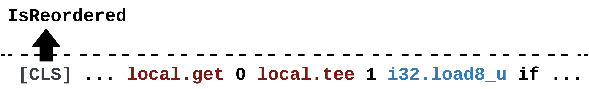
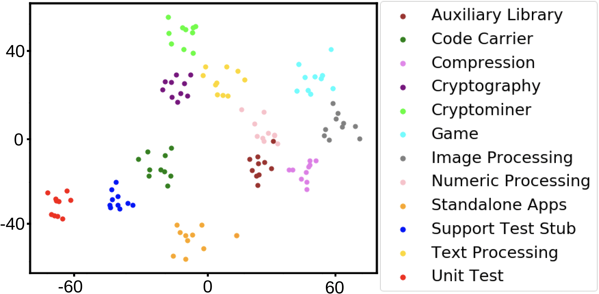
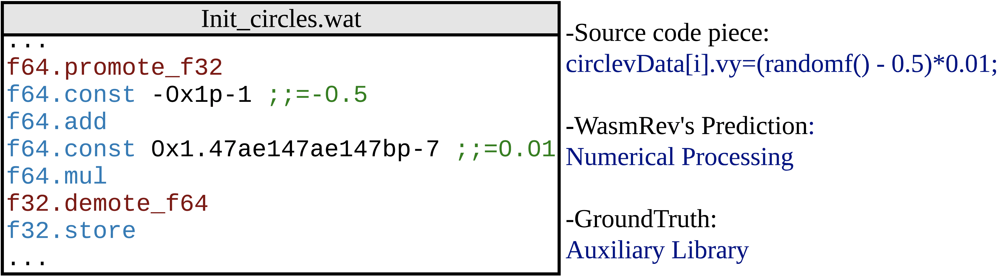
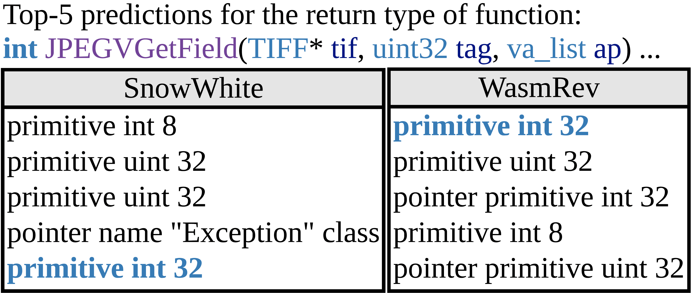
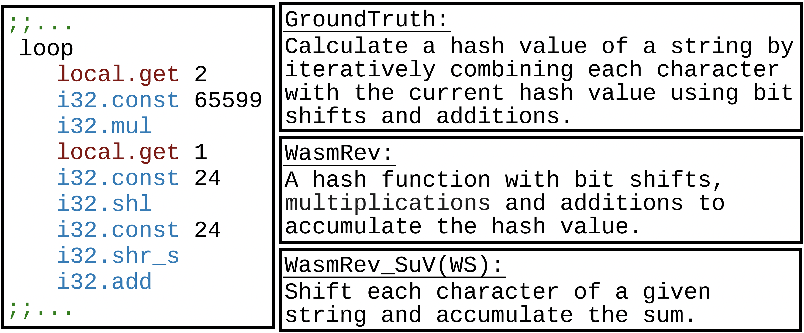

# 通过多模态学习方法，探索WebAssembly逆向工程的新途径。

发布时间：2024年04月03日

`LLM应用` `WebAssembly` `逆向工程`

> Multi-modal Learning for WebAssembly Reverse Engineering

# 摘要

> 随着WebAssembly（Wasm）在性能和安全性要求高的任务中的应用日益广泛，对于Wasm程序的理解和逆向工程技术的需求也在不断增长。尽管最新的研究已经开始尝试利用基于机器学习的WebAssembly逆向工程工具，但这些特定任务的机器学习解决方案的普适性仍然是一个难题，因为它们的效果依赖于大量高质量的标记数据。此外，以往的研究还忽略了源代码及其文档中蕴含的丰富语义信息。鉴于大量带有文档的源代码可以被编译成Wasm，我们提出了一种新方法：同时学习这些代码及其文档的表示，并利用它们之间的相互关系，以更有效地进行Wasm逆向工程。本文首次推出了WasmRev，这是一个针对WebAssembly逆向工程的多模态预训练语言模型。WasmRev通过自监督学习在包含源代码、代码文档和编译后的Wasm的大规模多模态语料库上进行预训练，无需依赖标记数据。该模型结合了三项专门设计的多模态预训练任务，旨在捕捉Wasm的多样特性和跨模态间的关系。WasmRev仅需一次训练，便可生成通用的表示，通过少量标记数据的微调，即可广泛应用于各种WebAssembly逆向工程任务，显著提升数据使用效率。我们在类型恢复、函数目的识别和Wasm摘要三个关键的逆向工程任务上对WasmRev进行了微调，实验结果显示，WasmRev在多模态样本语料库上的预训练为这些任务打下了坚实的基础，不仅任务准确度高，而且性能超越了当前最先进的基于机器学习的WebAssembly逆向工程方法。

> The increasing adoption of WebAssembly (Wasm) for performance-critical and security-sensitive tasks drives the demand for WebAssembly program comprehension and reverse engineering. Recent studies have introduced machine learning (ML)-based WebAssembly reverse engineering tools. Yet, the generalization of task-specific ML solutions remains challenging, because their effectiveness hinges on the availability of an ample supply of high-quality task-specific labeled data. Moreover, previous works overlook the high-level semantics present in source code and its documentation. Acknowledging the abundance of available source code with documentation, which can be compiled into WebAssembly, we propose to learn representations of them concurrently and harness their mutual relationships for effective WebAssembly reverse engineering.
  In this paper, we present WasmRev, the first multi-modal pre-trained language model for WebAssembly reverse engineering. WasmRev is pre-trained using self-supervised learning on a large-scale multi-modal corpus encompassing source code, code documentation and the compiled WebAssembly, without requiring labeled data. WasmRev incorporates three tailored multi-modal pre-training tasks to capture various characteristics of WebAssembly and cross-modal relationships. WasmRev is only trained once to produce general-purpose representations that can broadly support WebAssembly reverse engineering tasks through few-shot fine-tuning with much less labeled data, improving data efficiency. We fine-tune WasmRev onto three important reverse engineering tasks: type recovery, function purpose identification and WebAssembly summarization. Our results show that WasmRev pre-trained on the corpus of multi-modal samples establishes a robust foundation for these tasks, achieving high task accuracy and outperforming the state-of-the-art ML methods for WebAssembly reverse engineering.

[Arxiv](https://arxiv.org/abs/2404.03171)