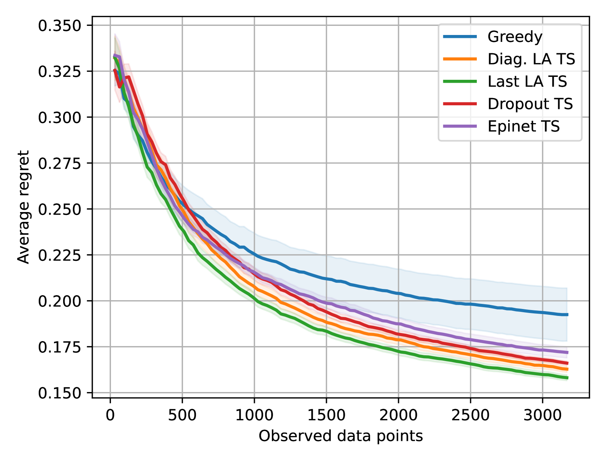
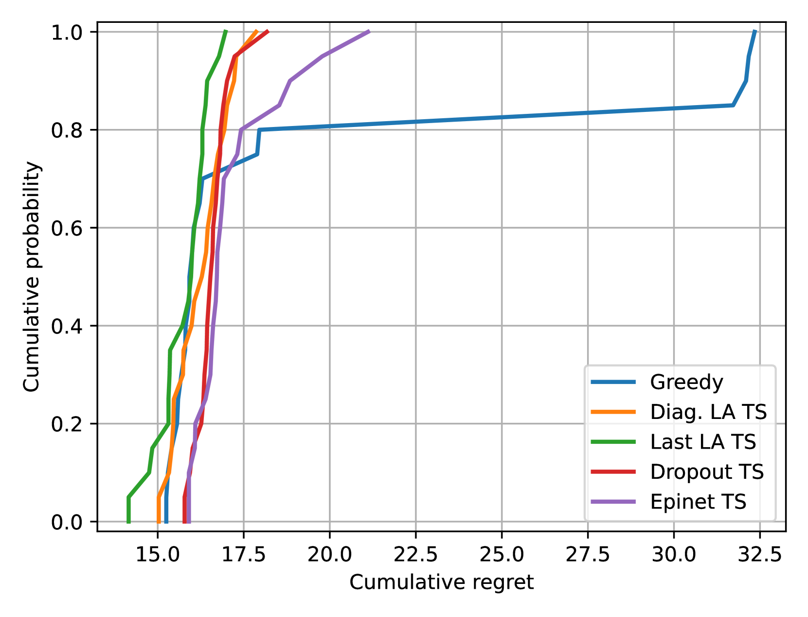
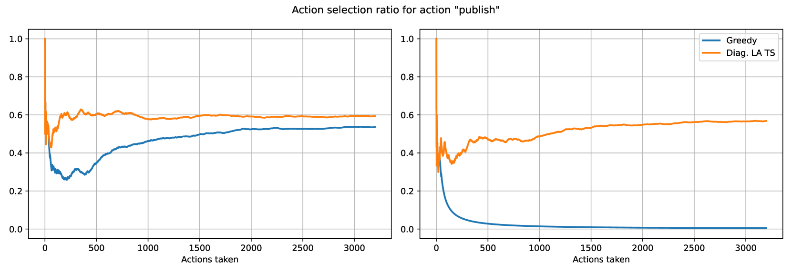
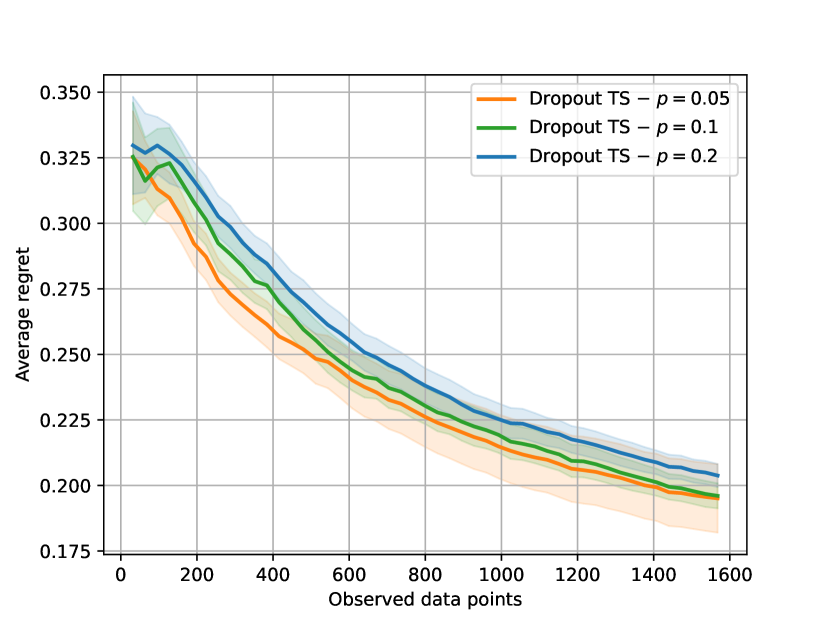
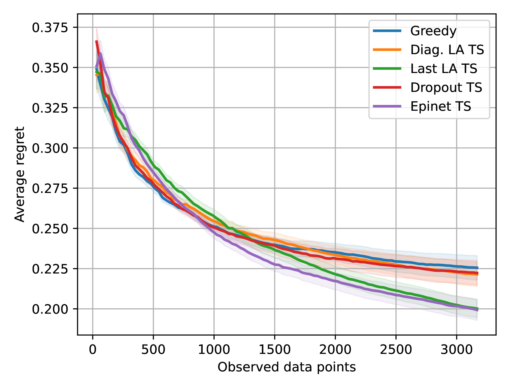
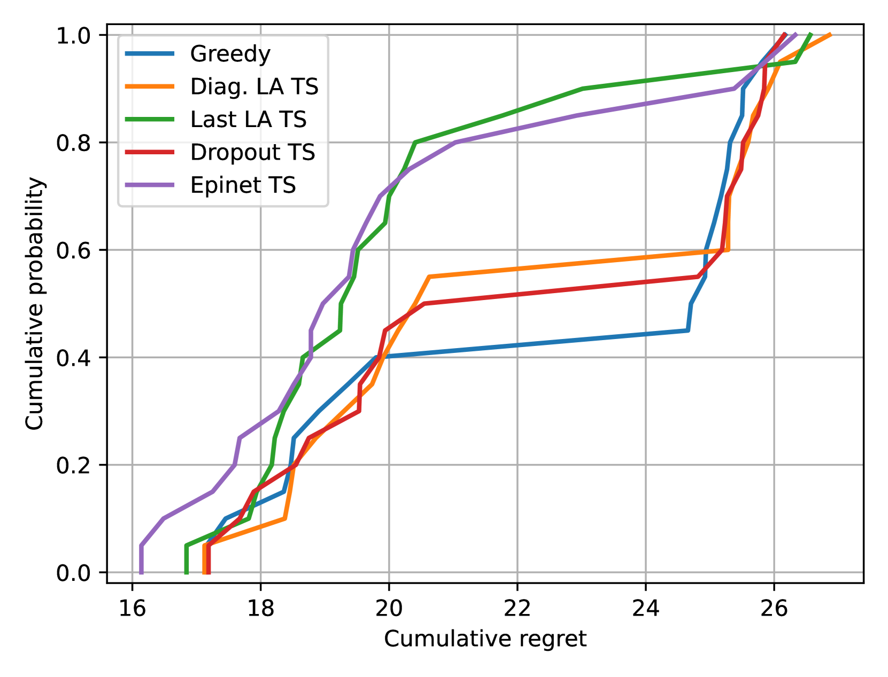

# 在运用大型语言模型进行决策时，不确定性的角色不容忽视。

发布时间：2024年04月03日

`Agent` `决策支持系统`

> On the Importance of Uncertainty in Decision-Making with Large Language Models

# 摘要

> 我们探索了自然语言输入决策问题中不确定性的影响。在这类问题中，大型语言模型作为决策代理已成为常规做法。但是，目前的方法都没有对代理在决策过程中对世界的认知不确定性进行评估。我们专注于一个基于自然语言输入的基本决策框架——上下文 bandits，其上下文信息由文本提供。我们以一个采用贪婪策略的 LLM bandit 作为参照，它仅选择预测收益最大的行动。与之相比，我们研究了那些通过 Thompson 采样策略整合不确定性来主动评估不确定性的 LLM bandits。我们运用了 Laplace 近似、Dropout 和 Epinets 等不确定性估计技术。实际数据显示，贪婪策略的效果不如 Thompson 采样策略。这一发现揭示了，尽管在 LLM 研究中常被忽略，不确定性在涉及 LLM 的 bandit 任务中却起着至关重要的作用。

> We investigate the role of uncertainty in decision-making problems with natural language as input. For such tasks, using Large Language Models as agents has become the norm. However, none of the recent approaches employ any additional phase for estimating the uncertainty the agent has about the world during the decision-making task. We focus on a fundamental decision-making framework with natural language as input, which is the one of contextual bandits, where the context information consists of text. As a representative of the approaches with no uncertainty estimation, we consider an LLM bandit with a greedy policy, which picks the action corresponding to the largest predicted reward. We compare this baseline to LLM bandits that make active use of uncertainty estimation by integrating the uncertainty in a Thompson Sampling policy. We employ different techniques for uncertainty estimation, such as Laplace Approximation, Dropout, and Epinets. We empirically show on real-world data that the greedy policy performs worse than the Thompson Sampling policies. These findings suggest that, while overlooked in the LLM literature, uncertainty plays a fundamental role in bandit tasks with LLMs.

[Arxiv](https://arxiv.org/abs/2404.02649)