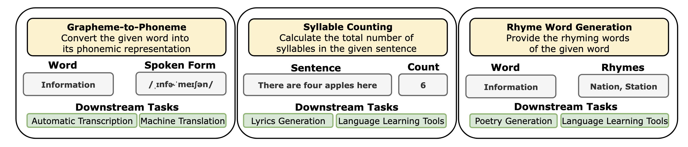
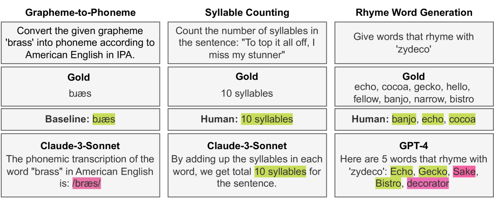
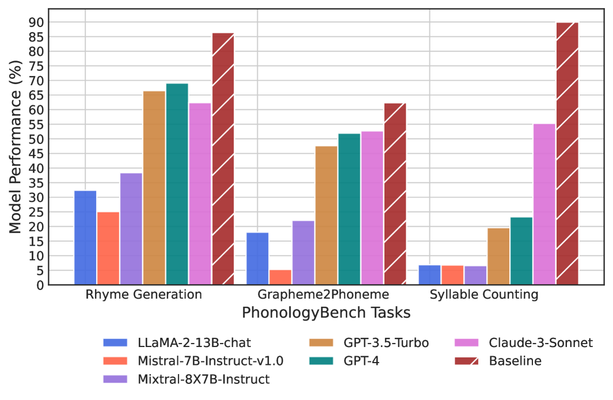
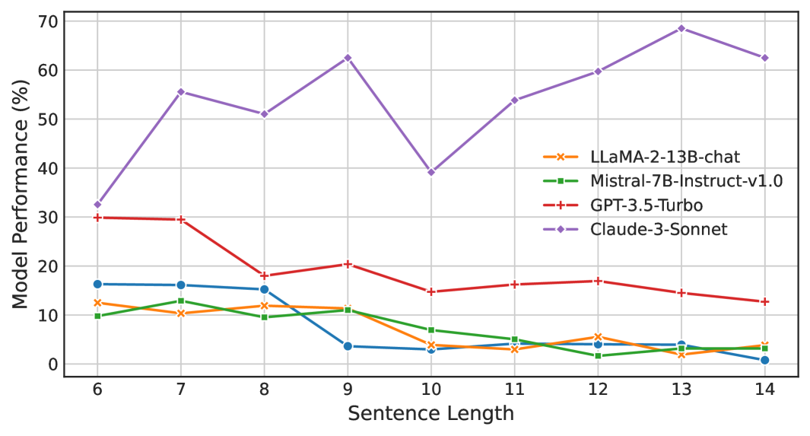

# PhonologyBench：探究大型语言模型的音系能力

发布时间：2024年04月03日

`LLM应用` `语音学`

> PhonologyBench: Evaluating Phonological Skills of Large Language Models

# 摘要

> 语音学在大型语言模型（LLM）的研究中扮演着至关重要却常被忽略的角色。LLM广泛应用于多种依赖语音学的下游应用，如教育工具和诗歌创作。LLM还可能从训练数据中学到字形与音素之间的不精确对应关系。因此，对LLM的语音处理能力进行评估显得尤为重要。我们推出了PhonologyBench，这是一个由三个诊断任务组成的新基准测试，用以专门检测LLM在英语语音处理方面的能力：音素转换、音节计数和押韵词生成。尽管缺乏语音数据，LLM在PhonologyBench任务上的表现仍引人注目。然而，与人类的表现相比，我们在押韵词生成和音节计数任务中分别发现了17%和45%的性能差距。这一发现凸显了研究LLM在语音处理任务上的表现对于现实世界应用的潜在影响。我们建议研究者选择在与其下游应用紧密相关的语音处理任务上表现出色的LLM，因为我们发现没有一个模型能在所有任务上始终超越其他模型。

> Phonology, the study of speech's structure and pronunciation rules, is a critical yet often overlooked component in Large Language Model (LLM) research. LLMs are widely used in various downstream applications that leverage phonology such as educational tools and poetry generation. Moreover, LLMs can potentially learn imperfect associations between orthographic and phonological forms from the training data. Thus, it is imperative to benchmark the phonological skills of LLMs. To this end, we present PhonologyBench, a novel benchmark consisting of three diagnostic tasks designed to explicitly test the phonological skills of LLMs in English: grapheme-to-phoneme conversion, syllable counting, and rhyme word generation. Despite having no access to speech data, LLMs showcased notable performance on the PhonologyBench tasks. However, we observe a significant gap of 17% and 45% on Rhyme Word Generation and Syllable counting, respectively, when compared to humans. Our findings underscore the importance of studying LLM performance on phonological tasks that inadvertently impact real-world applications. Furthermore, we encourage researchers to choose LLMs that perform well on the phonological task that is closely related to the downstream application since we find that no single model consistently outperforms the others on all the tasks.

[Arxiv](https://arxiv.org/abs/2404.02456)