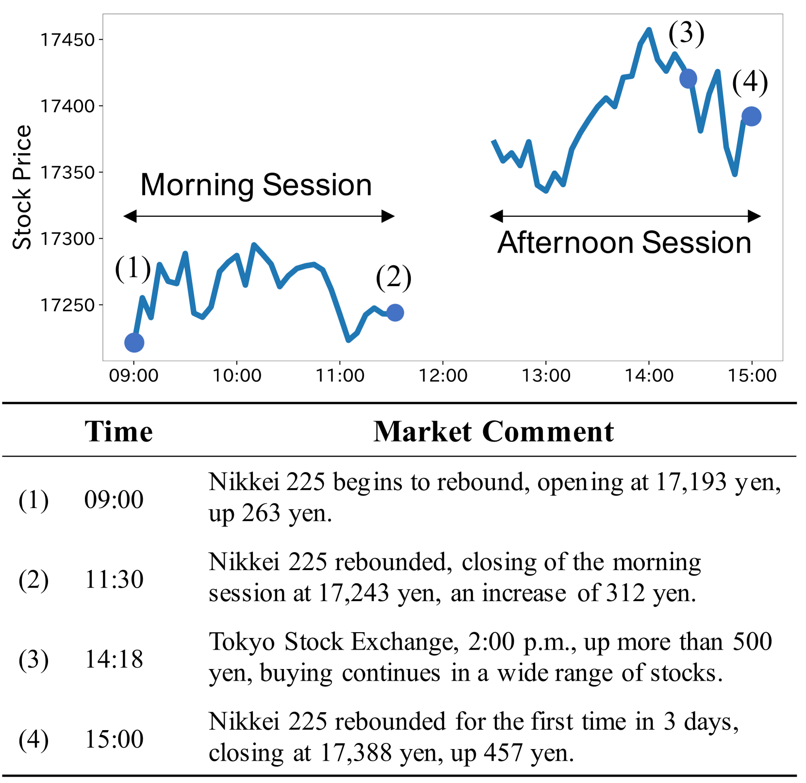
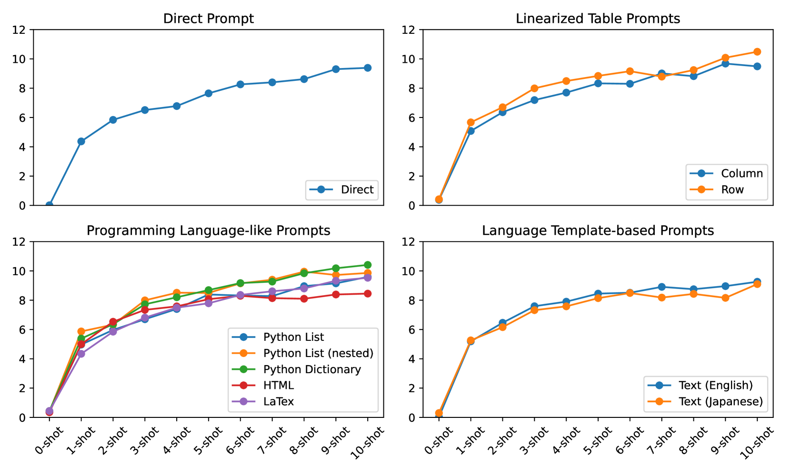
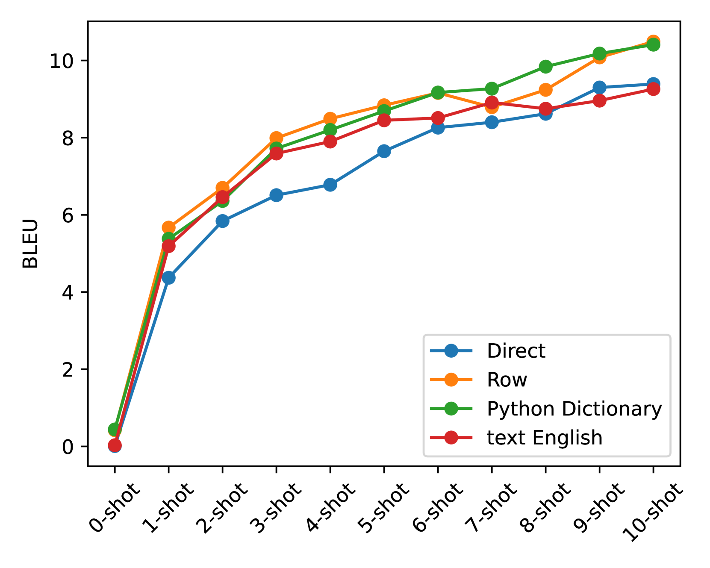

# 数字序列提示：市场评论生成案例分析

发布时间：2024年04月03日

`LLM应用` `时间序列数据分析`

> Prompting for Numerical Sequences: A Case Study on Market Comment Generation

# 摘要

> 大型语言模型（LLMs）已广泛运用于多种数据转文本任务，如表格、图形及时间序列数据。尽管对表格和图形这类结构化数据生成提示的研究日益受到关注，但对时间序列数据的深入研究尚显不足。本研究尝试了多种输入表示法，包括令牌序列和HTML、LaTeX、Python编码等结构化格式。实验聚焦于股市评论生成任务，即输入一系列股价数据，输出相应的市场评论。出乎意料的是，类似编程语言的提示效果更佳，而自然语言风格及HTML、LaTeX等长篇格式则不太有效。这些发现为从数值序列生成文本的任务中设计高效提示提供了新的洞见。

> Large language models (LLMs) have been applied to a wide range of data-to-text generation tasks, including tables, graphs, and time-series numerical data-to-text settings. While research on generating prompts for structured data such as tables and graphs is gaining momentum, in-depth investigations into prompting for time-series numerical data are lacking. Therefore, this study explores various input representations, including sequences of tokens and structured formats such as HTML, LaTeX, and Python-style codes. In our experiments, we focus on the task of Market Comment Generation, which involves taking a numerical sequence of stock prices as input and generating a corresponding market comment. Contrary to our expectations, the results show that prompts resembling programming languages yield better outcomes, whereas those similar to natural languages and longer formats, such as HTML and LaTeX, are less effective. Our findings offer insights into creating effective prompts for tasks that generate text from numerical sequences.

[Arxiv](https://arxiv.org/abs/2404.02466)