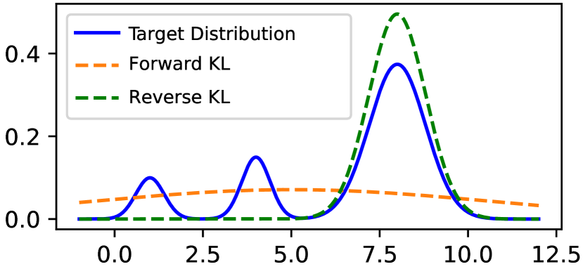
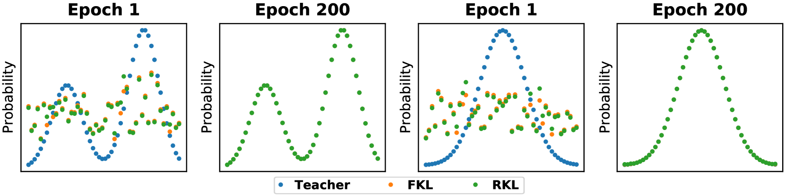
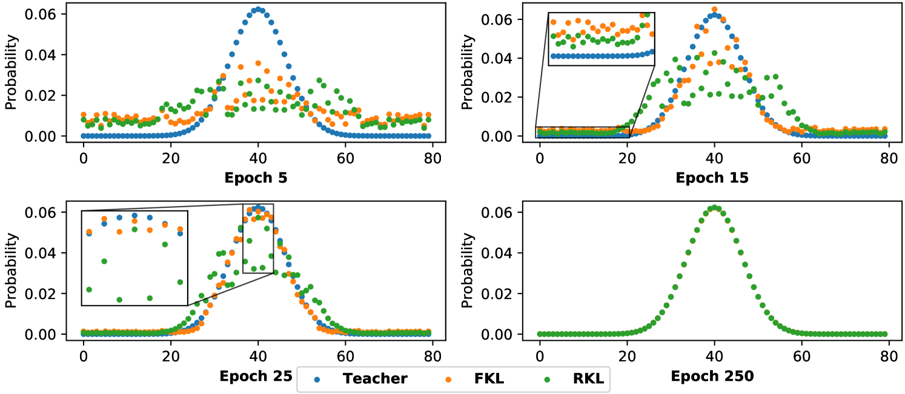
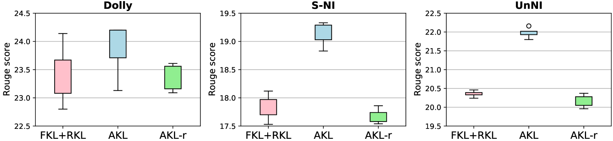
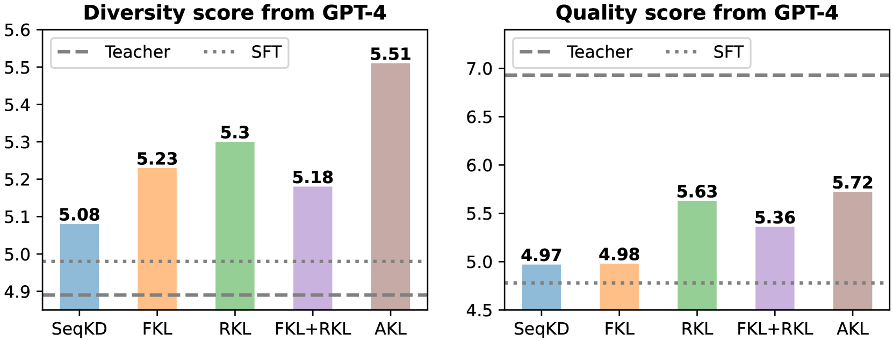

# 在大型语言模型的知识蒸馏过程中，对Kullback-Leibler散度的再认识与应用。

发布时间：2024年04月03日

`LLM理论` `知识蒸馏` `大型语言模型`

> Rethinking Kullback-Leibler Divergence in Knowledge Distillation for Large Language Models

# 摘要

> Kullback-Leiber散度作为知识蒸馏（KD）中压缩大型语言模型（LLMs）的常用工具，其效果并非如先前所认为的那样，逆向Kullback-Leiber（RKL）散度并不比正向Kullback-Leiber（FKL）散度更优。本研究通过实证和理论分析揭示，在LLMs的知识蒸馏过程中，RKL和FKL实际上并无模式寻求或平均寻求的特性，两者在足够多的训练周期后均能达到收敛。然而，鉴于实际训练的限制，LLMs很少会经历如此漫长的训练周期。此外，我们还发现，在训练初期，RKL更关注分布的尾部，而FKL则集中于头部。基于这些发现，我们提出了一种自适应Kullback-Leiber（AKL）散度方法，它能够灵活地权衡FKL和RKL的权重，实现两者的有效结合。通过基于指标和GPT-4的评估，我们证明了AKL在多项任务上均优于传统基线，且在提升生成响应的多样性和质量方面表现出色。

> Kullback-Leiber divergence has been widely used in Knowledge Distillation (KD) to compress Large Language Models (LLMs). Contrary to prior assertions that reverse Kullback-Leibler (RKL) divergence is mode-seeking and thus preferable over the mean-seeking forward Kullback-Leibler (FKL) divergence, this study empirically and theoretically demonstrates that neither mode-seeking nor mean-seeking properties manifest in KD for LLMs. Instead, RKL and FKL are found to share the same optimization objective and both converge after a sufficient number of epochs. However, due to practical constraints, LLMs are seldom trained for such an extensive number of epochs. Meanwhile, we further find that RKL focuses on the tail part of the distributions, while FKL focuses on the head part at the beginning epochs. Consequently, we propose a simple yet effective Adaptive Kullback-Leiber (AKL) divergence method, which adaptively allocates weights to combine FKL and RKL. Metric-based and GPT-4-based evaluations demonstrate that the proposed AKL outperforms the baselines across various tasks and improves the diversity and quality of generated responses.

[Arxiv](https://arxiv.org/abs/2404.02657)