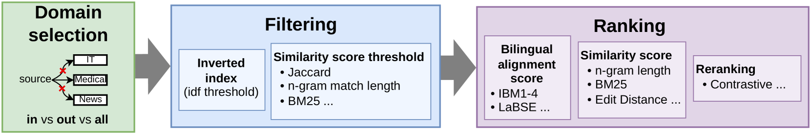

# 为了提升神经机器翻译的检索性能，本研究系统地比较了从记忆中检索示例的方法。

发布时间：2024年04月03日

`RAG` `机器翻译`

> Retrieving Examples from Memory for Retrieval Augmented Neural Machine Translation: A Systematic Comparison

# 摘要

> RAMT 架构通过从记忆库中提取样本来辅助翻译生成。尽管目前研究多集中于如何更有效地利用检索到的样本，但对于初步的检索阶段却鲜有涉及。本文探讨了不同检索策略在多种翻译架构中的作用，旨在深入理解这两个阶段的相互作用。我们在跨多个领域的环境下对两种语言组合进行了实验，并基于传统的自回归模型、编辑型模型以及具备上下文学习能力的大型语言模型，考察了多种下游架构。实验结果显示，不同的检索技术对翻译质量有显著影响，且这种影响在不同架构中表现不一。此外，我们还讨论了增加样本数量和多样性对翻译效果的积极影响。

> Retrieval-Augmented Neural Machine Translation (RAMT) architectures retrieve examples from memory to guide the generation process. While most works in this trend explore new ways to exploit the retrieved examples, the upstream retrieval step is mostly unexplored. In this paper, we study the effect of varying retrieval methods for several translation architectures, to better understand the interplay between these two processes. We conduct experiments in two language pairs in a multi-domain setting and consider several downstream architectures based on a standard autoregressive model, an edit-based model, and a large language model with in-context learning. Our experiments show that the choice of the retrieval technique impacts the translation scores, with variance across architectures. We also discuss the effects of increasing the number and diversity of examples, which are mostly positive across the board.

[Arxiv](https://arxiv.org/abs/2404.02835)