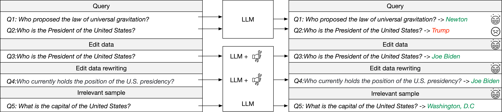
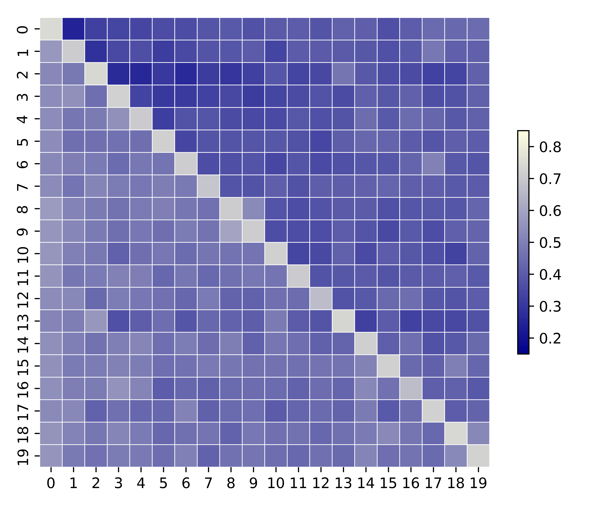
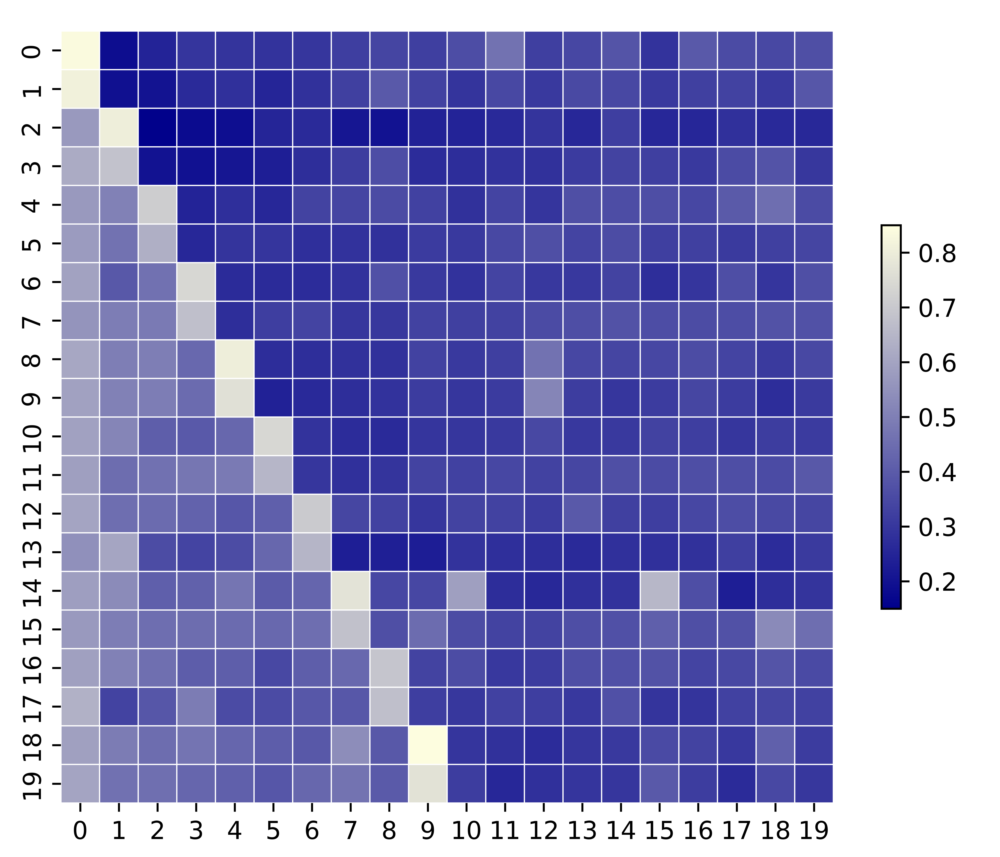
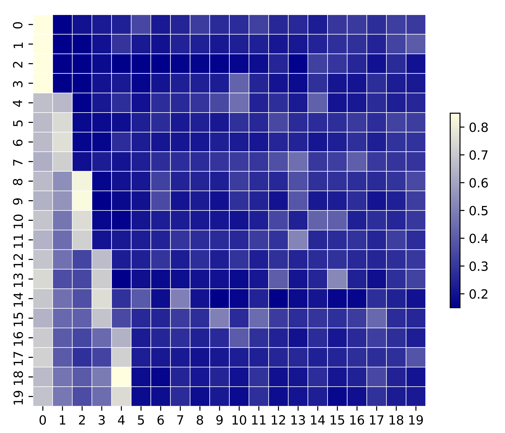
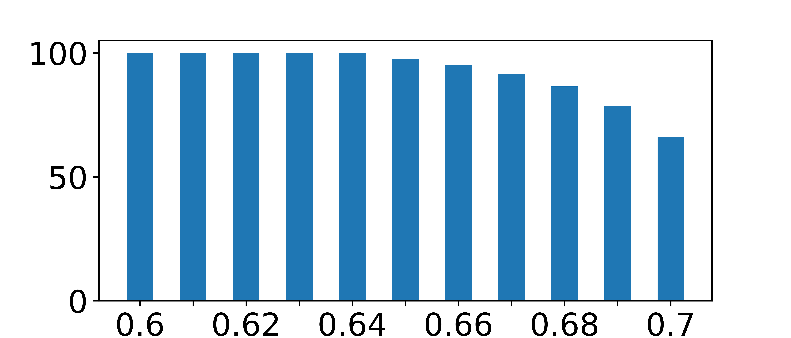
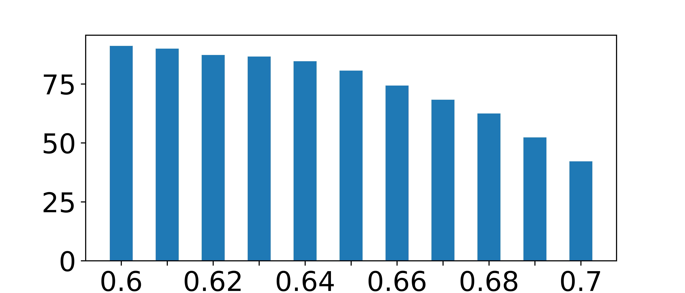
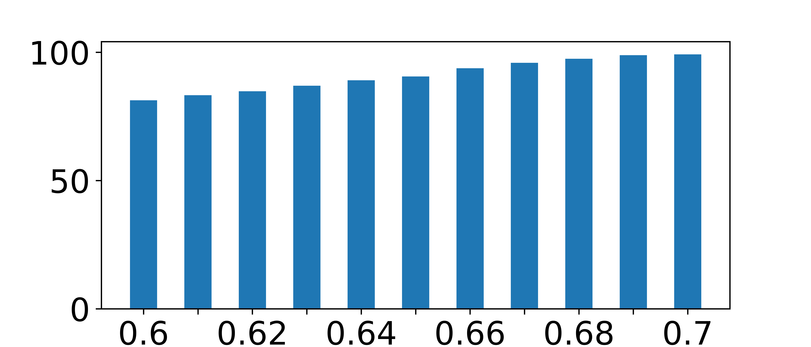
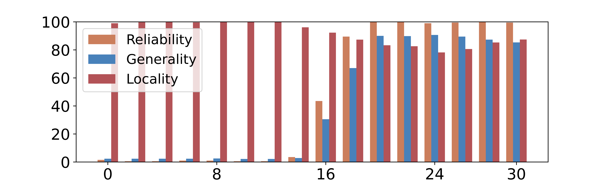

# 本文介绍了一种通过定制专家网络来实现模型编辑的可扩展方法。

发布时间：2024年04月03日

`LLM理论` `语言模型` `知识更新`

> Scalable Model Editing via Customized Expert Networks

# 摘要

> 要确保大型语言模型的可靠运用，解决其幻觉和陈旧知识问题非常关键。模型编辑开辟了一条成本有效的解决之道。但现有技术常因泛化能力不足和对非目标样本的副作用而受限。为此，我们提出了一种创新方案：通过定制专家网络实现可扩展的模型编辑（SCEN），它采用双阶段连续训练策略。首先，针对每项需更新的知识，独立训练一套轻量专家网络。接着，针对每位专家训练一个神经元，用以调控其活跃程度。在对 Llama2 7B 和 13B 两种规模的开源大型语言模型进行的实验中，我们的方法相较于传统模型编辑技术，达到了业界领先水平。相关代码已在 https: //github.com/TAL-auroraX/SCEN 上发布。

> Addressing the issue of hallucinations and outdated knowledge in large language models is critical for their reliable application. Model Editing presents a promising avenue for mitigating these challenges in a cost-effective manner. However, existing methods often suffer from unsatisfactory generalization and unintended effects on unrelated samples. To overcome these limitations, we introduce a novel approach: Scalable Model Editing via Customized Expert Networks (SCEN), which is a two-stage continuous training paradigm. Specifically, in the first stage, we train lightweight expert networks individually for each piece of knowledge that needs to be updated. Subsequently, we train a corresponding neuron for each expert to control the activation state of that expert. Our experiments on two different sizes of open-source large language models, the Llama2 7B and 13B, achieve state-of-the-art results compared to existing mainstream Model Editing methods. Our code is available at https: //github.com/TAL-auroraX/SCEN

[Arxiv](https://arxiv.org/abs/2404.02699)