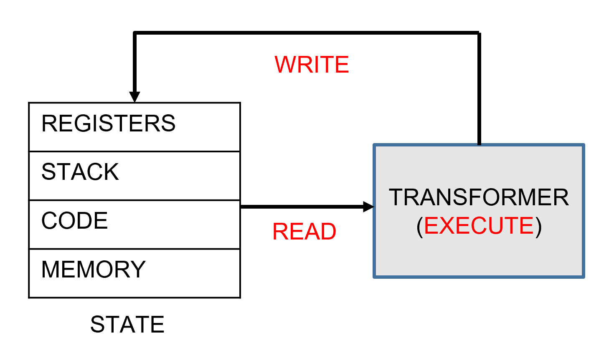
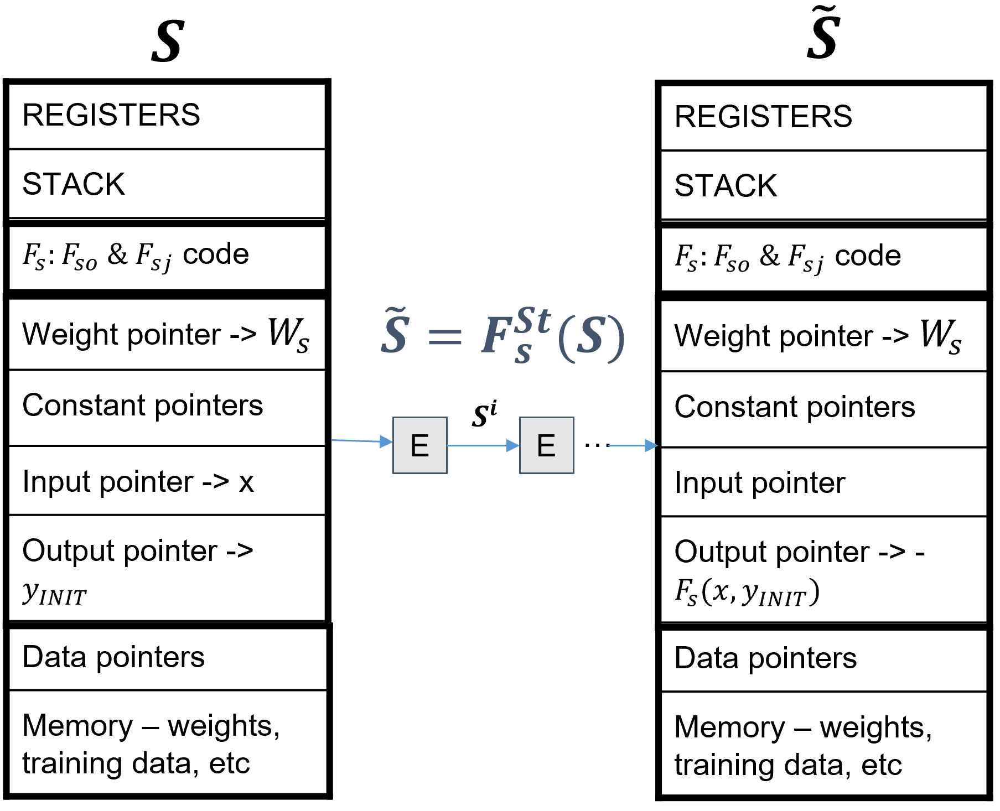
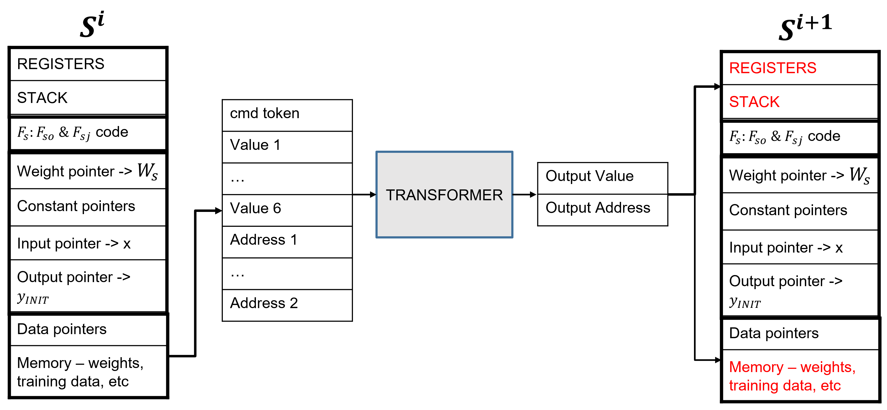

# 这种架构能够通过隐式组合的方式，适用于各种任务的算法归纳，不受特定任务的限制。

发布时间：2024年04月03日

`LLM理论` `机器学习` `多模态处理`

> Task Agnostic Architecture for Algorithm Induction via Implicit Composition

# 摘要

> 在应用机器学习领域，比如计算机视觉、语音处理和自然语言处理，人们一直在打造特定领域的解决方案。然而，目前我们正目睹一股逆流，即朝着开发更通用架构的方向发展，这一趋势得益于大型语言模型和多模态基础模型的兴起。这些新架构旨在应对各种任务，包括之前未曾遇到的，同时处理来自多个模态的输入。将这种泛化趋势推向极致，我们设想或许存在一种能够应对所有任务的单一深度网络架构。本文旨在探讨如何构建这样一个统一架构，并提出了一个理论框架。我们的设想基于几个假设：首先，任务的解决是通过一系列指令完成的，这些指令在传统硬件上通常以代码形式顺序执行；其次，最近的生成性AI，尤其是基于Transformer的模型，展现出作为广泛领域算法构建者的潜力。例如，GPT-4在上下文学习新任务方面的能力非凡，这似乎只能解释为它能够将先前学习到的算法片段组合成新的解决方案；第三，我们观察到，开发一个真正通用网络的主要障碍在于缺乏一种高效的自我一致输入方法，用于在网络内部前向传递过程中输入和组合先前学习的算法子步骤（隐式）。我们的研究深入分析了基于Transformer和其他算法在高效、正确组合算法方面的现有能力和局限，并提出了一个类似Transformer的架构和一个离散学习框架，以期克服这些挑战。

> Different fields in applied machine learning such as computer vision, speech or natural language processing have been building domain-specialised solutions. Currently, we are witnessing an opposing trend towards developing more generalist architectures, driven by Large Language Models and multi-modal foundational models. These architectures are designed to tackle a variety of tasks, including those previously unseen and using inputs across multiple modalities. Taking this trend of generalization to the extreme suggests the possibility of a single deep network architecture capable of solving all tasks. This position paper aims to explore developing such a unified architecture and proposes a theoretical framework of how it could be constructed. Our proposal is based on the following assumptions. Firstly, tasks are solved by following a sequence of instructions, typically implemented in code for conventional computing hardware, which inherently operates sequentially. Second, recent Generative AI, especially Transformer-based models, demonstrate potential as an architecture capable of constructing algorithms for a wide range of domains. For example, GPT-4 shows exceptional capability at in-context learning of novel tasks which is hard to explain in any other way than the ability to compose novel solutions from fragments on previously learnt algorithms. Third, the observation that the main missing component in developing a truly generalised network is an efficient approach for self-consistent input of previously learnt sub-steps of an algorithm and their (implicit) composition during the network's internal forward pass. Our exploration delves into current capabilities and limitations of Transformer-based and other methods in efficient and correct algorithm composition and proposes a Transformer-like architecture as well as a discrete learning framework to overcome these limitations.

[Arxiv](https://arxiv.org/abs/2404.02450)