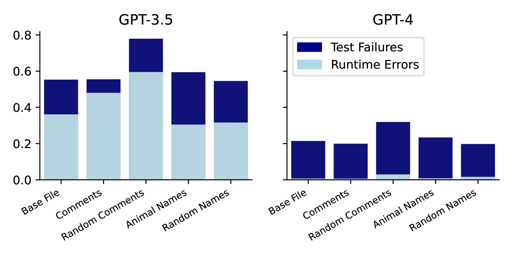
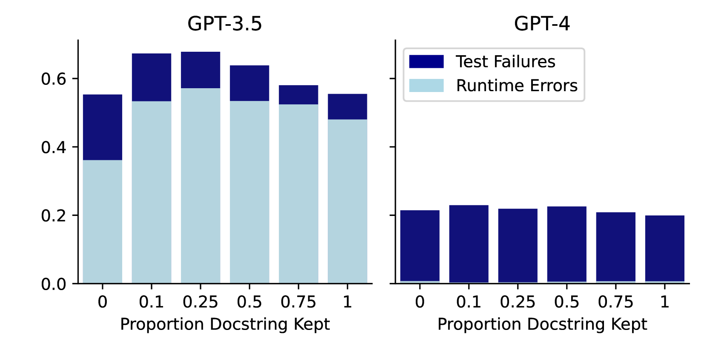
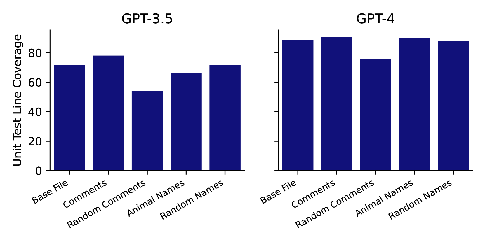
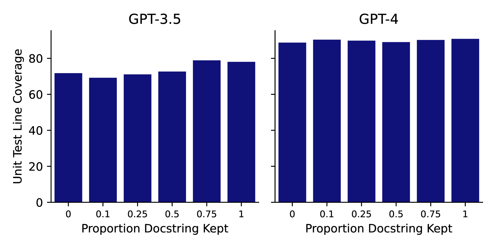

# 探究代码注释在提升大型语言模型对代码理解方面的作用

发布时间：2024年04月03日

`LLM应用` `软件开发` `代码生成`

> Testing the Effect of Code Documentation on Large Language Model Code Understanding

# 摘要

> 近年来，大型语言模型（LLMs）在代码生成和理解方面取得了显著成果。但关于文档和其他代码特性如何影响LLM的理解和代码生成能力，研究尚不充分。本研究通过实证分析发现，错误的文档会严重妨碍LLM对代码的理解，而文档的不完整或缺失对LLM理解代码的能力影响不大。

> Large Language Models (LLMs) have demonstrated impressive abilities in recent years with regards to code generation and understanding. However, little work has investigated how documentation and other code properties affect an LLM's ability to understand and generate code or documentation. We present an empirical analysis of how underlying properties of code or documentation can affect an LLM's capabilities. We show that providing an LLM with "incorrect" documentation can greatly hinder code understanding, while incomplete or missing documentation does not seem to significantly affect an LLM's ability to understand code.

[Arxiv](https://arxiv.org/abs/2404.03114)