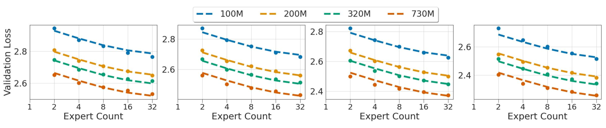
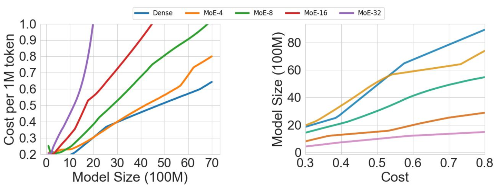
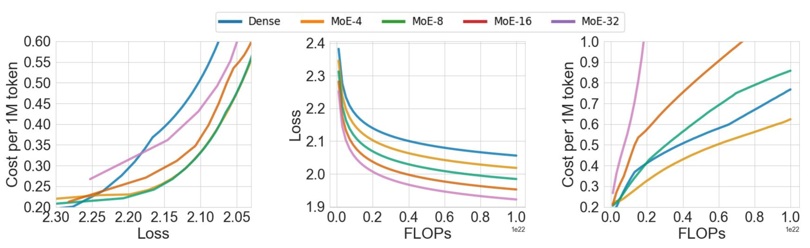
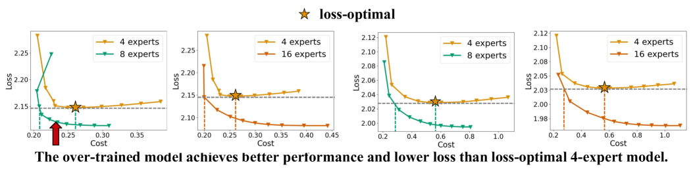
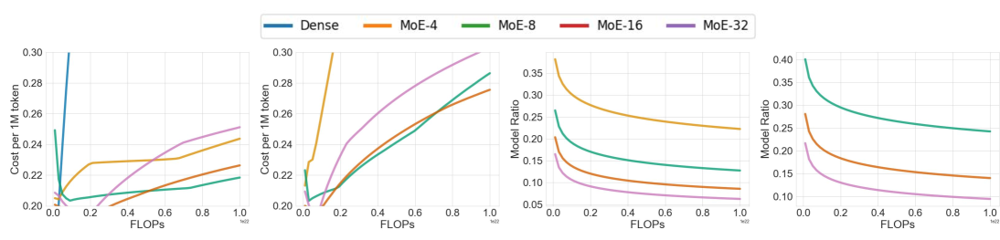
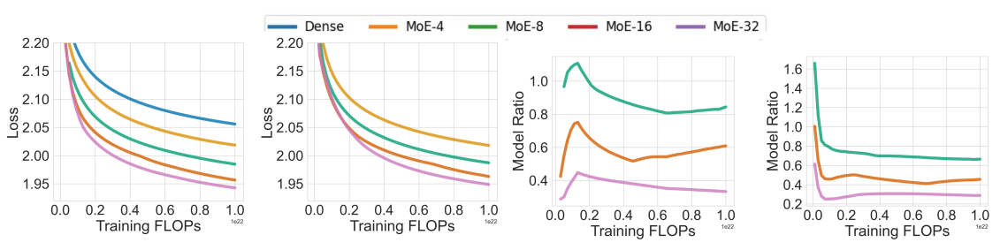
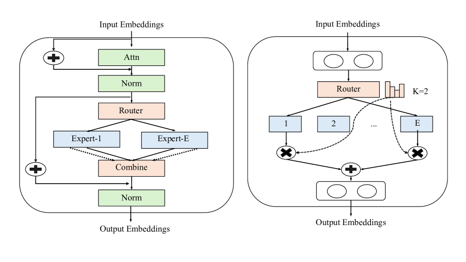
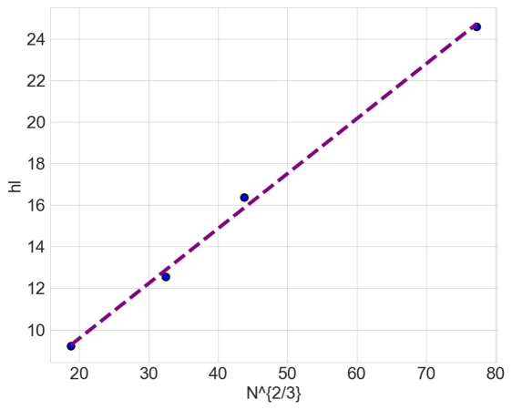

# 为实现最优化推理性能，我们探索了专家混合型大型语言模型的构建。

发布时间：2024年04月03日

`LLM理论` `混合专家架构` `大型语言模型`

> Toward Inference-optimal Mixture-of-Expert Large Language Models

# 摘要

> 采用混合专家（MoE）架构的大型语言模型，例如最新的Mixtral和DeepSeek-MoE，展现出在避免传统密集型变换器训练成本指数增长的同时扩大模型规模的显著优势。与密集型模型相似，MoE训练同样面临一个问题：在有限的训练预算下，如何平衡模型规模和令牌数量以达到最优分配？本研究探讨了MoE型LLMs的扩展规律，分析了模型性能、规模、数据集大小和专家数量之间的关系。我们的发现与以往在不同情境下对MoE的研究结果相一致，即增加专家数量的边际效益逐渐减少。然而，这似乎意味着我们应该增加专家数量直至达到饱和点，因为这样做训练成本不会增加，尽管这在推理阶段可能带来问题。我们建议在评估MoE扩展效果时，除了验证损失之外，还应考虑推理效率这一指标。研究显示，拥有4至8个专家的MoE在保持相同性能的同时，具有最高的服务效率，尽管其训练成本增加了2.5至3.5倍。相对地，训练一个包含16至32个专家的MoE，尽管规模较损失最优化模型小了70%至85%，但若配合更大的训练数据集，这在有限的训练预算下仍是一个充满潜力的方案。

> Mixture-of-Expert (MoE) based large language models (LLMs), such as the recent Mixtral and DeepSeek-MoE, have shown great promise in scaling model size without suffering from the quadratic growth of training cost of dense transformers. Like dense models, training MoEs requires answering the same question: given a training budget, what is the optimal allocation on the model size and number of tokens? We study the scaling law of MoE-based LLMs regarding the relations between the model performance, model size, dataset size, and the expert degree. Echoing previous research studying MoE in different contexts, we observe the diminishing return of increasing the number of experts, but this seems to suggest we should scale the number of experts until saturation, as the training cost would remain constant, which is problematic during inference time. We propose to amend the scaling law of MoE by introducing inference efficiency as another metric besides the validation loss. We find that MoEs with a few (4/8) experts are the most serving efficient solution under the same performance, but costs 2.5-3.5x more in training. On the other hand, training a (16/32) expert MoE much smaller (70-85%) than the loss-optimal solution, but with a larger training dataset is a promising setup under a training budget.

[Arxiv](https://arxiv.org/abs/2404.02852)