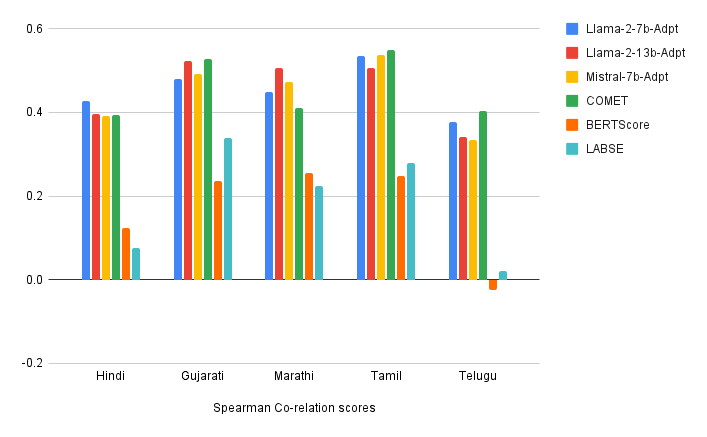
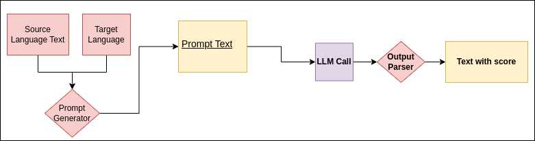

# 面向英语和印度语言的大型语言模型驱动的无参考翻译评估研究。

发布时间：2024年04月03日

`LLM应用` `自动翻译评估` `机器翻译`

> Towards Large Language Model driven Reference-less Translation Evaluation for English and Indian Languages

# 摘要

> 本研究致力于探索大型语言模型在自动无参考翻译评估的有效性，通过模拟人类的直接评估方法，对英语和印度语言的翻译质量进行打分。我们创建了一个翻译评估任务，采用零-shot学习、上下文示例驱动学习以及大型语言模型的微调，评分范围为1至100，100分代表完美翻译，1分则意味着翻译质量不佳。通过与COMET、BERT-Scorer和LABSE等现有评估方法对比，我们发现基于LLM的评估器（LLaMA-2-13B）在评估印度语言对时，其与人类评价的相关性相当甚至更高。

> With the primary focus on evaluating the effectiveness of large language models for automatic reference-less translation assessment, this work presents our experiments on mimicking human direct assessment to evaluate the quality of translations in English and Indian languages. We constructed a translation evaluation task where we performed zero-shot learning, in-context example-driven learning, and fine-tuning of large language models to provide a score out of 100, where 100 represents a perfect translation and 1 represents a poor translation. We compared the performance of our trained systems with existing methods such as COMET, BERT-Scorer, and LABSE, and found that the LLM-based evaluator (LLaMA-2-13B) achieves a comparable or higher overall correlation with human judgments for the considered Indian language pairs.

[Arxiv](https://arxiv.org/abs/2404.02512)