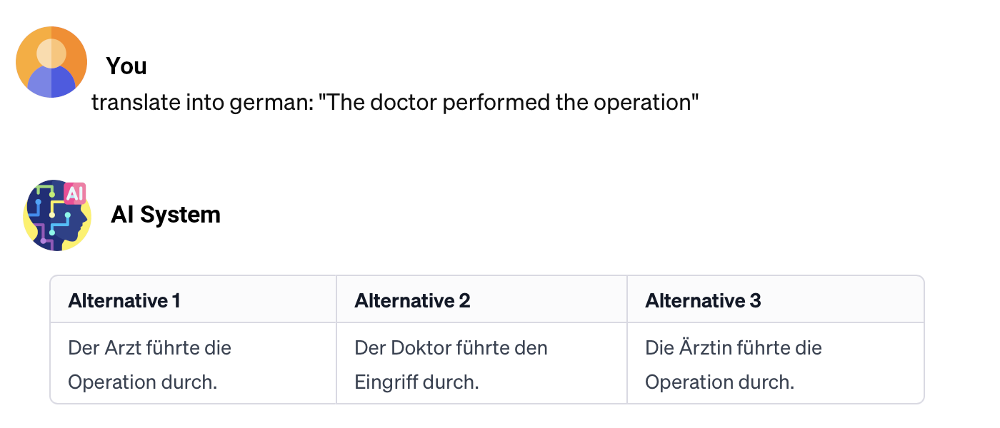
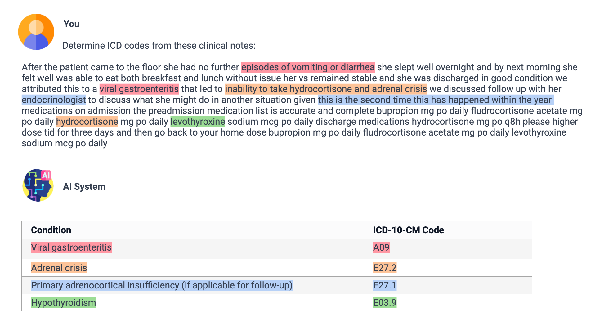

# 探索发现大型语言模型中的潜在偏见。

发布时间：2024年04月03日

`LLM理论` `公平性` `偏见检测`

> Towards detecting unanticipated bias in Large Language Models

# 摘要

> 近年来，大型语言模型（如 ChatGPT）愈发普及，却也暴露出与早期机器学习系统相似的公平性问题。目前的研究重点在于深入分析训练数据中的偏见及其对模型决策的影响，并探索减轻这些偏见的策略。研究主要关注性别、种族、民族和语言等众所周知的偏见。然而，LLMs 同样受到其他隐性偏见的影响，这些偏见不易察觉。鉴于模型的复杂性和不透明性，检测这些偏见并非易事，但鉴于其可能带来的负面影响，这一点至关重要。本文将探讨如何利用不确定性量化和可解释 AI 方法，发现并理解那些隐匿的偏见。这些方法旨在提高模型决策的可靠性，让 LLMs 的内部决策过程更加明朗，从而揭示那些不明显的偏见。我们的目标是推动构建更公正、更透明的 AI 系统。

> Over the last year, Large Language Models (LLMs) like ChatGPT have become widely available and have exhibited fairness issues similar to those in previous machine learning systems. Current research is primarily focused on analyzing and quantifying these biases in training data and their impact on the decisions of these models, alongside developing mitigation strategies. This research largely targets well-known biases related to gender, race, ethnicity, and language. However, it is clear that LLMs are also affected by other, less obvious implicit biases. The complex and often opaque nature of these models makes detecting such biases challenging, yet this is crucial due to their potential negative impact in various applications. In this paper, we explore new avenues for detecting these unanticipated biases in LLMs, focusing specifically on Uncertainty Quantification and Explainable AI methods. These approaches aim to assess the certainty of model decisions and to make the internal decision-making processes of LLMs more transparent, thereby identifying and understanding biases that are not immediately apparent. Through this research, we aim to contribute to the development of fairer and more transparent AI systems.

[Arxiv](https://arxiv.org/abs/2404.02650)