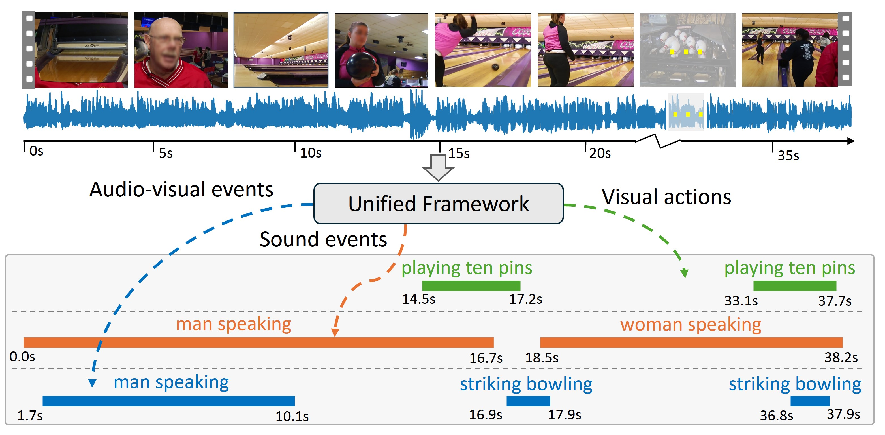
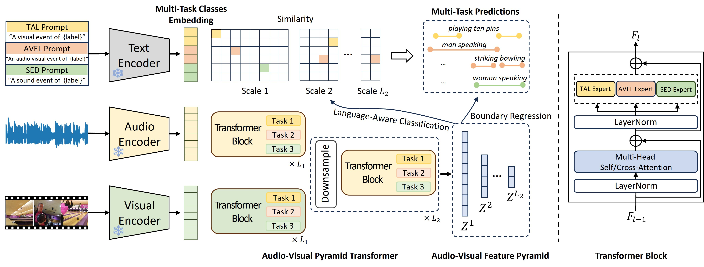
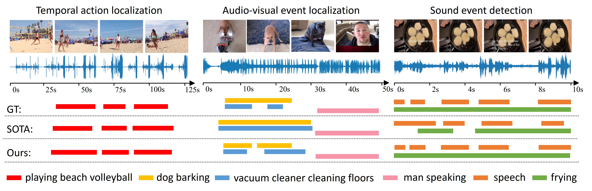
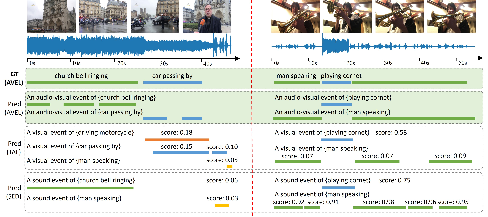
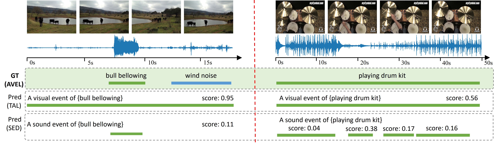
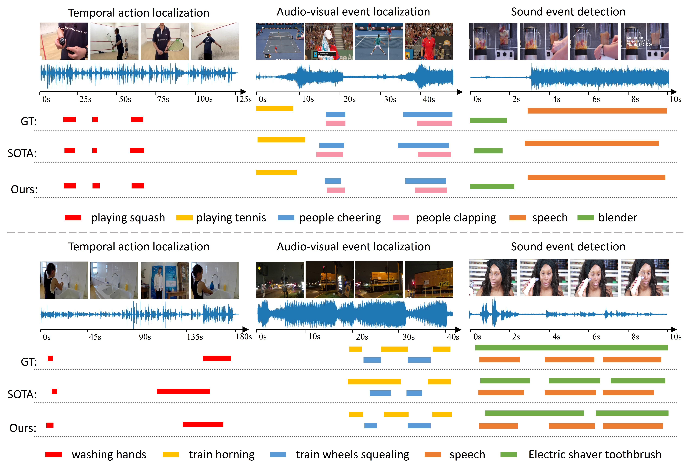
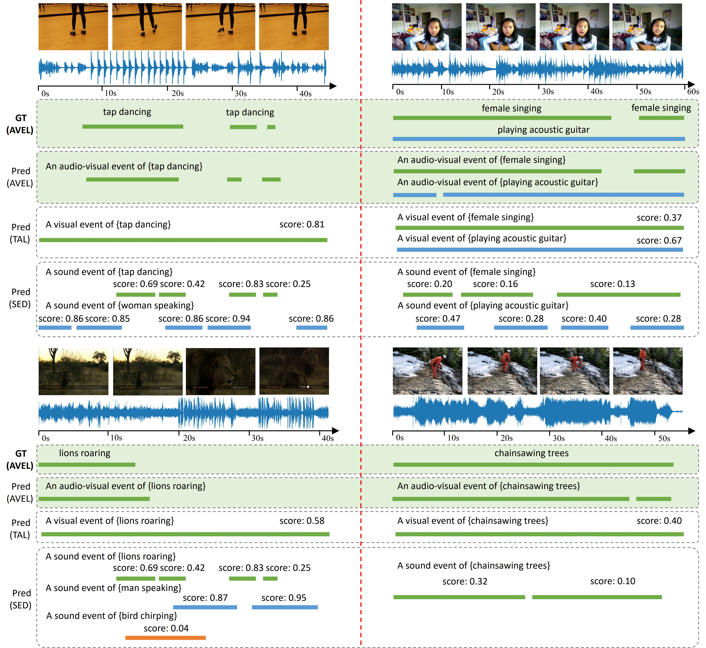
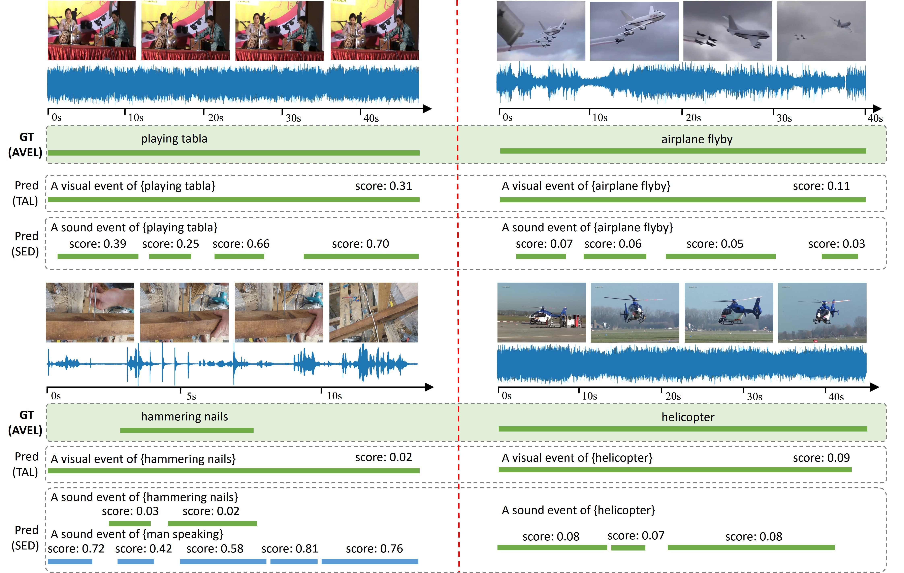

# UniAV：集视听感知于一体，实现多任务视频精准定位

发布时间：2024年04月03日

`Agent` `视频处理` `人工智能`

> UniAV: Unified Audio-Visual Perception for Multi-Task Video Localization

# 摘要

> 视频定位任务致力于在视频中精确找到特定场景，涵盖动作定位、声音事件检测和音视频事件定位等领域。然而，现有研究往往针对各个任务独立开展，忽略了这些场景在同一视频中的共生关系。本研究提出了UniAV，一种创新的音视频一体化感知网络，首次实现了这三项任务的协同学习。UniAV能够整合各类任务特定数据集中的丰富信息，让模型跨任务和感官学习共享互惠知识。面对数据集差异大和任务特性多样的挑战，我们设计了统一的视觉和音频编码方式，提取通用特征表示，并针对每个任务定制专家系统，捕捉独到知识。此外，结合预训练文本编码器，我们开发了一种通用的语言感知分类器，使得模型能够通过调整提示词灵活识别各类场景，包括之前未见过的实例。UniAV在参数数量更少的情况下，显著超越了单一任务模型，并在多个权威基准测试中达到了与顶尖特定任务方法相媲美或更优的性能。

> Video localization tasks aim to temporally locate specific instances in videos, including temporal action localization (TAL), sound event detection (SED) and audio-visual event localization (AVEL). Existing methods over-specialize on each task, overlooking the fact that these instances often occur in the same video to form the complete video content. In this work, we present UniAV, a Unified Audio-Visual perception network, to achieve joint learning of TAL, SED and AVEL tasks for the first time. UniAV can leverage diverse data available in task-specific datasets, allowing the model to learn and share mutually beneficial knowledge across tasks and modalities. To tackle the challenges posed by substantial variations in datasets (size/domain/duration) and distinct task characteristics, we propose to uniformly encode visual and audio modalities of all videos to derive generic representations, while also designing task-specific experts to capture unique knowledge for each task. Besides, we develop a unified language-aware classifier by utilizing a pre-trained text encoder, enabling the model to flexibly detect various types of instances and previously unseen ones by simply changing prompts during inference. UniAV outperforms its single-task counterparts by a large margin with fewer parameters, achieving on-par or superior performances compared to state-of-the-art task-specific methods across ActivityNet 1.3, DESED and UnAV-100 benchmarks.

[Arxiv](https://arxiv.org/abs/2404.03179)