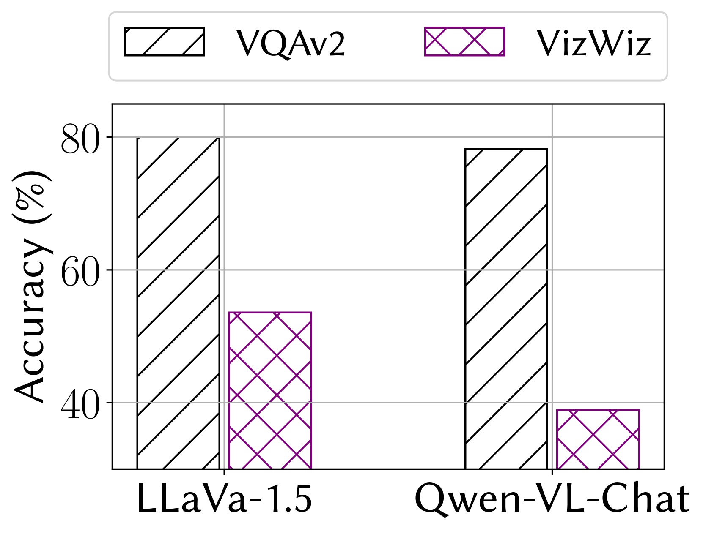
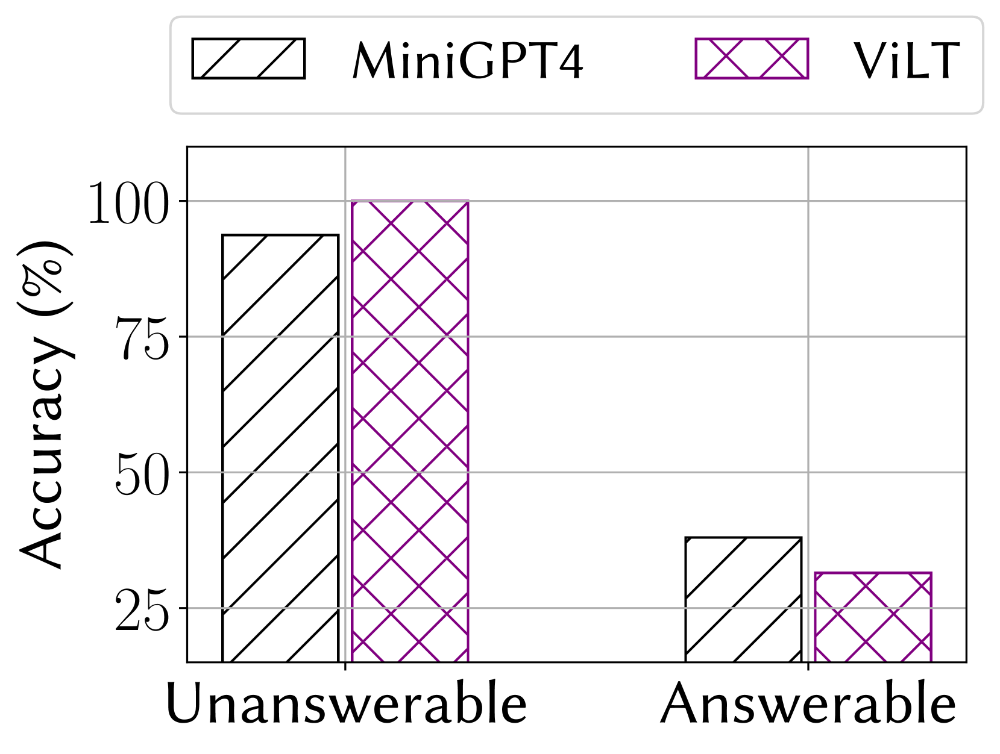
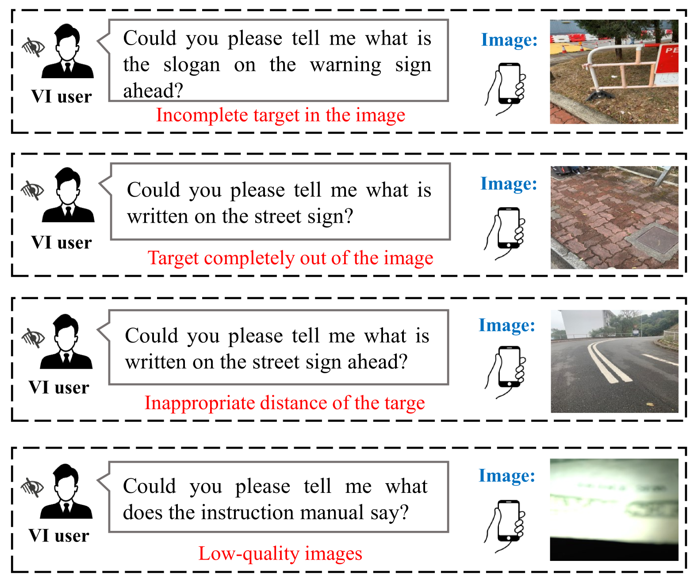
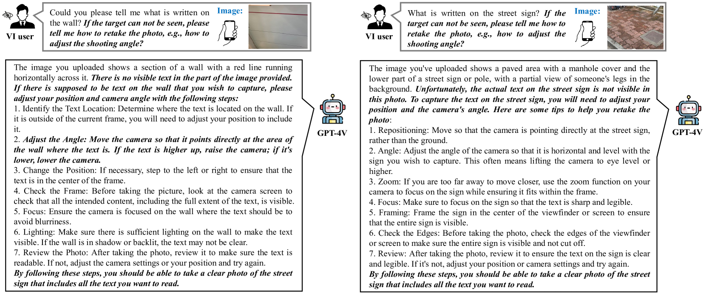
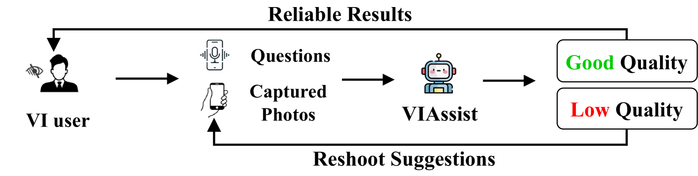
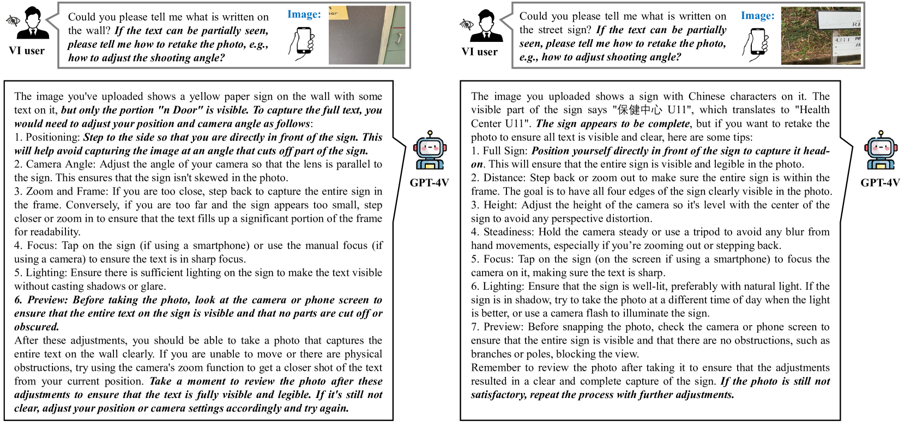
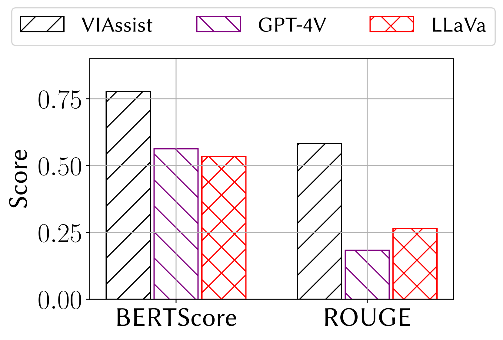
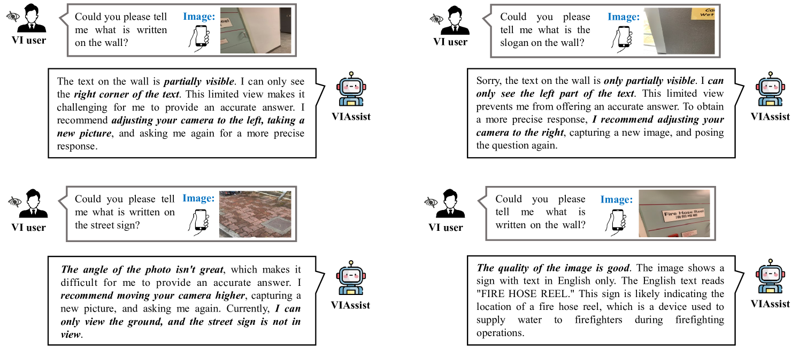

# VIAssist：为视障用户定制的多模态大型语言模型

发布时间：2024年04月03日

`LLM应用` `辅助技术` `多模态处理`

> VIAssist: Adapting Multi-modal Large Language Models for Users with Visual Impairments

# 摘要

> 视力受损者，无论是部分还是完全视觉障碍，全球约有22亿人的生活受到影响。多模态大型语言模型（MLLMs）的最新进展在多个领域展现了其卓越能力，我们期望借助这些能力来协助视力受损者。然而，由于难以获取满足日常需求的理想图像，视力受损者在使用MLLMs时遇到了难题。例如，图像中的目标物体可能没有完整或部分地呈现。本文研究了如何利用MLLMs帮助视力受损者获取视觉问题的答案。VIAssist能够筛选出不合适的图像并采取相应措施。最终，基于图像信息，VIAssist能够为用户提供准确的答案。研究结果显示，VIAssist的答案在BERTScore和ROUGE评价指标上，比基线分别提高了0.21和0.31。

> Individuals with visual impairments, encompassing both partial and total difficulties in visual perception, are referred to as visually impaired (VI) people. An estimated 2.2 billion individuals worldwide are affected by visual impairments. Recent advancements in multi-modal large language models (MLLMs) have showcased their extraordinary capabilities across various domains. It is desirable to help VI individuals with MLLMs' great capabilities of visual understanding and reasoning. However, it is challenging for VI people to use MLLMs due to the difficulties in capturing the desirable images to fulfill their daily requests. For example, the target object is not fully or partially placed in the image. This paper explores how to leverage MLLMs for VI individuals to provide visual-question answers. VIAssist can identify undesired images and provide detailed actions. Finally, VIAssist can provide reliable answers to users' queries based on the images. Our results show that VIAssist provides +0.21 and +0.31 higher BERTScore and ROUGE scores than the baseline, respectively.

[Arxiv](https://arxiv.org/abs/2404.02508)