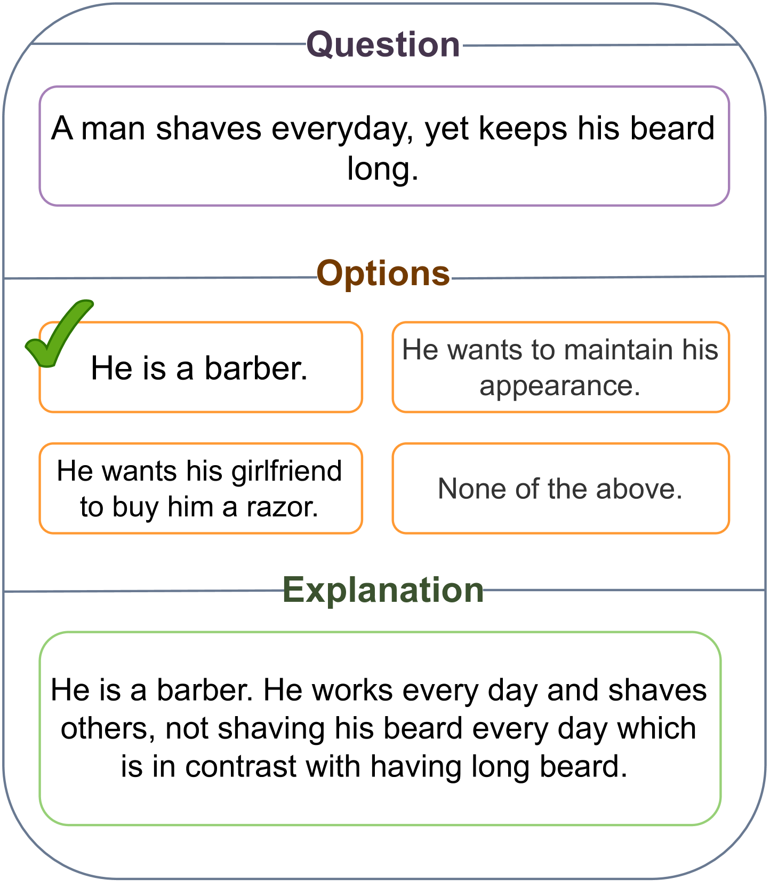
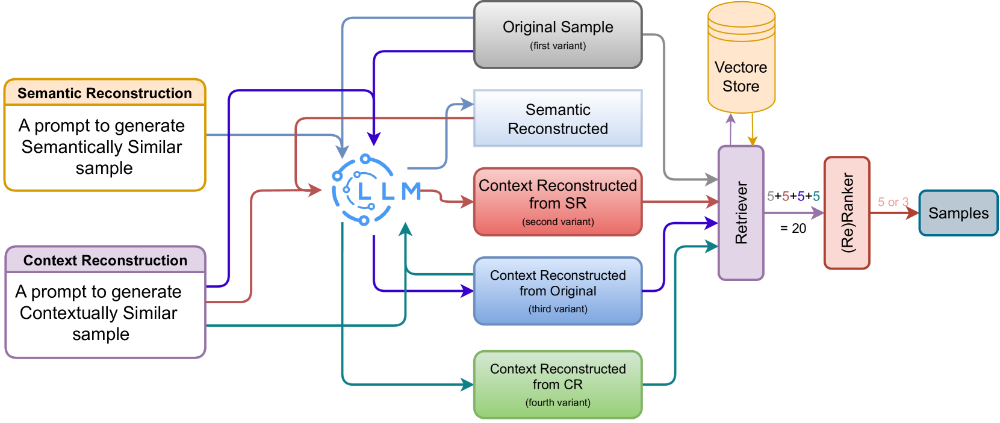
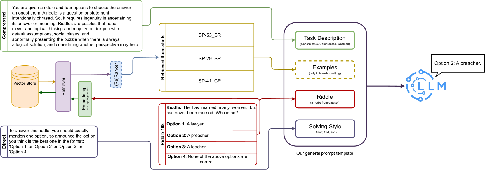
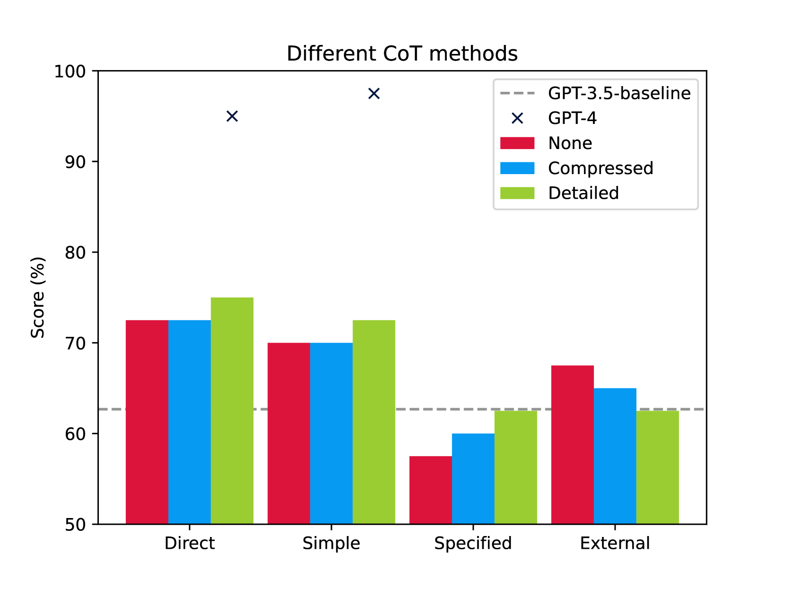
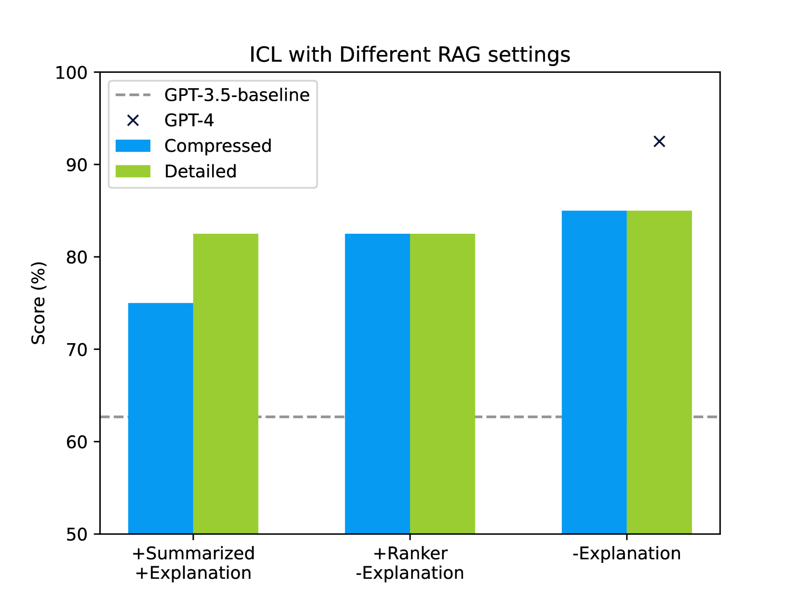

# uTeBC-NLP 参与 SemEval-2024 的第 9 项任务，探讨大型语言模型是否能够进行横向思考。

发布时间：2024年04月03日

`LLM应用` `人工智能`

> uTeBC-NLP at SemEval-2024 Task 9: Can LLMs be Lateral Thinkers?

# 摘要

> 借鉴人类思维，蒋团队（2023c）设计了一项测试，专门评估大型语言模型（LLMs）的创新思维能力——即跳出常规的思考方式。我们进一步探讨了各种提示技巧如何助力LLMs在这一任务上的表现，以展现它们在非常规思维上的潜力。参与SemEval-2024的句子谜题挑战，我们尝试了思维链（CoT）、直接提示、丰富描述提示，以及结合检索增强生成（RAG）技术的情境提示。实验涵盖了GPT-3.5、GPT-4和Zephyr-7B-beta三款LLMs。利用GPT-4，我们构建了一个连接谜题与选项的思考路径数据集，并经人工审核确保其质量。研究结果显示，简洁而信息丰富的提示能有效提升模型性能。动态上下文学习对模型的提升尤为显著。此外，针对我们的数据库对Zephyr模型进行微调后，其在多个常识推理数据集上的性能也得到了提升，这验证了创新思维的重要性。

> Inspired by human cognition, Jiang et al.(2023c) create a benchmark for assessing LLMs' lateral thinking-thinking outside the box. Building upon this benchmark, we investigate how different prompting methods enhance LLMs' performance on this task to reveal their inherent power for outside-the-box thinking ability. Through participating in SemEval-2024, task 9, Sentence Puzzle sub-task, we explore prompt engineering methods: chain of thoughts (CoT) and direct prompting, enhancing with informative descriptions, and employing contextualizing prompts using a retrieval augmented generation (RAG) pipeline. Our experiments involve three LLMs including GPT-3.5, GPT-4, and Zephyr-7B-beta. We generate a dataset of thinking paths between riddles and options using GPT-4, validated by humans for quality. Findings indicate that compressed informative prompts enhance performance. Dynamic in-context learning enhances model performance significantly. Furthermore, fine-tuning Zephyr on our dataset enhances performance across other commonsense datasets, underscoring the value of innovative thinking.

[Arxiv](https://arxiv.org/abs/2404.02474)