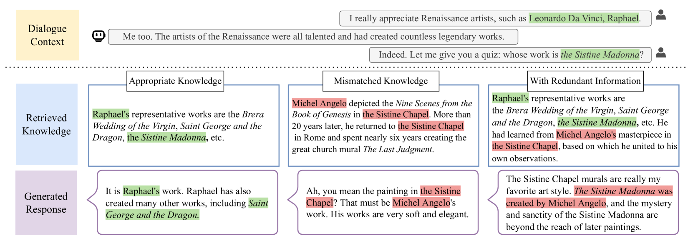
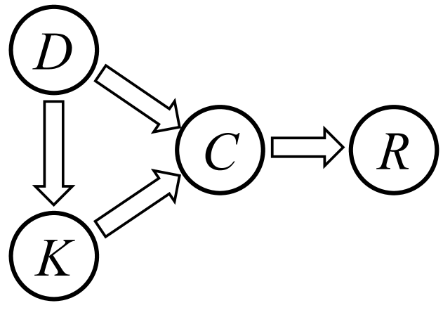
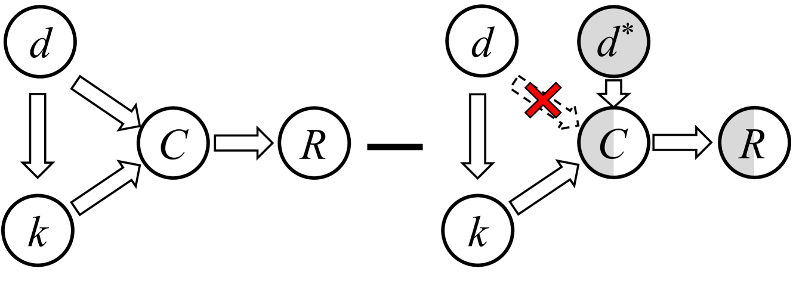
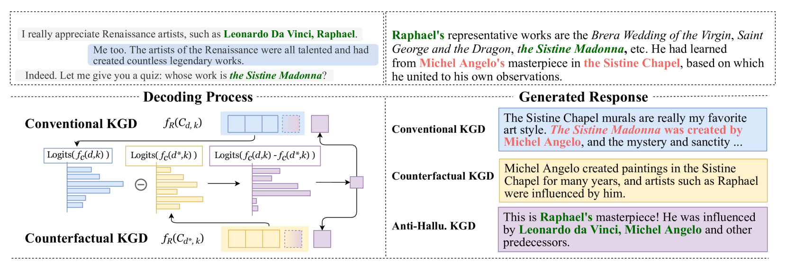

# 本文通过因果分析，探讨了如何减轻知识引导对话生成中的知识幻觉问题。

发布时间：2024年04月04日

`LLM应用` `对话系统` `知识引导`

> A Cause-Effect Look at Alleviating Hallucination of Knowledge-grounded Dialogue Generation

# 摘要

> 借助大规模预训练语言模型，当前对话系统在流畅自然的对话中表现出色。但幻觉问题仍困扰着它们，导致生成回答中出现不实之词。为解决这一难题，知识引导对话生成模型通过引入外部知识资源，有效减少了幻觉现象。一些研究已在这方面取得了显著成果。然而，知识噪声也可能引发幻觉，因此迫切需要探究其原因，并为构建KGD任务中的抗噪方法指明方向。本文通过反事实推理剖析了这一问题的根源，并提出了一种新方案，通过对话与知识的互动来减轻幻觉。实验证明，该方法能有效降低幻觉，同时不影响对话系统的整体表现，并适用于多种生成模型。我们期望此研究能推动更多关注，助力开发出更加稳健可信的轻量级对话技术。

> Empowered by the large-scale pretrained language models, existing dialogue systems have demonstrated impressive performance conducting fluent and natural-sounding conversations. However, they are still plagued by the hallucination problem, causing unpredictable factual errors in the generated responses. Recently, knowledge-grounded dialogue generation models, that intentionally invoke external knowledge resources to more informative responses, are also proven to be effective in reducing hallucination. Following the idea of getting high-quality knowledge, a few efforts have achieved pretty good performance on this issue. As some inevitable knowledge noises may also lead to hallucinations, it is emergent to investigate the reason and future directions for building noise-tolerant methods in KGD tasks. In this paper, we analyze the causal story behind this problem with counterfactual reasoning methods. Based on the causal effect analysis, we propose a possible solution for alleviating the hallucination in KGD by exploiting the dialogue-knowledge interaction. Experimental results of our example implementation show that this method can reduce hallucination without disrupting other dialogue performance, while keeping adaptive to different generation models. We hope our efforts can support and call for more attention to developing lightweight techniques towards robust and trusty dialogue systems.

[Arxiv](https://arxiv.org/abs/2404.03491)