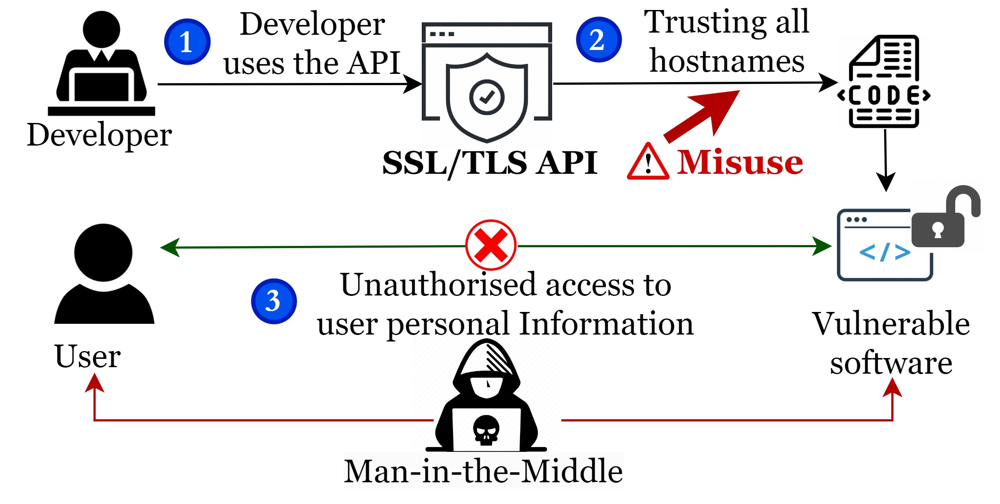
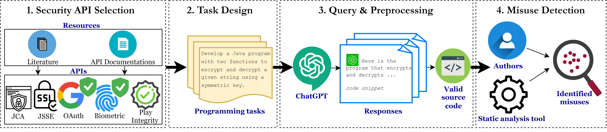
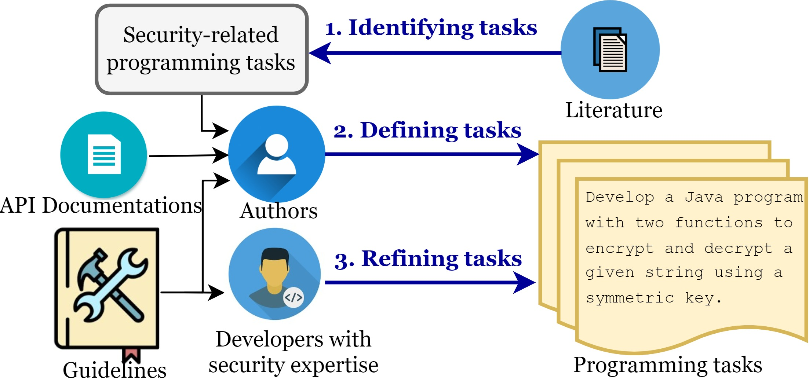
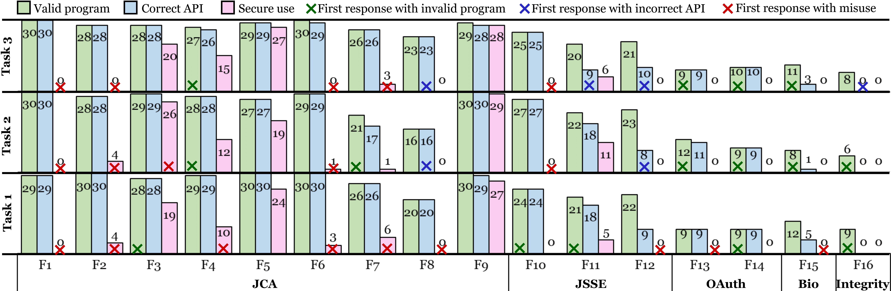
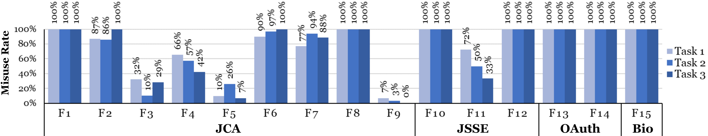

# 探究大型语言模型不当使用 Java 安全接口问题

发布时间：2024年04月04日

`LLM应用` `软件安全` `编程语言`

> An Investigation into Misuse of Java Security APIs by Large Language Models

# 摘要

> 随着大型语言模型（LLMs）在代码生成领域的应用日益增多，它们能否生成可靠的代码成为了一个值得关注的问题。众多研究者正尝试利用代码生成技术来发现软件的安全漏洞，但安全应用程序编程接口（APIs）的重要性常被忽略。APIs对于保障软件安全至关重要，然而，如何有效地整合安全APIs却是一项艰巨的挑战。这往往导致开发者在不知情的情况下误用APIs，增加了软件的安全隐患。为应对这一问题，开发者或许能从LLMs那里获得支持。本文系统性地评估了ChatGPT在Java安全API应用场景中代码生成的可信性。我们汇集了48个编程任务，涉及5种常用的安全APIs，以进行全面的评估。我们结合自动化和人工方法，对ChatGPT生成的代码中的安全API误用进行了有效检测。研究结果令人忧虑：在每项任务30次尝试中，约70%的代码实例存在安全API误用，共发现20种不同的误用情形。更令人担忧的是，对于近一半的任务，误用率达到了100%，这表明开发者在依赖ChatGPT来安全地实现安全API代码之前，仍有很长的路要走。

> The increasing trend of using Large Language Models (LLMs) for code generation raises the question of their capability to generate trustworthy code. While many researchers are exploring the utility of code generation for uncovering software vulnerabilities, one crucial but often overlooked aspect is the security Application Programming Interfaces (APIs). APIs play an integral role in upholding software security, yet effectively integrating security APIs presents substantial challenges. This leads to inadvertent misuse by developers, thereby exposing software to vulnerabilities. To overcome these challenges, developers may seek assistance from LLMs. In this paper, we systematically assess ChatGPT's trustworthiness in code generation for security API use cases in Java. To conduct a thorough evaluation, we compile an extensive collection of 48 programming tasks for 5 widely used security APIs. We employ both automated and manual approaches to effectively detect security API misuse in the code generated by ChatGPT for these tasks. Our findings are concerning: around 70% of the code instances across 30 attempts per task contain security API misuse, with 20 distinct misuse types identified. Moreover, for roughly half of the tasks, this rate reaches 100%, indicating that there is a long way to go before developers can rely on ChatGPT to securely implement security API code.

[Arxiv](https://arxiv.org/abs/2404.03823)