# AutoWebGLM：利用自助法和强化策略，打造一款基于大型语言模型的智能网络浏览助手。

发布时间：2024年04月04日

`Agent` `网页导航` `人工智能代理`

> AutoWebGLM: Bootstrap And Reinforce A Large Language Model-based Web Navigating Agent

# 摘要

> 大型语言模型（LLMs）为智能代理任务如网页导航提供了强大动力，然而，由于网页上行动的多样性、HTML文本超出处理能力以及开放领域决策的复杂性，现有代理在现实网页上的表现并不尽如人意。为此，我们推出了AutoWebGLM，一款超越GPT-4的自动化网页导航代理，它基于ChatGLM3-6B并模仿人类浏览习惯，通过HTML简化算法精准捕捉网页核心信息。我们采用人机协作方式构建训练数据，并通过强化学习与拒绝采样技术对模型进行优化，以提升网页理解、浏览器操作和任务分解的效率。我们创建了双语的AutoWebBench基准，用于评估真实网页浏览任务，并通过多项基准测试展示了AutoWebGLM的进步和应对真实环境的挑战。相关资源将在 \url{https://github.com/THUDM/AutoWebGLM} 上线。

> Large language models (LLMs) have fueled many intelligent agent tasks, such as web navigation -- but most existing agents perform far from satisfying in real-world webpages due to three factors: (1) the versatility of actions on webpages, (2) HTML text exceeding model processing capacity, and (3) the complexity of decision-making due to the open-domain nature of web. In light of the challenge, we develop AutoWebGLM, a GPT-4-outperforming automated web navigation agent built upon ChatGLM3-6B. Inspired by human browsing patterns, we design an HTML simplification algorithm to represent webpages, preserving vital information succinctly. We employ a hybrid human-AI method to build web browsing data for curriculum training. Then, we bootstrap the model by reinforcement learning and rejection sampling to further facilitate webpage comprehension, browser operations, and efficient task decomposition by itself. For testing, we establish a bilingual benchmark -- AutoWebBench -- for real-world web browsing tasks. We evaluate AutoWebGLM across diverse web navigation benchmarks, revealing its improvements but also underlying challenges to tackle real environments. Related code, model, and data will be released at \url{https://github.com/THUDM/AutoWebGLM}.

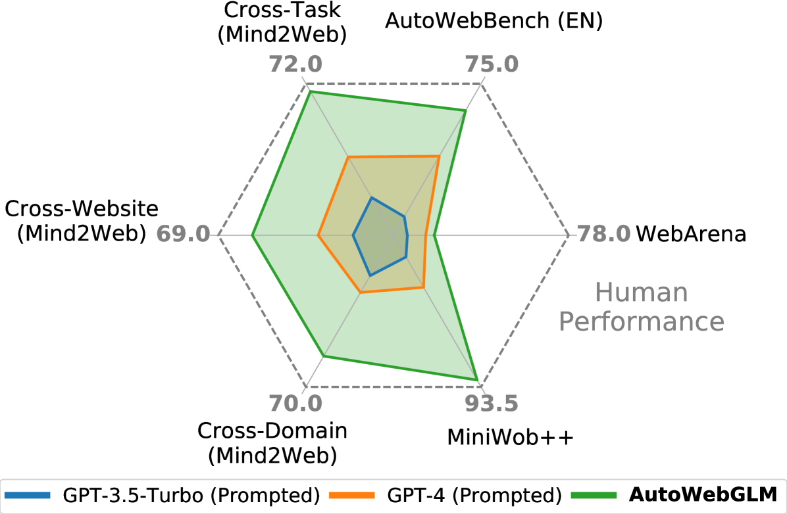

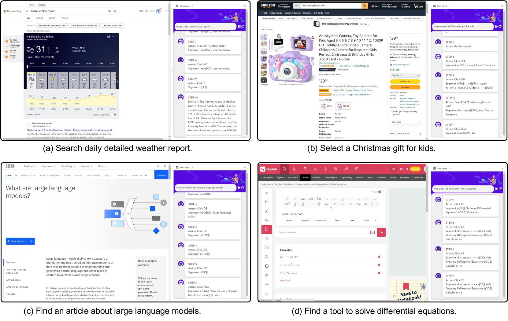

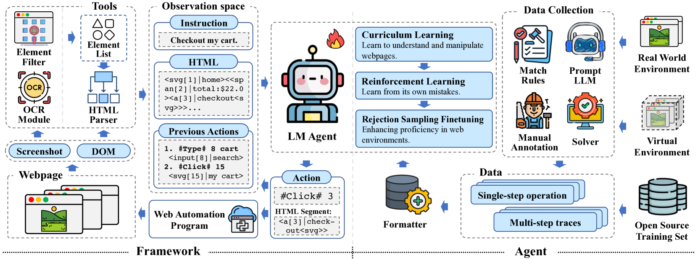

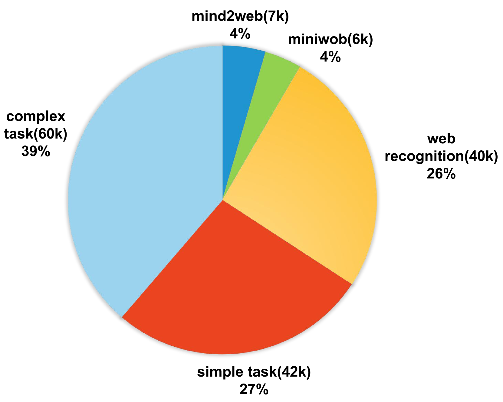

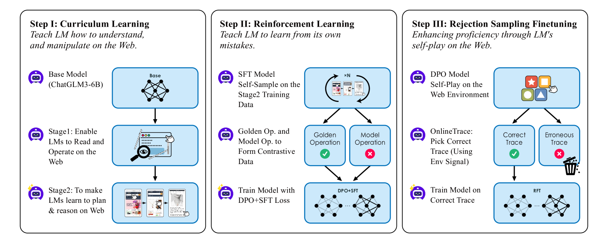

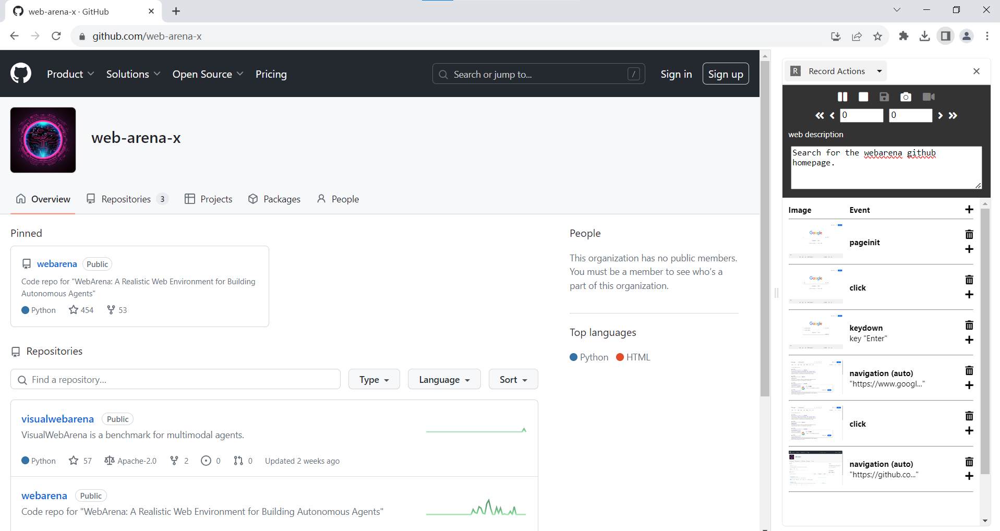

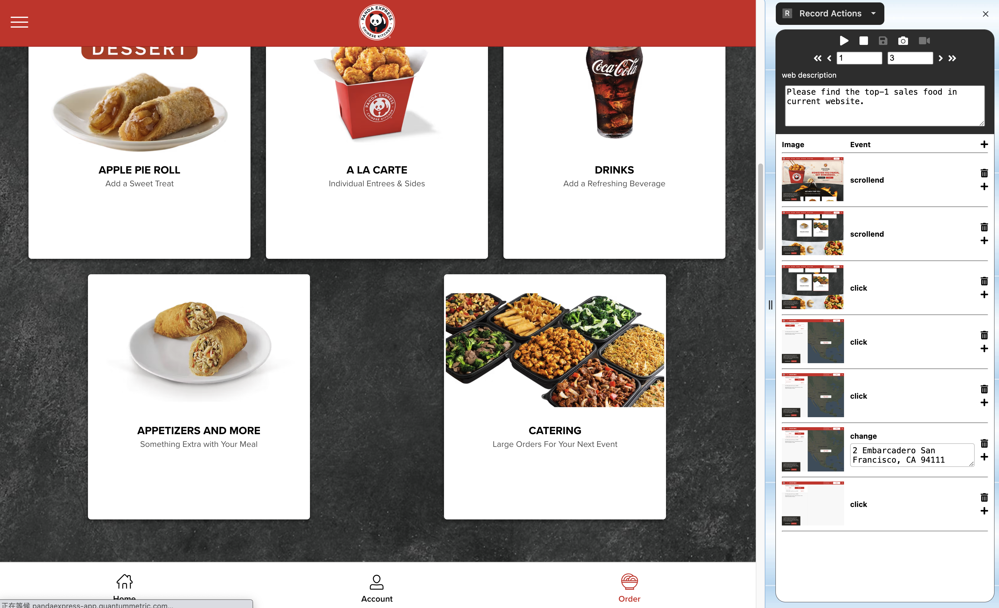

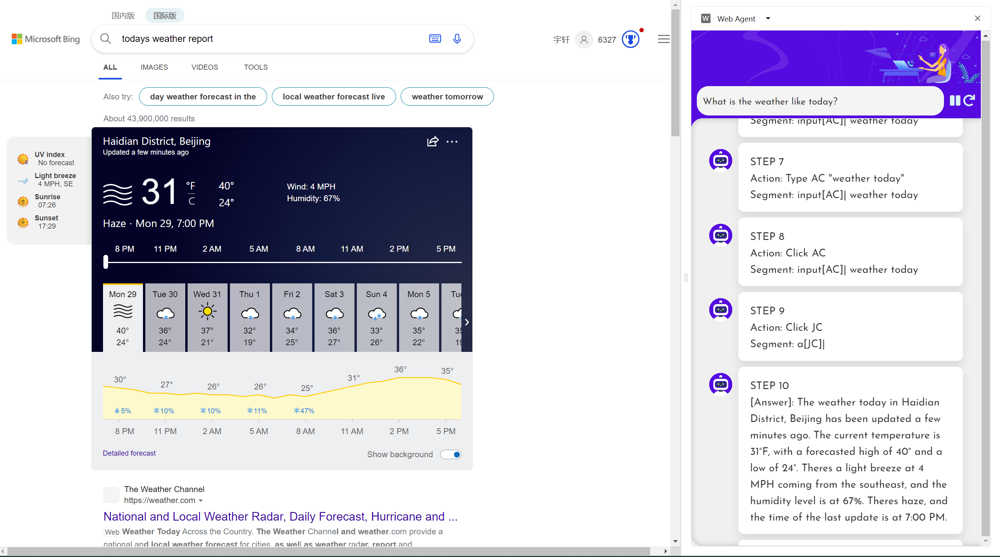

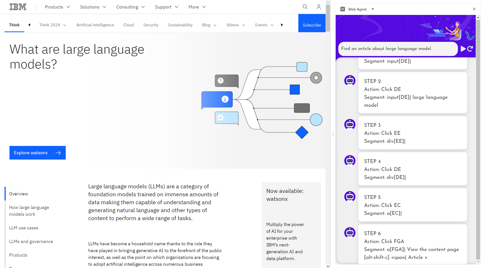

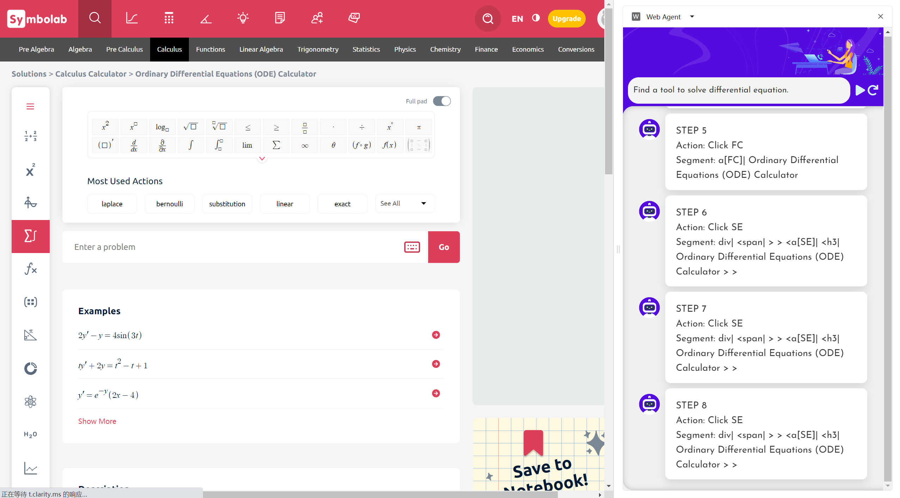

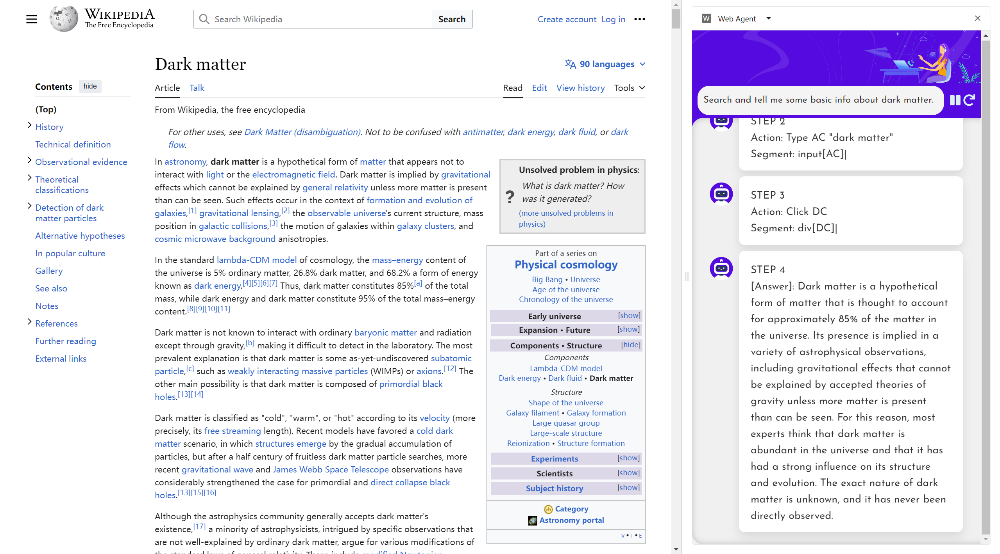

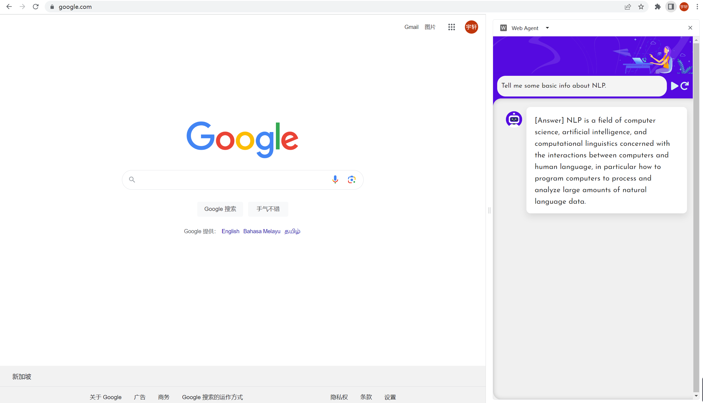

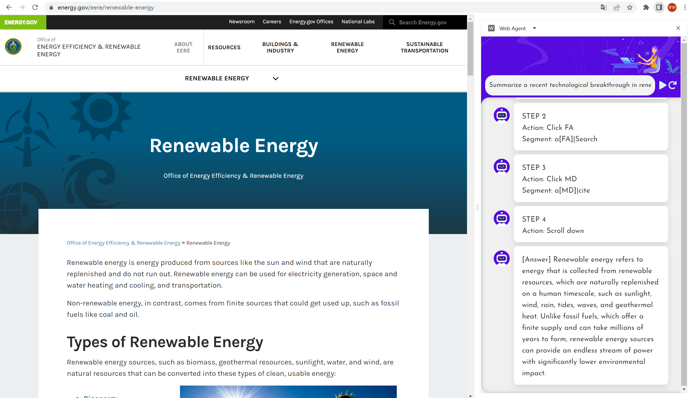

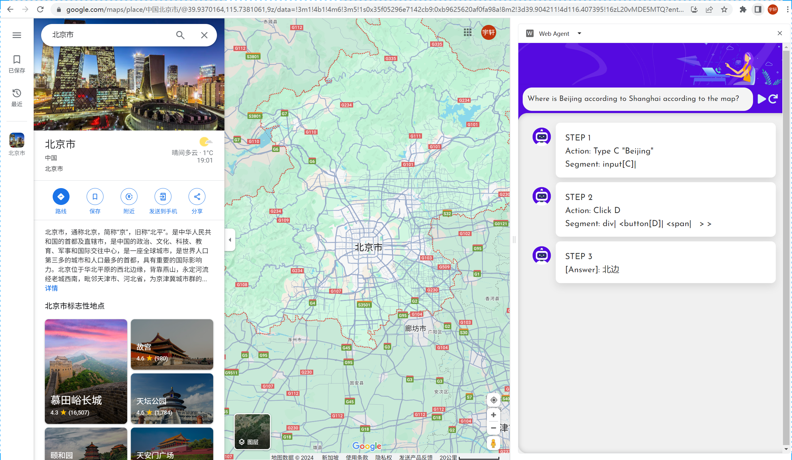

[Arxiv](https://arxiv.org/abs/2404.03648)