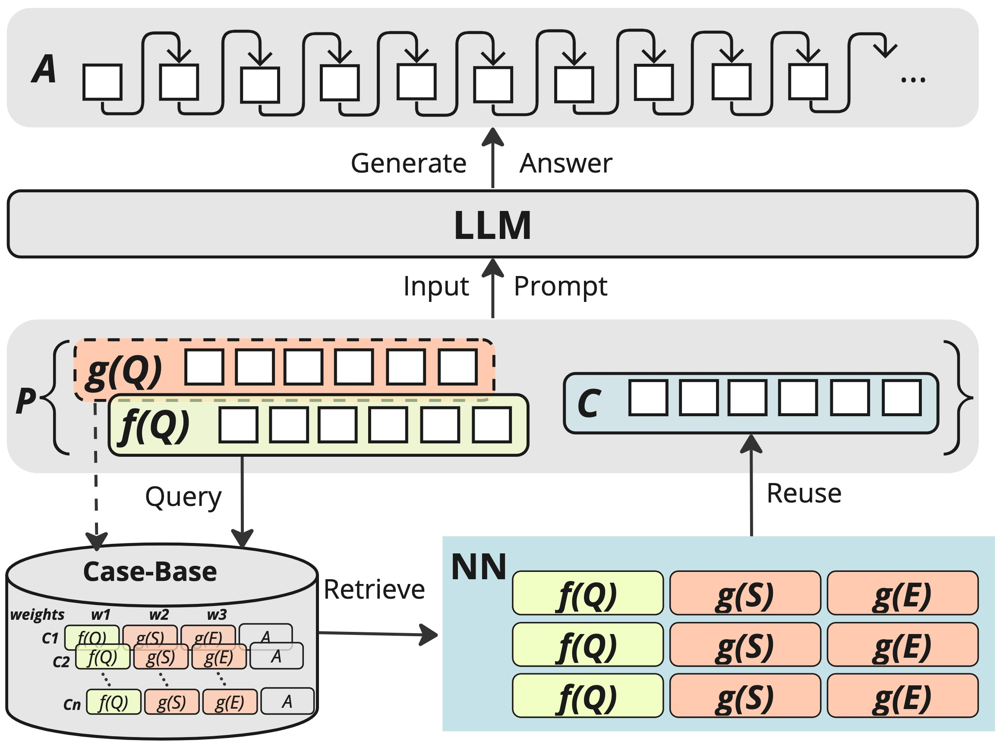
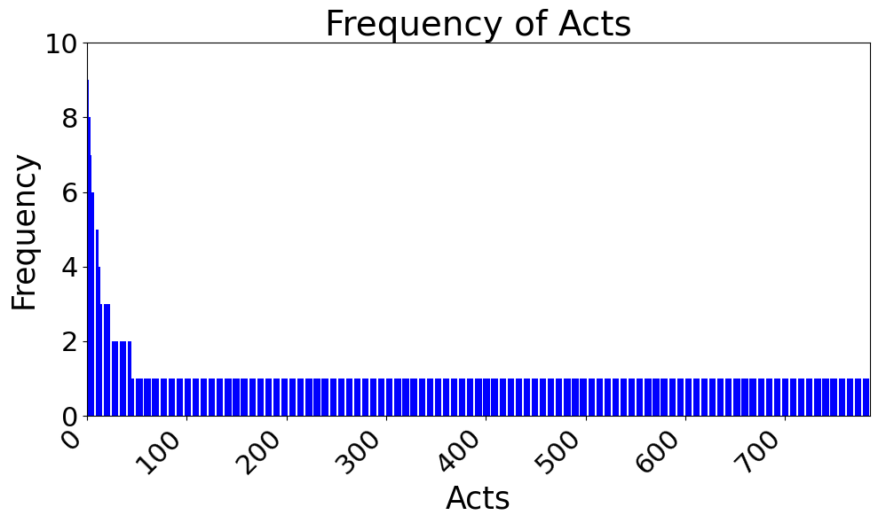
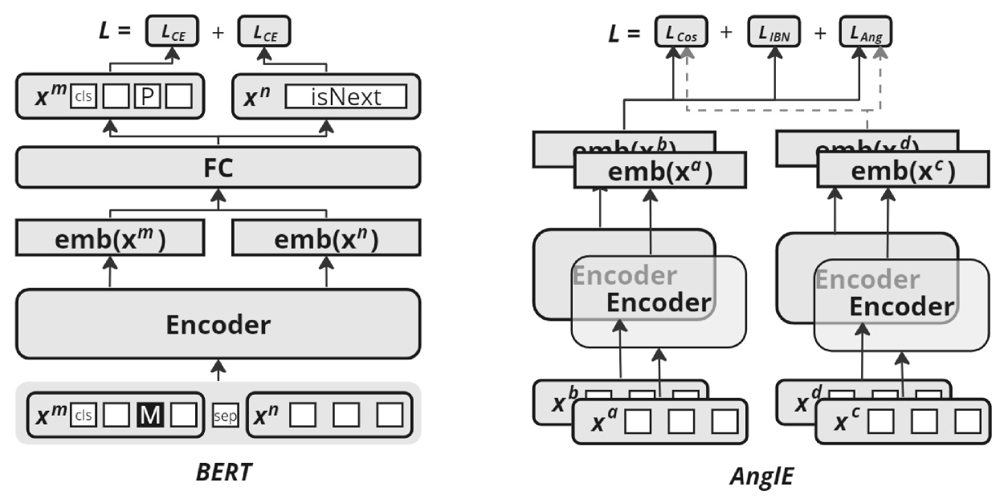
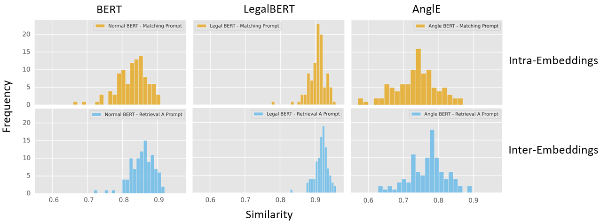
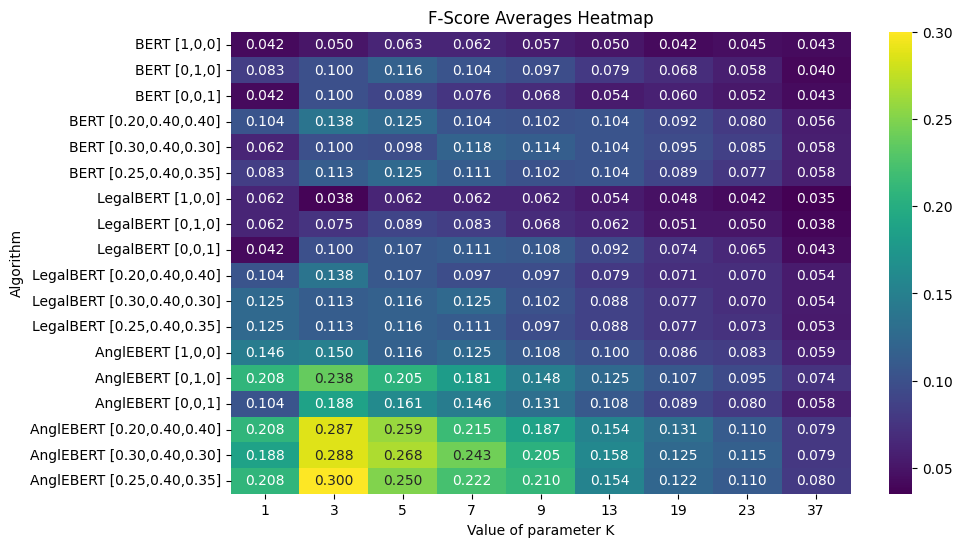

# CBR-RAG：案例推理辅助生成，提升大型语言模型在法律问答中的检索能力

发布时间：2024年04月04日

`RAG` `问答系统`

> CBR-RAG: Case-Based Reasoning for Retrieval Augmented Generation in LLMs for Legal Question Answering

# 摘要

> 检索增强生成（RAG）技术通过引入先验知识作为输入上下文，提升了大型语言模型（LLM）的输出质量。这在法律问答等需要专业知识和证据支持的任务中尤为有效。基于案例的推理（CBR）在LLM的RAG流程中起到了关键的结构化检索作用。我们提出了CBR-RAG模型，利用CBR的检索阶段、索引词汇和相似性知识库，为LLM查询提供具有上下文相关性的案例，从而丰富了原始查询。我们对CBR-RAG进行了评估，并探讨了在法律问答任务中，不同表示方法（如通用和领域特定嵌入）及比较方法（如内部、内部和混合相似性）的效果。研究结果显示，CBR提供的案例上下文增强了问题与证据之间的相似性，显著提升了生成答案的质量。

> Retrieval-Augmented Generation (RAG) enhances Large Language Model (LLM) output by providing prior knowledge as context to input. This is beneficial for knowledge-intensive and expert reliant tasks, including legal question-answering, which require evidence to validate generated text outputs. We highlight that Case-Based Reasoning (CBR) presents key opportunities to structure retrieval as part of the RAG process in an LLM. We introduce CBR-RAG, where CBR cycle's initial retrieval stage, its indexing vocabulary, and similarity knowledge containers are used to enhance LLM queries with contextually relevant cases. This integration augments the original LLM query, providing a richer prompt. We present an evaluation of CBR-RAG, and examine different representations (i.e. general and domain-specific embeddings) and methods of comparison (i.e. inter, intra and hybrid similarity) on the task of legal question-answering. Our results indicate that the context provided by CBR's case reuse enforces similarity between relevant components of the questions and the evidence base leading to significant improvements in the quality of generated answers.

[Arxiv](https://arxiv.org/abs/2404.04302)