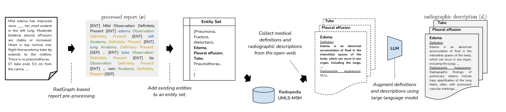
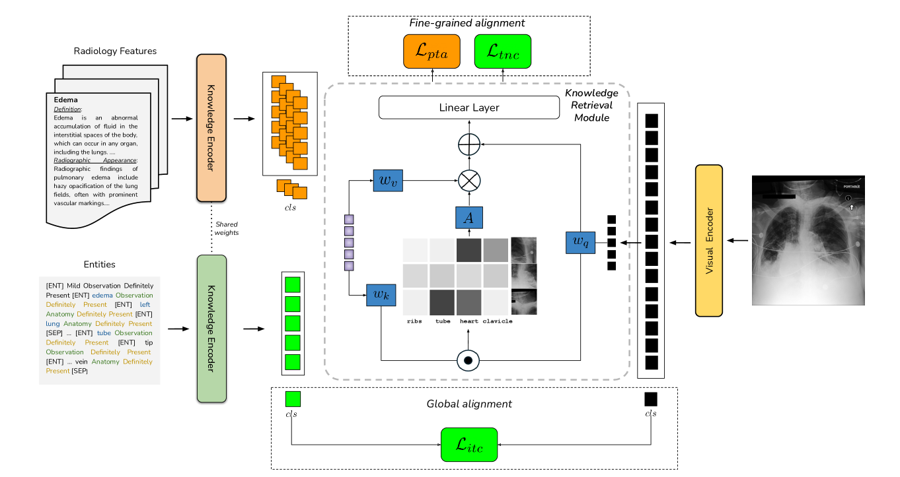
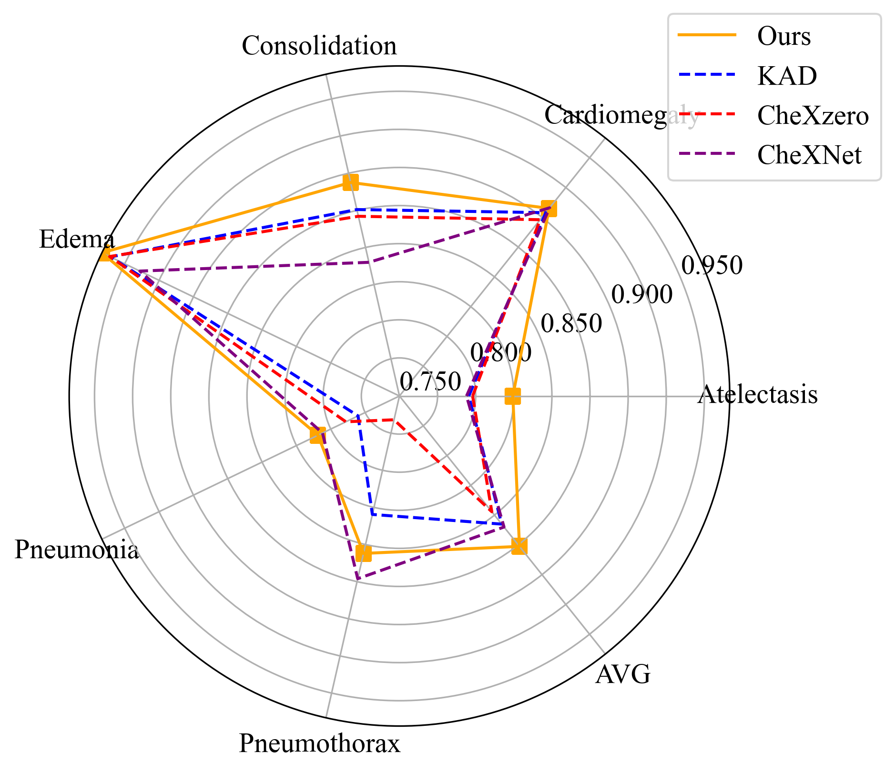
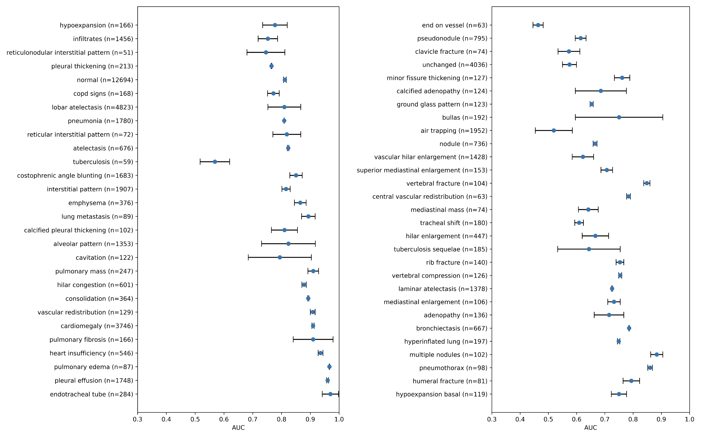
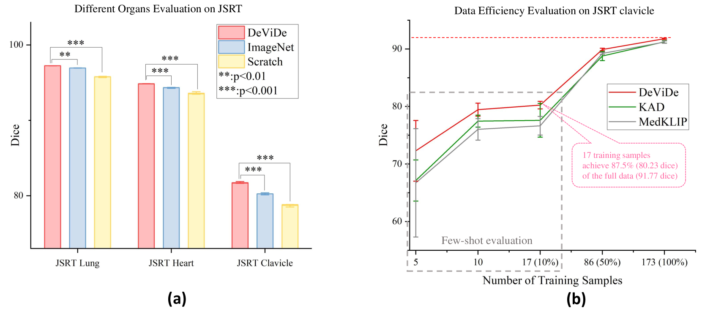
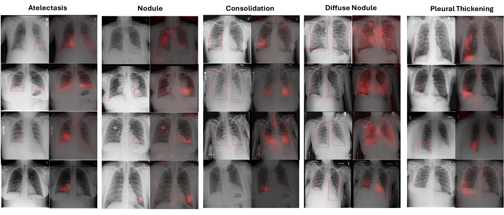
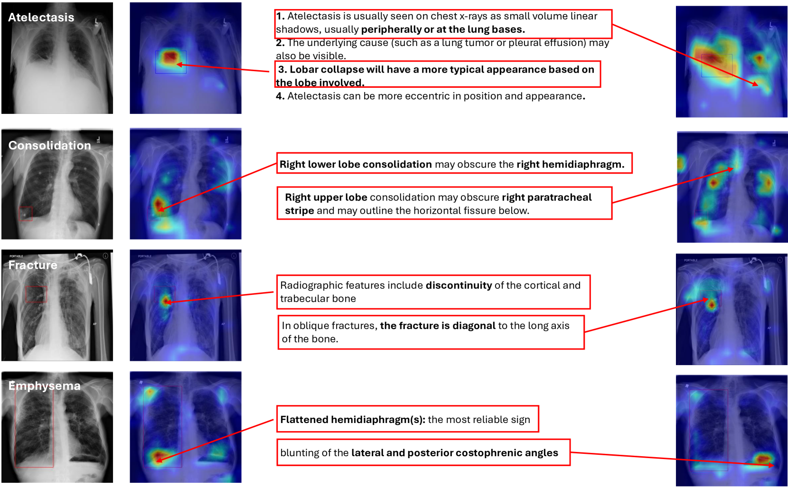

# DeViDe：面向医学视觉-语言预训练的全方位医学知识架构

发布时间：2024年04月04日

`LLM应用` `医学影像`

> DeViDe: Faceted medical knowledge for improved medical vision-language pre-training

# 摘要

> 胸部X光的视觉-语言预训练通过利用成对的射线照片和放射学报告取得了显著进步。但现有技术在有效编码医学知识上仍面临难题。放射学报告虽能揭示疾病当前表现，但医学定义往往过于理论化，导致知识断层。为此，我们推出了DeViDe，这是一种基于变换器的创新方法，它利用公开网络上的射线照片描述，描绘了疾病在射线照片中的一般视觉特征。结合抽象定义和放射学报告，DeViDe提供了一个全面的知识概览。该方法整合了三个核心特性，以增强知识的视觉-语言对齐：一是运用大型语言模型增强技术，统一不同来源的医学知识；二是在多个细节层次上将这些知识与图像信息对齐；三是引入了一个新颖的投影层，以应对多标签环境下每张图像与多个描述对齐的复杂性。在零-shot环境下，DeViDe的表现与全监督模型不相上下，并在三大大规模数据集上取得了顶尖成果。此外，对DeViDe进行微调后，在四个下游任务和六个分割任务上的表现，证明了其在多样化数据分布上的优越性能。

> Vision-language pre-training for chest X-rays has made sig- nificant strides, primarily by utilizing paired radiographs and radiology reports. However, existing approaches often face challenges in encoding medical knowledge effectively. While radiology reports provide insights into the current disease manifestation, medical definitions (as used by contemporary methods) tend to be overly abstract, creating a gap in knowledge. To address this, we propose DeViDe, a novel transformer- based method that leverages radiographic descriptions from the open web. These descriptions outline general visual characteristics of diseases in radiographs, and when combined with abstract definitions and radiol- ogy reports, provide a holistic snapshot of knowledge. DeViDe incorpo- rates three key features for knowledge-augmented vision language align- ment: First, a large-language model-based augmentation is employed to homogenise medical knowledge from diverse sources. Second, this knowl- edge is aligned with image information at various levels of granularity. Third, a novel projection layer is proposed to handle the complexity of aligning each image with multiple descriptions arising in a multi-label setting. In zero-shot settings, DeViDe performs comparably to fully su- pervised models on external datasets and achieves state-of-the-art results on three large-scale datasets. Additionally, fine-tuning DeViDe on four downstream tasks and six segmentation tasks showcases its superior per- formance across data from diverse distributions.

[Arxiv](https://arxiv.org/abs/2404.03618)