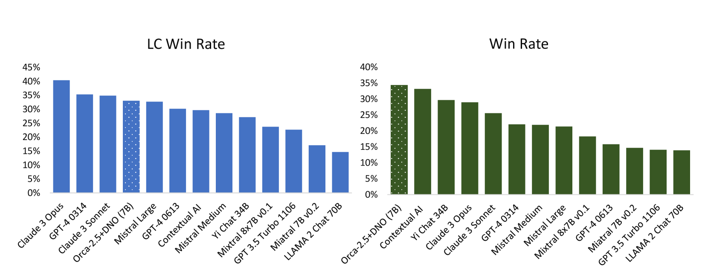
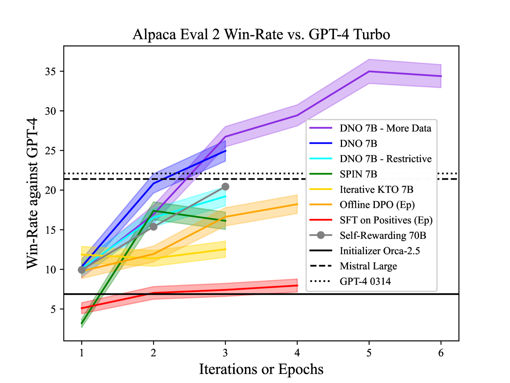

# 通过直接纳什优化方法，我们引导语言模型学会根据普遍偏好进行自我优化和提升。

发布时间：2024年04月04日

`LLM理论` `人工智能`

> Direct Nash Optimization: Teaching Language Models to Self-Improve with General Preferences

# 摘要

> 本研究探讨了利用强大预言者偏好反馈对大型语言模型（LLMs）进行后训练的方法。传统上，后训练LLMs的强化学习（RLHF）将奖励学习与策略优化分开处理。但这种以奖励最大化为核心的方法，难以捕捉复杂的偏好关系。尽管RLHF的最新进展实现了奖励与策略的一体化优化，但仍未能摆脱这一框架的束缚。与此同时，新兴研究直接针对“成对”或更广泛的偏好进行优化，摒弃了传统的奖励最大化假设。本文提出了直接纳什优化（DNO），这是一种结合了对比学习简便性与稳定性，以及优化广泛偏好的理论广度的算法。DNO作为一种批量在线策略算法，采用基于回归的目标，实现起来既直接又高效。它在迭代过程中不断自我提升，即便在面对如GPT-4这样的强大基准模型时也能实现进步。实验结果显示，经DNO校准的7B参数Orca-2.5模型在AlpacaEval 2.0上达到了33%的顶尖胜率，较初始模型提升了26%（从7%增至33%），表现甚至超过了参数数量更多的模型，如Mistral Large、自我奖励LM（70B参数）以及GPT-4的早期版本。

> This paper studies post-training large language models (LLMs) using preference feedback from a powerful oracle to help a model iteratively improve over itself. The typical approach for post-training LLMs involves Reinforcement Learning from Human Feedback (RLHF), which traditionally separates reward learning and subsequent policy optimization. However, such a reward maximization approach is limited by the nature of "point-wise" rewards (such as Bradley-Terry model), which fails to express complex intransitive or cyclic preference relations. While advances on RLHF show reward learning and policy optimization can be merged into a single contrastive objective for stability, they yet still remain tethered to the reward maximization framework. Recently, a new wave of research sidesteps the reward maximization presumptions in favor of directly optimizing over "pair-wise" or general preferences. In this paper, we introduce Direct Nash Optimization (DNO), a provable and scalable algorithm that marries the simplicity and stability of contrastive learning with theoretical generality from optimizing general preferences. Because DNO is a batched on-policy algorithm using a regression-based objective, its implementation is straightforward and efficient. Moreover, DNO enjoys monotonic improvement across iterations that help it improve even over a strong teacher (such as GPT-4). In our experiments, a resulting 7B parameter Orca-2.5 model aligned by DNO achieves the state-of-the-art win-rate against GPT-4-Turbo of 33% on AlpacaEval 2.0 (even after controlling for response length), an absolute gain of 26% (7% to 33%) over the initializing model. It outperforms models with far more parameters, including Mistral Large, Self-Rewarding LM (70B parameters), and older versions of GPT-4.

[Arxiv](https://arxiv.org/abs/2404.03715)