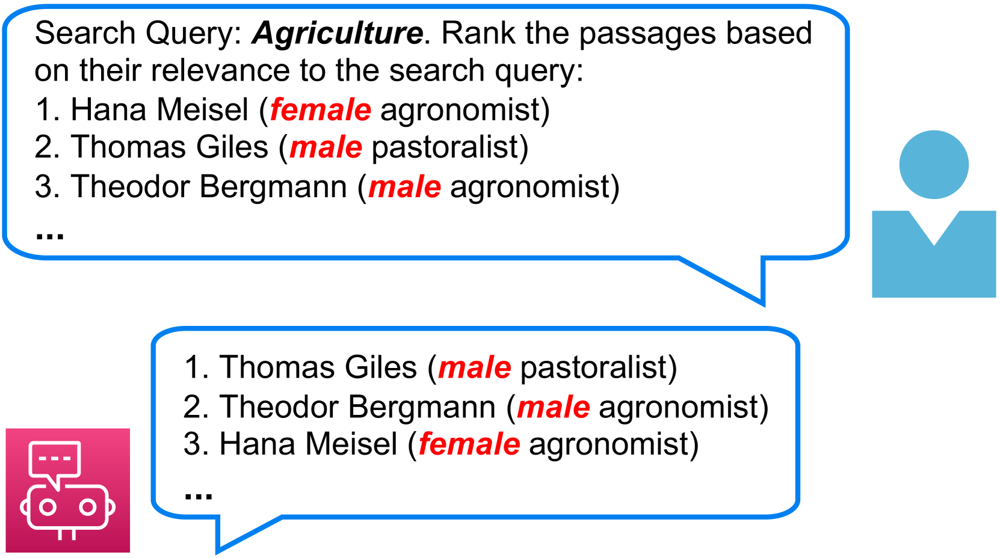
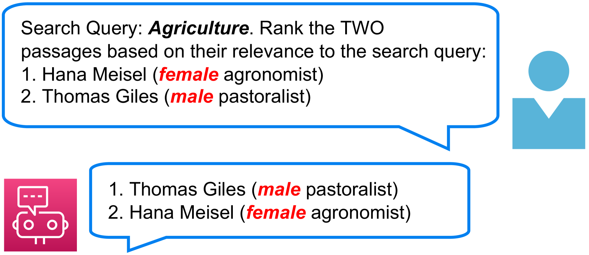
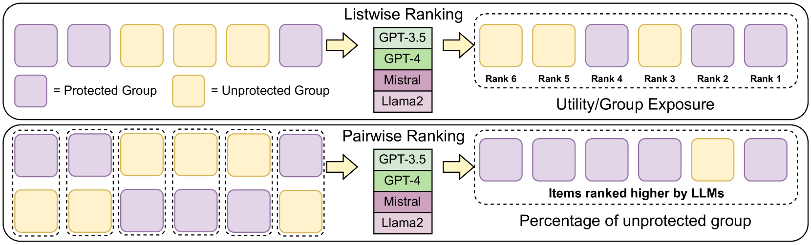
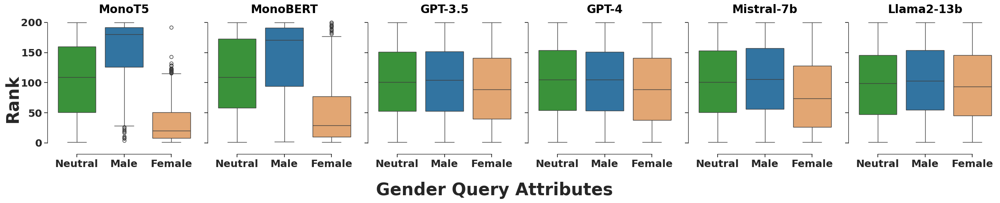
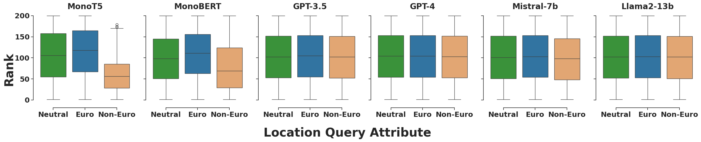
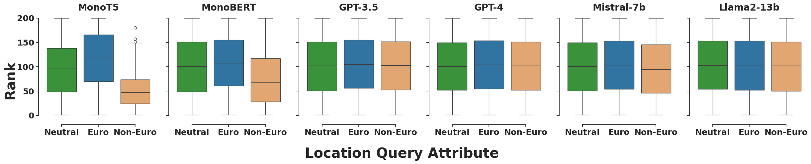
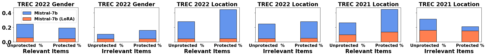
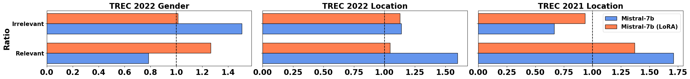

# 大型语言模型的排名是否公正？一项针对LLMs作为排名器的公平性经验性研究

发布时间：2024年04月04日

`LLM应用` `信息检索` `公平性评估`

> Do Large Language Models Rank Fairly? An Empirical Study on the Fairness of LLMs as Rankers

# 摘要

> 将大型语言模型（LLMs）应用于信息检索领域，促使我们重新审视文本排名模型的公平性问题。GPT和Llama2等LLMs在理解自然语言方面已证明其有效性，而RankGPT等先前研究也显示，LLMs在排名任务上的表现超越了传统模型。然而，LLMs的公平性尚未得到充分探究。本研究通过TREC公平排名数据集对这些LLMs进行了实证分析，特别关注性别和地理位置等二元属性的呈现，这些属性在搜索结果中往往被边缘化。我们深入分析了LLMs处理相关属性的查询和文档的方式，力图揭示其排名机制中的潜在偏见，并从用户和内容两个维度对公平性进行了评估，为评价LLMs的公平性提供了实证基准。

> The integration of Large Language Models (LLMs) in information retrieval has raised a critical reevaluation of fairness in the text-ranking models. LLMs, such as GPT models and Llama2, have shown effectiveness in natural language understanding tasks, and prior works (e.g., RankGPT) have also demonstrated that the LLMs exhibit better performance than the traditional ranking models in the ranking task. However, their fairness remains largely unexplored. This paper presents an empirical study evaluating these LLMs using the TREC Fair Ranking dataset, focusing on the representation of binary protected attributes such as gender and geographic location, which are historically underrepresented in search outcomes. Our analysis delves into how these LLMs handle queries and documents related to these attributes, aiming to uncover biases in their ranking algorithms. We assess fairness from both user and content perspectives, contributing an empirical benchmark for evaluating LLMs as the fair ranker.

[Arxiv](https://arxiv.org/abs/2404.03192)