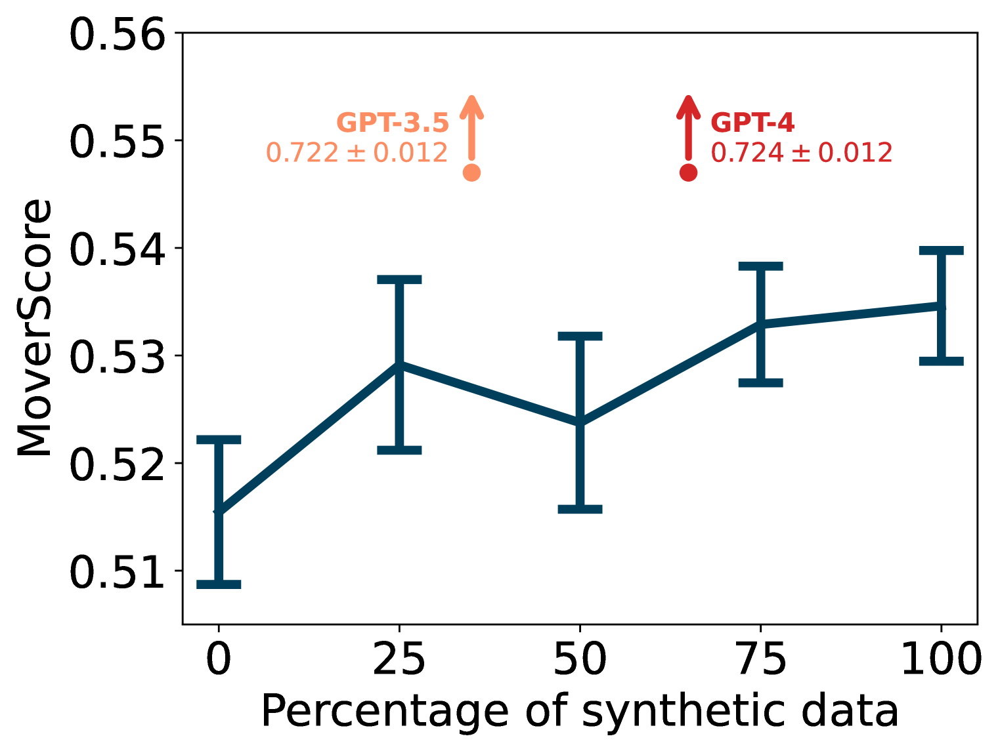
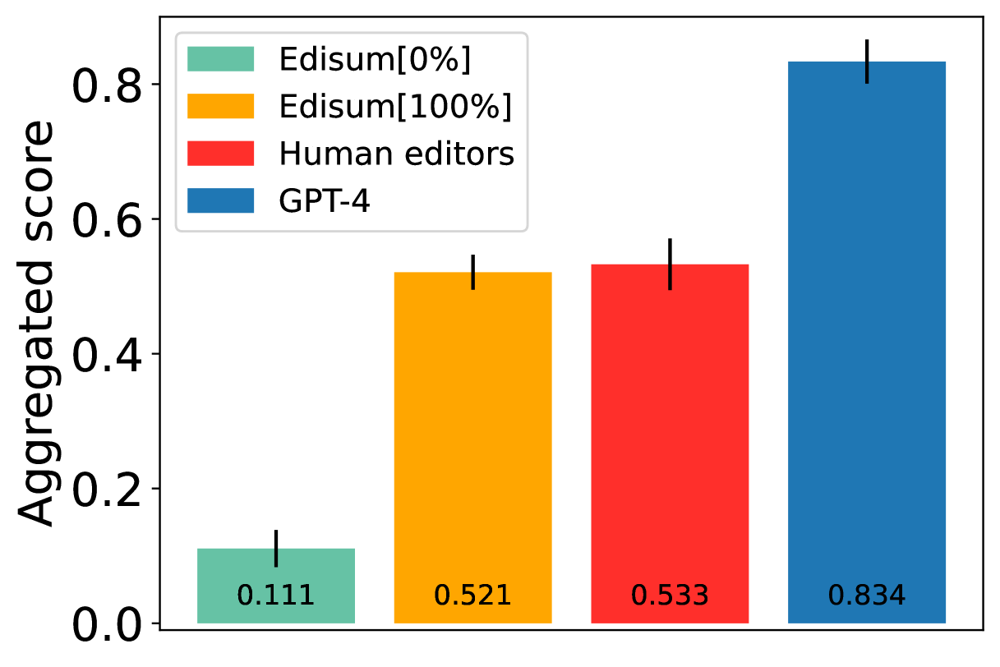
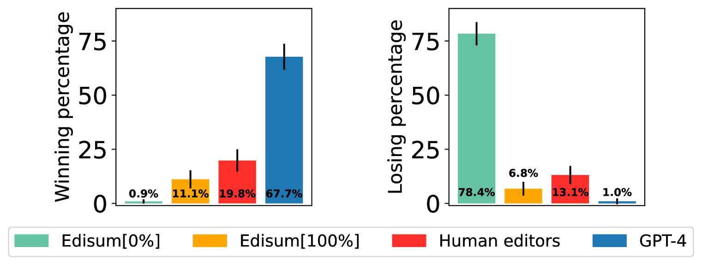
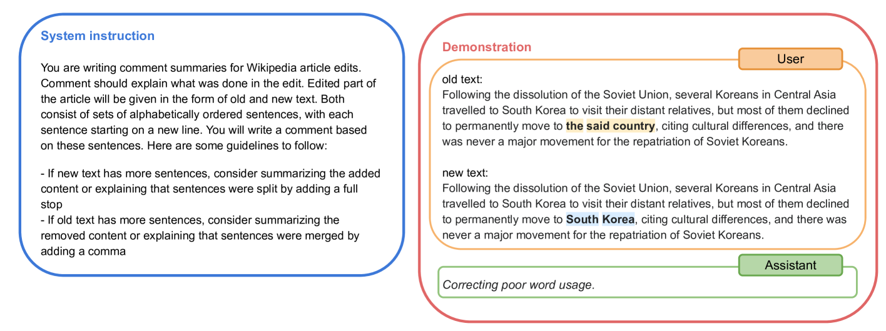

# Edisum：面向大规模的维基百科编辑，实现内容概括与阐释。

发布时间：2024年04月04日

`LLM应用` `维基百科` `内容审核`

> Edisum: Summarizing and Explaining Wikipedia Edits at Scale

# 摘要

> 维基百科编辑摘要是编辑者对页面修改所作的简短说明，它对于内容审核者判断是否采纳修改至关重要，同时也为研究者提供了宝贵的数据资源。然而，许多编辑缺乏摘要或摘要不完整，我们为此提出了一个推荐系统，该系统利用训练有素的语言模型根据编辑差异生成高质量的摘要。面对训练数据质量不一、需理解修改内容及其原因等挑战，我们通过结合人工与合成数据，并优化一个适合大规模部署的小型生成型语言模型来解决。我们的模型在性能上与人类编辑者不相上下。虽然商业大型语言模型能更出色地完成这项任务，但在维基百科上的应用成本过高。本文更广泛地阐述了语言建模技术如何助力人类维护这一网络巨擘。

> An edit summary is a succinct comment written by a Wikipedia editor explaining the nature of, and reasons for, an edit to a Wikipedia page. Edit summaries are crucial for maintaining the encyclopedia: they are the first thing seen by content moderators and help them decide whether to accept or reject an edit. Additionally, edit summaries constitute a valuable data source for researchers. Unfortunately, as we show, for many edits, summaries are either missing or incomplete. To overcome this problem and help editors write useful edit summaries, we propose a model for recommending edit summaries generated by a language model trained to produce good edit summaries given the representation of an edit diff. This is a challenging task for multiple reasons, including mixed-quality training data, the need to understand not only what was changed in the article but also why it was changed, and efficiency requirements imposed by the scale of Wikipedia. We address these challenges by curating a mix of human and synthetically generated training data and fine-tuning a generative language model sufficiently small to be used on Wikipedia at scale. Our model performs on par with human editors. Commercial large language models are able to solve this task better than human editors, but would be too expensive to run on Wikipedia at scale. More broadly, this paper showcases how language modeling technology can be used to support humans in maintaining one of the largest and most visible projects on the Web.

[Arxiv](https://arxiv.org/abs/2404.03428)