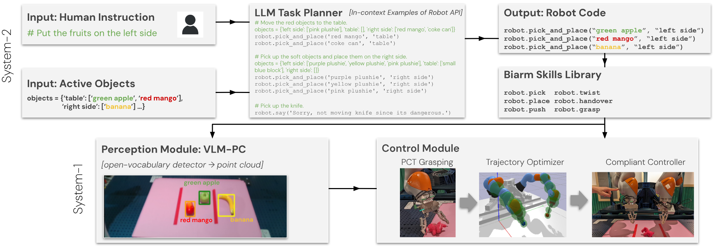
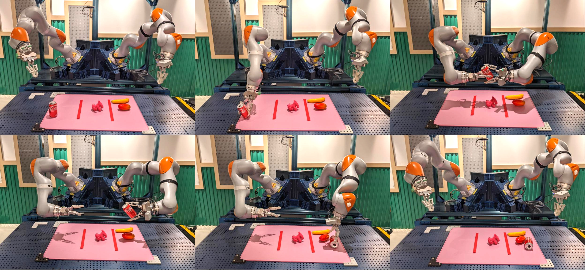
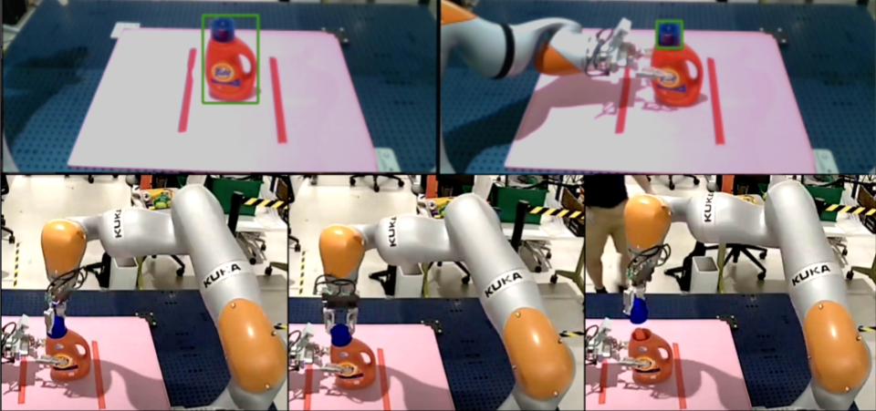

# 双臂机器人的具身人工智能：探索零-shot 学习能力、安全性能与模块化设计。

发布时间：2024年04月04日

`Agent` `机器人`

> Embodied AI with Two Arms: Zero-shot Learning, Safety and Modularity

# 摘要

> 我们呈现了一个具身AI系统，它能够接收人类的自然语言指令，并指挥双臂协作完成大型工作区内的复杂任务。系统采用模块化设计：利用顶尖的大型语言模型进行任务规划，结合视觉-语言模型实现语义识别，以及运用点云变换器完成抓取动作。为确保操作的语义和物理安全，各模块与实时轨迹优化器和柔顺跟踪控制器相结合，使得人与机器人能够安全互动。系统在双臂排序、开瓶和垃圾处理等任务上展现出色性能，且这些模型在未经过任何与该双臂机器人相关的现实世界数据训练的情况下，仍能零-shot完成这些任务。通过模块化地组合学习和非学习型组件，并提供可解释的输入输出，用户可以轻松定位并修复失败和脆弱点。此外，用户还可以即时替换模块，以增强整个平台的鲁棒性，例如采用通过模仿学习得到的政策。

> We present an embodied AI system which receives open-ended natural language instructions from a human, and controls two arms to collaboratively accomplish potentially long-horizon tasks over a large workspace. Our system is modular: it deploys state of the art Large Language Models for task planning,Vision-Language models for semantic perception, and Point Cloud transformers for grasping. With semantic and physical safety in mind, these modules are interfaced with a real-time trajectory optimizer and a compliant tracking controller to enable human-robot proximity. We demonstrate performance for the following tasks: bi-arm sorting, bottle opening, and trash disposal tasks. These are done zero-shot where the models used have not been trained with any real world data from this bi-arm robot, scenes or workspace.Composing both learning- and non-learning-based components in a modular fashion with interpretable inputs and outputs allows the user to easily debug points of failures and fragilities. One may also in-place swap modules to improve the robustness of the overall platform, for instance with imitation-learned policies.

[Arxiv](https://arxiv.org/abs/2404.03570)