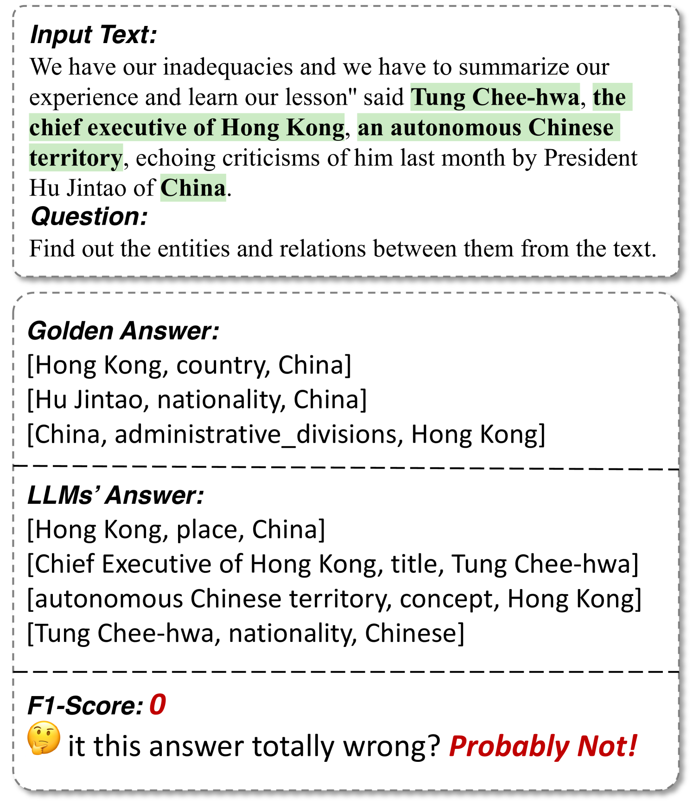
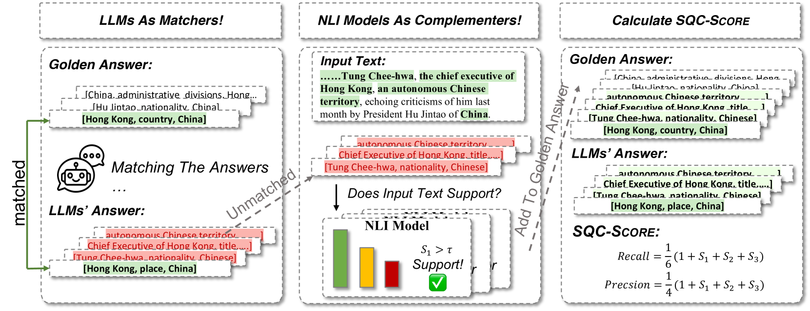

# 在信息提取领域，探究生成型语言模型在主观问题纠正任务中的表现。

发布时间：2024年04月04日

`LLM应用` `信息提取` `评估方法`

> Evaluating Generative Language Models in Information Extraction as Subjective Question Correction

# 摘要

> 现代大型语言模型（LLMs）在复杂认知任务上表现出色，却在简单的关系和事件提取等基础任务上不尽人意，这背后有两个主要问题：一是现有评估指标难以准确衡量模型输出与事实之间的语义一致性；二是评估基准本身的不完整，往往因为人为注释的局限而低估了LLMs的能力。我们从主观问题纠正中汲取灵感，提出了一种新的评估方法——SQC-Score。它通过利用经过主观问题纠正训练的LLMs，优化模型输出与标准答案的匹配度。同时，结合自然语言推理（NLI）模型，SQC-Score扩展了标准答案的范围，认可了之前被忽略的正确答案，从而弥补了评估基准的不足。在三项信息提取任务的测试中，SQC-Score得到了人类评估者的青睐，超越了传统基线指标。通过SQC-Score，我们对当前顶尖的LLMs进行了深入评估，并为未来信息提取领域的研究提供了宝贵的见解。相关数据集和代码已在 https://github.com/THU-KEG/SQC-Score 上线，供大家查阅。

> Modern Large Language Models (LLMs) have showcased remarkable prowess in various tasks necessitating sophisticated cognitive behaviors. Nevertheless, a paradoxical performance discrepancy is observed, where these models underperform in seemingly elementary tasks like relation extraction and event extraction due to two issues in conventional evaluation. (1) The imprecision of existing evaluation metrics that struggle to effectively gauge semantic consistency between model outputs and ground truth, and (2) The inherent incompleteness of evaluation benchmarks, primarily due to restrictive human annotation schemas, resulting in underestimated LLM performances. Inspired by the principles in subjective question correction, we propose a new evaluation method, SQC-Score. This method innovatively utilizes LLMs, fine-tuned through subjective question correction data, to refine matching between model outputs and golden labels. Additionally, by incorporating a Natural Language Inference (NLI) model, SQC-Score enriches golden labels, addressing benchmark incompleteness by acknowledging correct yet previously omitted answers. Results on three information extraction tasks show that SQC-Score is more preferred by human annotators than the baseline metrics. Utilizing SQC-Score, we conduct a comprehensive evaluation of the state-of-the-art LLMs and provide insights for future research for information extraction. Dataset and associated codes can be accessed at https://github.com/THU-KEG/SQC-Score.

[Arxiv](https://arxiv.org/abs/2404.03532)