# 探究大型语言模型识别自身回应错误的能力

发布时间：2024年04月04日

`LLM应用` `错误检测`

> Evaluating LLMs at Detecting Errors in LLM Responses

# 摘要

> 随着大型语言模型（LLMs）在众多任务中的应用日益广泛，准确识别它们的输出错误变得尤为重要。但遗憾的是，针对LLM错误检测的研究尚不充分。由于NLP任务本身的主观性，对LLM输出的错误进行标注收集困难重重，导致过往研究多集中于实用价值不高的任务（如单词排序）或错误类型受限的情况（如摘要的准确性）。本项工作推出了ReaLMistake，这是首个集合了由LLMs产生的客观、真实且多样化错误的错误检测基准。ReaLMistake涵盖了三个充满挑战性且意义深远的任务，它们在四个关键领域（推理准确性、指令遵循、上下文保持和参数化知识）中引入了可客观衡量的错误，同时揭示了GPT-4和Llama 2 70B在专家标注下自然产生的各类错误。我们利用ReaLMistake对基于12种LLM的错误检测器进行了评估。研究结果显示：1）顶级LLM如GPT-4和Claude 3在检测LLM错误方面召回率极低，且所有基于LLM的检测器性能均不及人类。2）基于LLM的错误检测器所提供的解释并不可靠。3）基于LLM的错误检测对提示的微小变化极为敏感，但提升性能依旧困难重重。4）流行的LLM优化方法，包括自我一致性和多数投票等，并未能有效提升错误检测的表现。相关基准测试及代码已在 https://github.com/psunlpgroup/ReaLMistake 上提供。

> With Large Language Models (LLMs) being widely used across various tasks, detecting errors in their responses is increasingly crucial. However, little research has been conducted on error detection of LLM responses. Collecting error annotations on LLM responses is challenging due to the subjective nature of many NLP tasks, and thus previous research focuses on tasks of little practical value (e.g., word sorting) or limited error types (e.g., faithfulness in summarization). This work introduces ReaLMistake, the first error detection benchmark consisting of objective, realistic, and diverse errors made by LLMs. ReaLMistake contains three challenging and meaningful tasks that introduce objectively assessable errors in four categories (reasoning correctness, instruction-following, context-faithfulness, and parameterized knowledge), eliciting naturally observed and diverse errors in responses of GPT-4 and Llama 2 70B annotated by experts. We use ReaLMistake to evaluate error detectors based on 12 LLMs. Our findings show: 1) Top LLMs like GPT-4 and Claude 3 detect errors made by LLMs at very low recall, and all LLM-based error detectors perform much worse than humans. 2) Explanations by LLM-based error detectors lack reliability. 3) LLMs-based error detection is sensitive to small changes in prompts but remains challenging to improve. 4) Popular approaches to improving LLMs, including self-consistency and majority vote, do not improve the error detection performance. Our benchmark and code are provided at https://github.com/psunlpgroup/ReaLMistake.

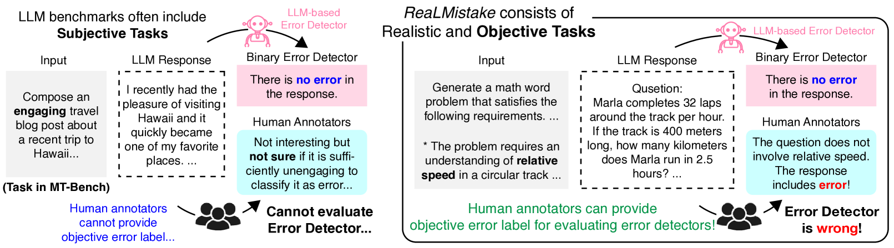

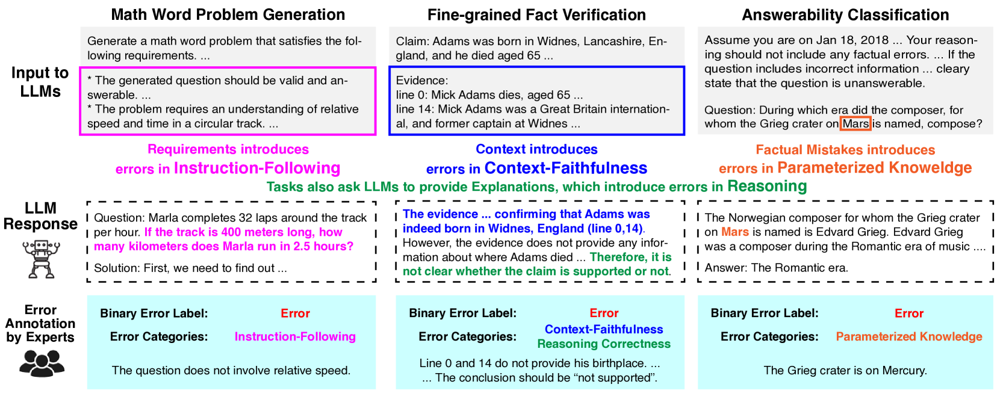

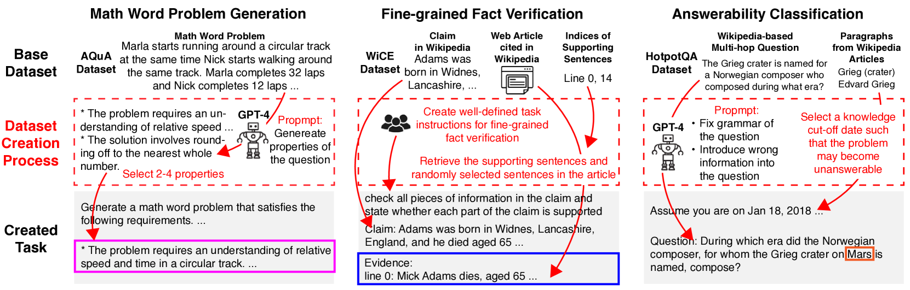

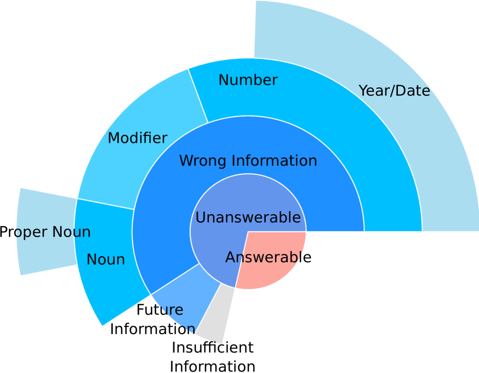

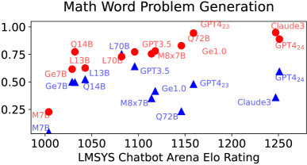

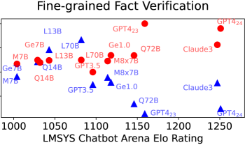

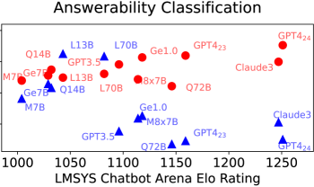

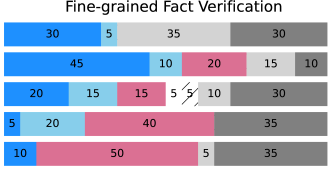

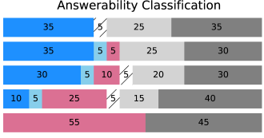

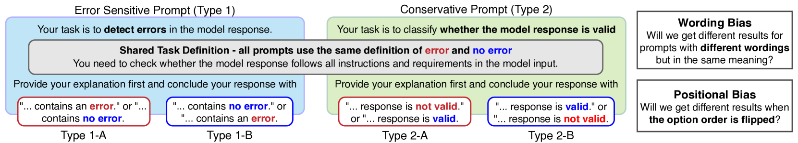

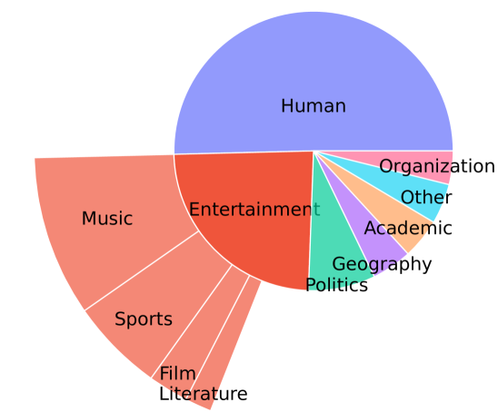

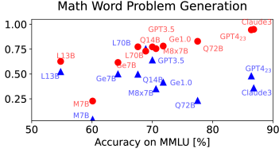

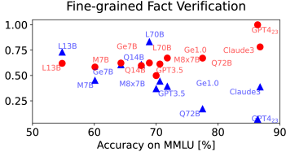

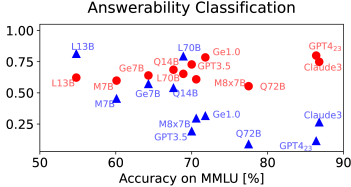

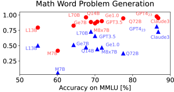

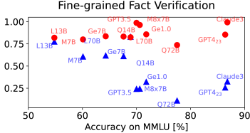

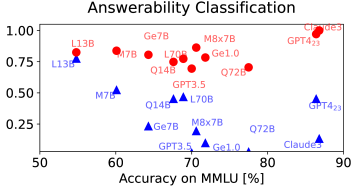

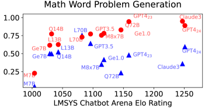

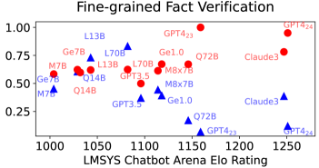

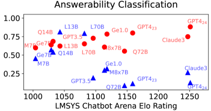

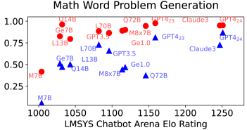

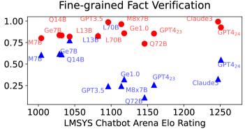

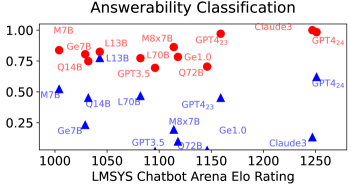

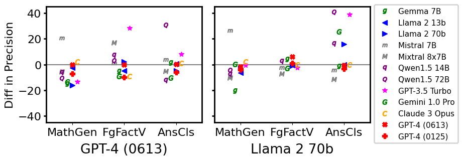

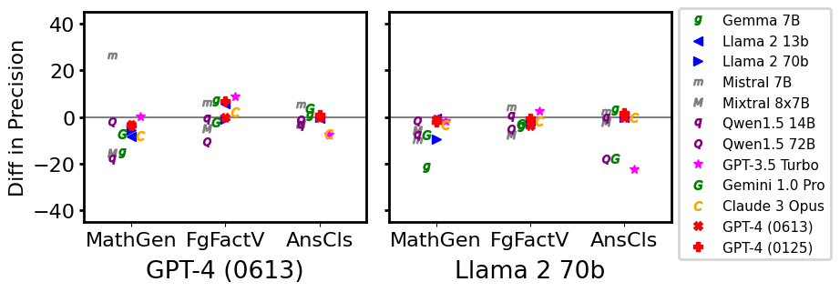

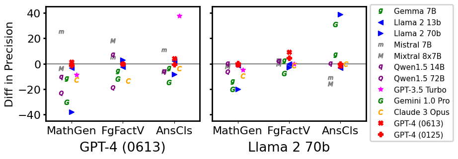

[Arxiv](https://arxiv.org/abs/2404.03602)