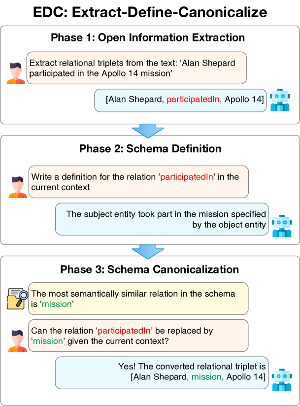
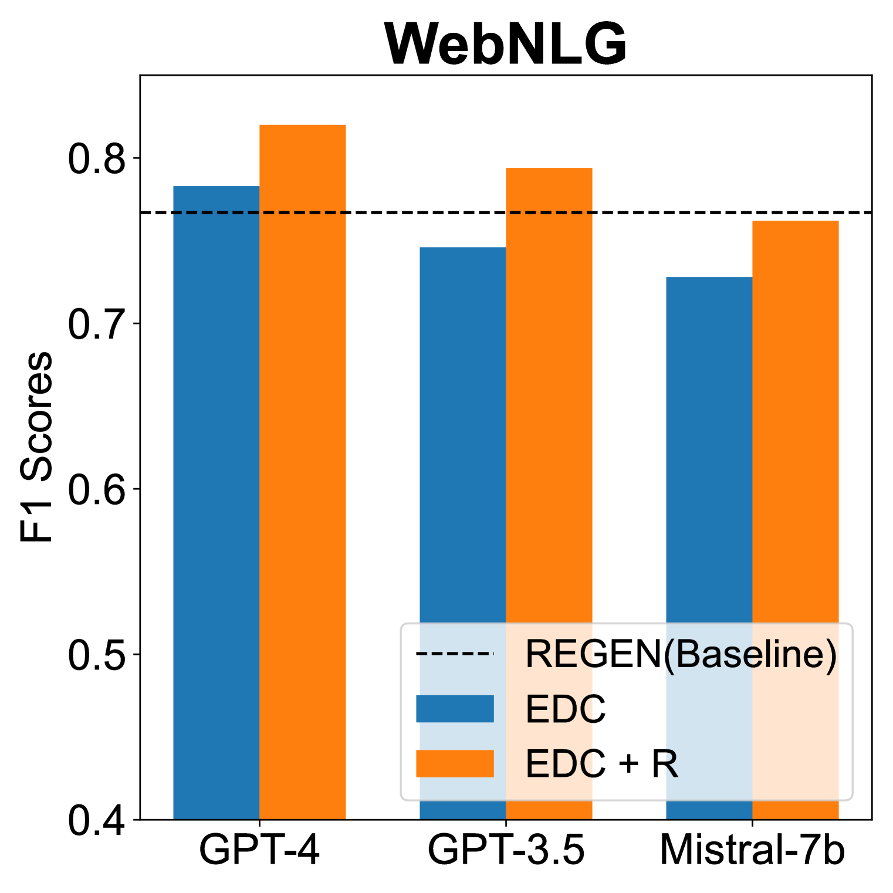
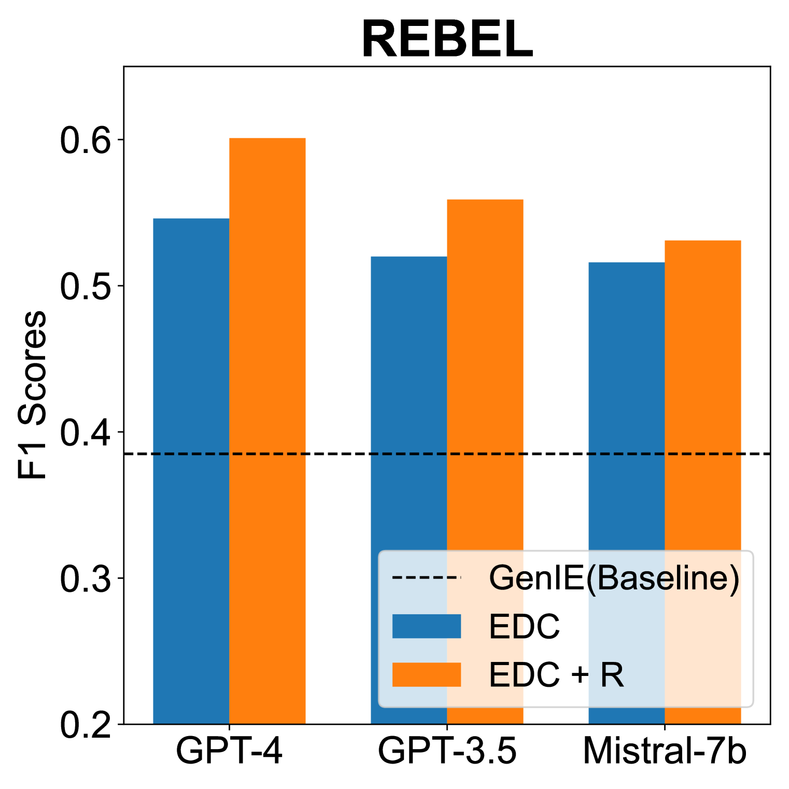
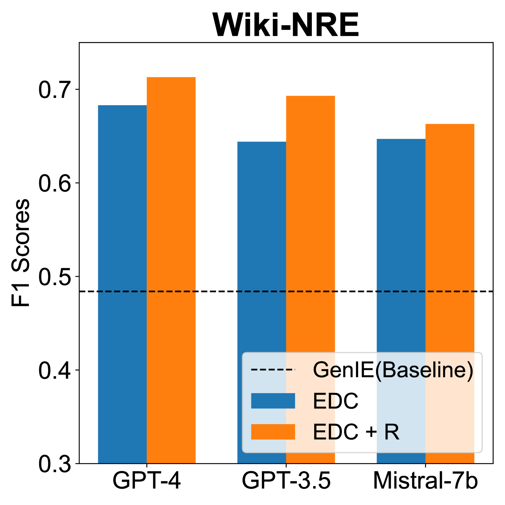

# 基于大型语言模型，构建知识图谱的新框架：提取信息、明确定义、统一规范。

发布时间：2024年04月04日

`RAG` `知识图谱` `自动化技术`

> Extract, Define, Canonicalize: An LLM-based Framework for Knowledge Graph Construction

# 摘要

> 本研究致力于探索从文本中自动构建知识图谱的自动化技术。随着大型语言模型的发展，已有研究尝试将其应用于知识图谱构建，如采用零次或少次提示的方法。尽管在小型特定数据集上取得了进展，但这些模型在处理现实世界应用中的大量文本时仍显不足。主要挑战在于，现有方法需要将知识图谱模式嵌入到语言模型的提示中以生成有效的三元组，而复杂或庞大的模式往往会超出模型的上下文处理能力。为此，我们提出了一个新颖的三步策略——提取-定义-规范化（EDC）框架，它先进行开放信息提取，再定义模式，最后进行规范化处理。EDC框架的优势在于其灵活性，无论是在已有预设模式还是无预设模式的情况下都能适用；在无预设模式的情况下，它能自动构建模式并进行自我规范化。此外，我们还引入了一个训练有素的组件，用以提取与输入文本紧密相关的模式元素，从而在无需调整参数的前提下，显著提升了模型在三个知识图谱构建基准测试中的三元组提取质量，并能处理比以往工作更庞大复杂的模式。

> In this work, we are interested in automated methods for knowledge graph creation (KGC) from input text. Progress on large language models (LLMs) has prompted a series of recent works applying them to KGC, e.g., via zero/few-shot prompting. Despite successes on small domain-specific datasets, these models face difficulties scaling up to text common in many real-world applications. A principal issue is that in prior methods, the KG schema has to be included in the LLM prompt to generate valid triplets; larger and more complex schema easily exceed the LLMs' context window length. To address this problem, we propose a three-phase framework named Extract-Define-Canonicalize (EDC): open information extraction followed by schema definition and post-hoc canonicalization. EDC is flexible in that it can be applied to settings where a pre-defined target schema is available and when it is not; in the latter case, it constructs a schema automatically and applies self-canonicalization. To further improve performance, we introduce a trained component that retrieves schema elements relevant to the input text; this improves the LLMs' extraction performance in a retrieval-augmented generation-like manner. We demonstrate on three KGC benchmarks that EDC is able to extract high-quality triplets without any parameter tuning and with significantly larger schemas compared to prior works.

[Arxiv](https://arxiv.org/abs/2404.03868)