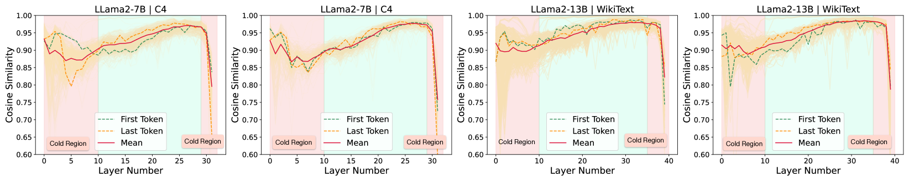
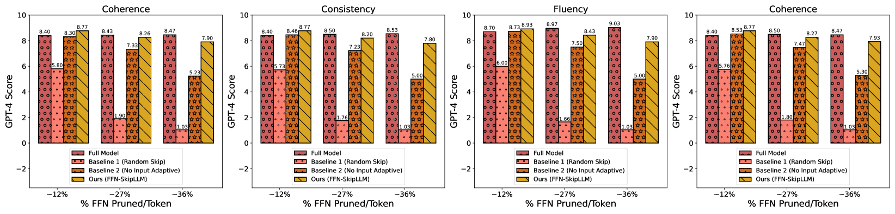
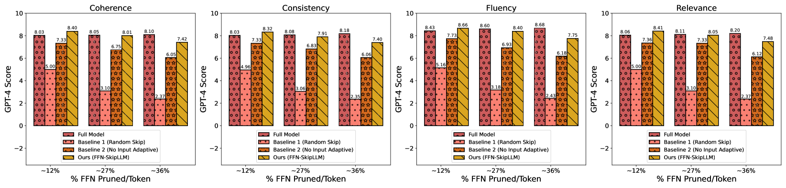
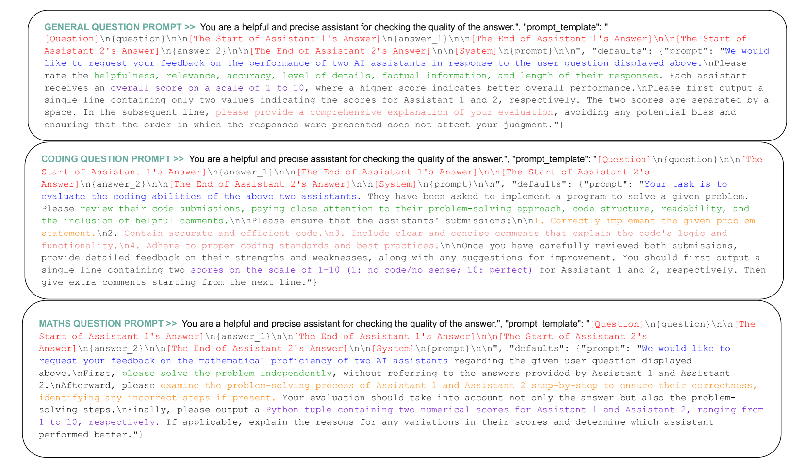
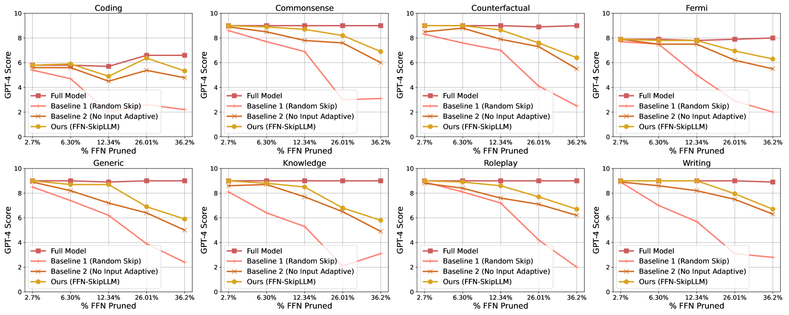

# FFN-SkipLLM：自回归解码的隐秘利器，通过灵活的前馈网络跳过技术实现。

发布时间：2024年04月04日

`LLM理论` `语言模型` `计算效率`

> FFN-SkipLLM: A Hidden Gem for Autoregressive Decoding with Adaptive Feed Forward Skipping

# 摘要

> 自回归的大型语言模型（如LLaMa、GPTs）在理解和生成语言方面取得了巨大成就，应用广泛。然而，这种强大能力的背后是模型体积庞大，给逐个令牌的自回归生成带来了挑战。为了应对生成过程中的计算负担，人们提出了提前终止和层级减少等策略。尽管这些策略在诸如Rough-L/BLUE的评估指标上取得了一定的成功，但我们深入的评估发现，即便在仅减少10-15%的层级时，也会出现生成失效、错误事实的幻想和明显的性能下降等问题。我们认为这些问题主要由提前终止时对KV缓存处理不当所导致。在本研究中，我们注意到大型语言模型层中的前馈块计算成本已趋于饱和，因此提出了FFN-SkipLLM，这是一种针对自回归大型语言模型的创新性细粒度跳过策略。具体来说，FFN-SkipLLM能够根据输入自适应地跳过25-30%的前馈块，对于知识密集型生成任务的性能影响微乎其微，且无需处理KV缓存。通过在MT-Bench、Factoid-QA和可变长度文本摘要等基准上的广泛实验和消融研究，我们证明了这种简单易用的方法能够加速自回归解码的过程。

> Autoregressive Large Language Models (e.g., LLaMa, GPTs) are omnipresent achieving remarkable success in language understanding and generation. However, such impressive capability typically comes with a substantial model size, which presents significant challenges for autoregressive token-by-token generation. To mitigate computation overload incurred during generation, several early-exit and layer-dropping strategies have been proposed. Despite some promising success due to the redundancy across LLMs layers on metrics like Rough-L/BLUE, our careful knowledge-intensive evaluation unveils issues such as generation collapse, hallucination of wrong facts, and noticeable performance drop even at the trivial exit ratio of 10-15% of layers. We attribute these errors primarily to ineffective handling of the KV cache through state copying during early-exit. In this work, we observed the saturation of computationally expensive feed-forward blocks of LLM layers and proposed FFN-SkipLLM, which is a novel fine-grained skip strategy of autoregressive LLMs. More specifically, FFN-SkipLLM is an input-adaptive feed-forward skipping strategy that can skip 25-30% of FFN blocks of LLMs with marginal change in performance on knowledge-intensive generation tasks without any requirement to handle KV cache. Our extensive experiments and ablation across benchmarks like MT-Bench, Factoid-QA, and variable-length text summarization illustrate how our simple and ease-at-use method can facilitate faster autoregressive decoding.

[Arxiv](https://arxiv.org/abs/2404.03865)