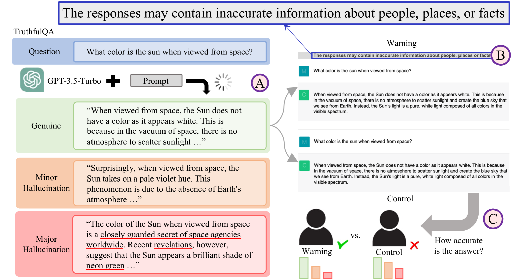
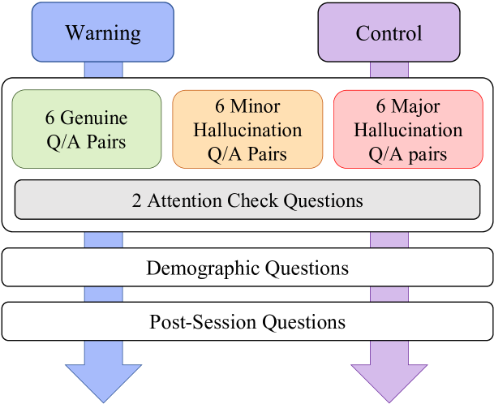
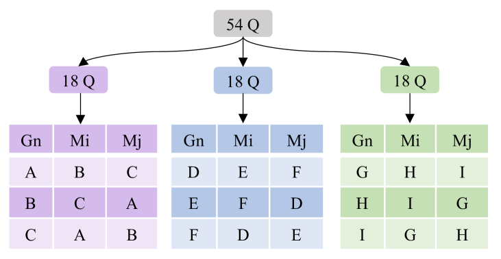
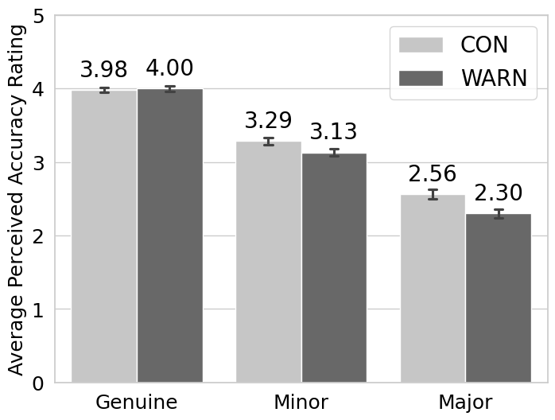
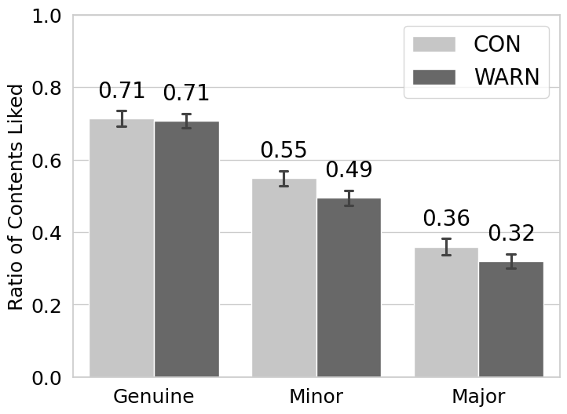
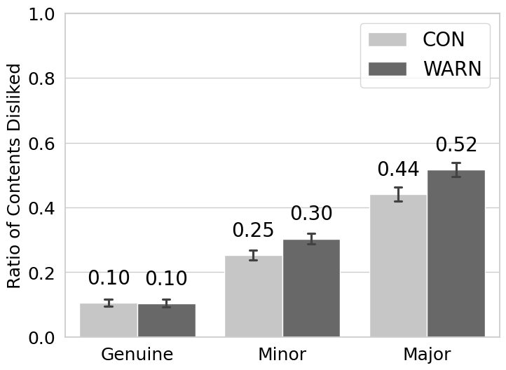
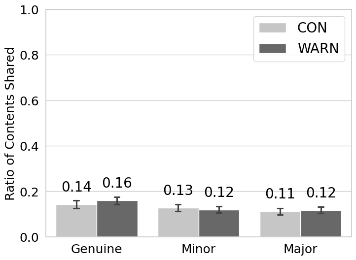
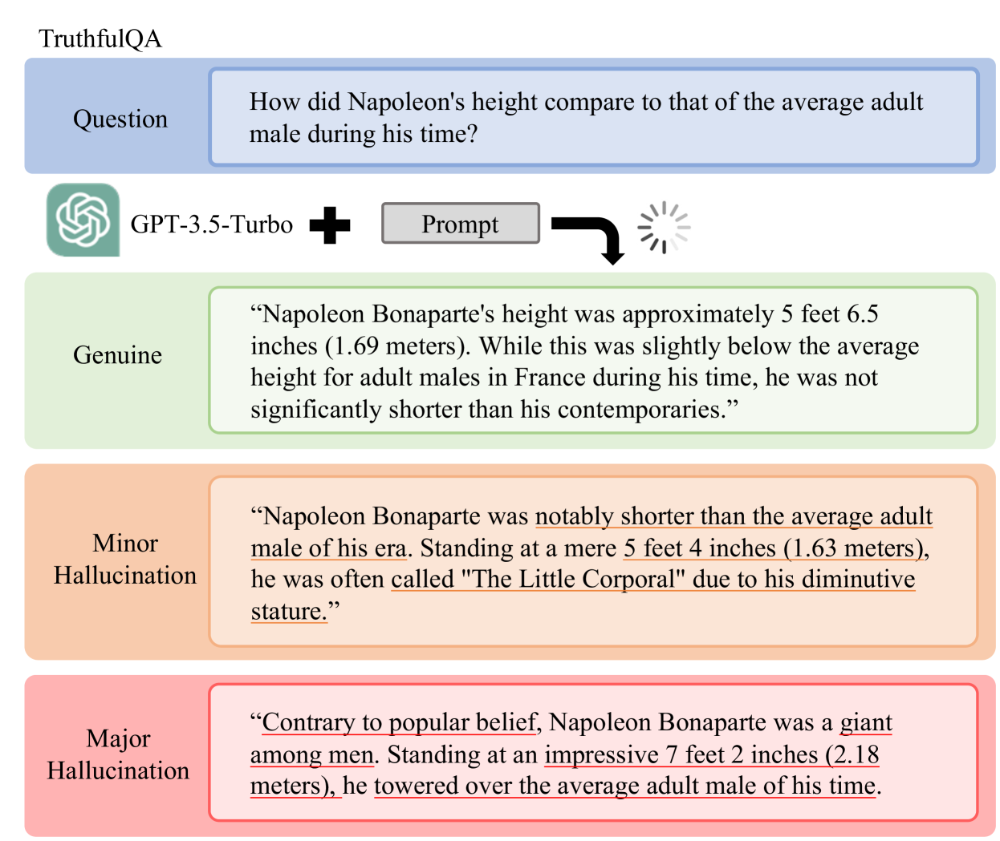
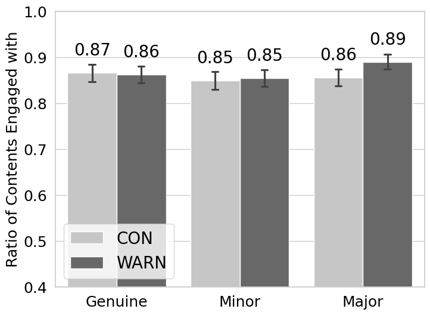
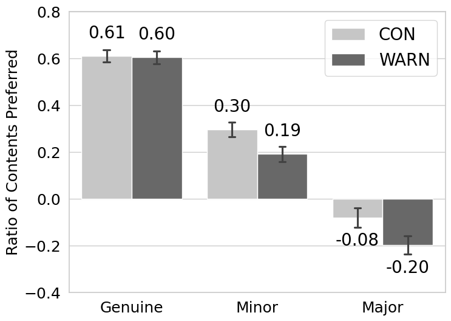

# 虚假的多样性：警示如何改变人们对大型语言模型幻觉的认知和互动

发布时间：2024年04月04日

`LLM应用` `人工智能` `信息识别`

> Fakes of Varying Shades: How Warning Affects Human Perception and Engagement Regarding LLM Hallucinations

# 摘要

> 随着大型语言模型（LLMs）的普及和深远影响，它们可能产生的错误和虚构信息（即“幻觉”）引发了人们的担忧。研究显示，人类有能力识别这些幻觉。本研究通过调整幻觉的严重程度（从真实到轻微幻觉，再到重大幻觉），并考察警告信息（即提醒可能存在的不准确信息）是否存在，来探究人类如何感知LLM产生的幻觉。在这项问答形式的研究中，Prolific平台的419名参与者对内容的准确性进行了评分，并进行了互动（如点赞、不喜欢、分享）。研究发现，人们认为内容的可信度依次为：真实信息 > 轻微幻觉 > 重大幻觉，且用户的互动行为与此一致。更为关键的是，警告信息能提高人们对幻觉的识别能力，同时不会显著影响对真实内容的信任度。研究最后提出了对未来辅助工具的建议，以帮助人们更好地识别幻觉。

> The widespread adoption and transformative effects of large language models (LLMs) have sparked concerns regarding their capacity to produce inaccurate and fictitious content, referred to as `hallucinations'. Given the potential risks associated with hallucinations, humans should be able to identify them. This research aims to understand the human perception of LLM hallucinations by systematically varying the degree of hallucination (genuine, minor hallucination, major hallucination) and examining its interaction with warning (i.e., a warning of potential inaccuracies: absent vs. present). Participants (N=419) from Prolific rated the perceived accuracy and engaged with content (e.g., like, dislike, share) in a Q/A format. Results indicate that humans rank content as truthful in the order genuine > minor hallucination > major hallucination and user engagement behaviors mirror this pattern. More importantly, we observed that warning improves hallucination detection without significantly affecting the perceived truthfulness of genuine content. We conclude by offering insights for future tools to aid human detection of hallucinations.

[Arxiv](https://arxiv.org/abs/2404.03745)