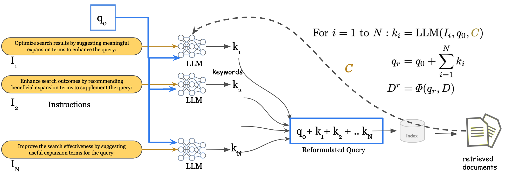
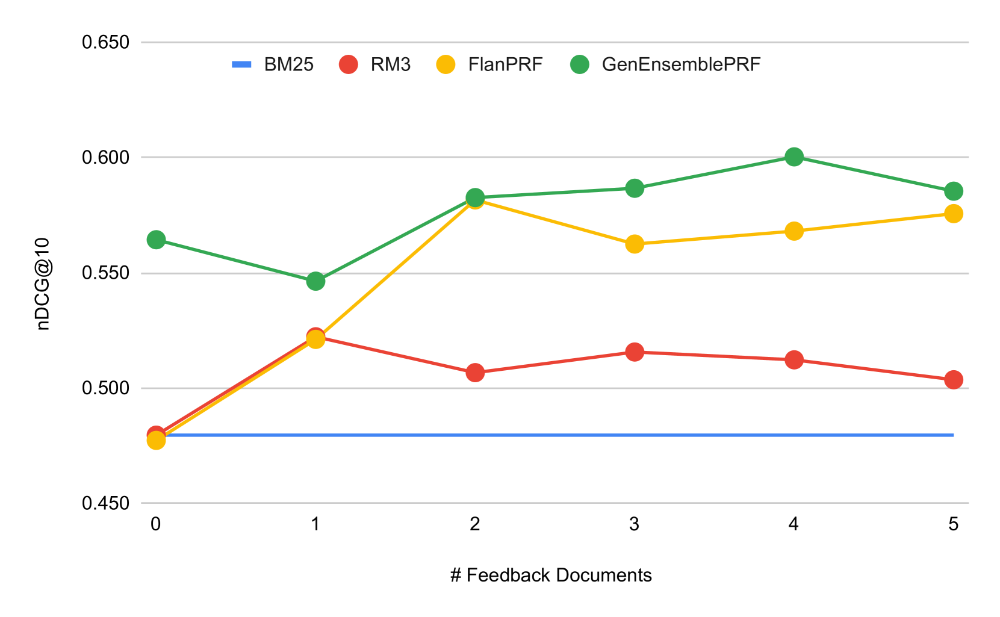

# GenQREnsemble：零-shot 技术打造的大型语言模型集成，为生成式查询改写而生。

发布时间：2024年04月04日

`LLM应用` `信息检索` `搜索引擎优化`

> GenQREnsemble: Zero-Shot LLM Ensemble Prompting for Generative Query Reformulation

# 摘要

> 查询重构（QR）技术能将用户的初始搜索词转化为更贴近其搜索意图的内容，从而优化搜索体验。新兴的零-shot QR 技术因其能挖掘大型语言模型内含的知识而备受瞩目。本研究借鉴了集成提示策略在多项任务中取得的成功，探讨其在查询重构中的应用。我们提出了一种名为 GenQREnsemble 的集成提示技术，通过生成零-shot 指令的不同改写版本，形成多个关键词组合，显著提升了检索效果。此外，我们还推出了其检索后版本 GenQREnsembleRF，用以整合伪相关反馈。经过四大信息检索基准测试评估，GenQREnsemble 在 nDCG@10 上相较于以往的零-shot 技术最高提升了 18%，MAP 提升了 24%。在 MSMarco 段落排名任务中，GenQREnsembleRF 利用伪相关反馈实现了 5% 的 MRR 相对增益，以及利用相关反馈文档实现了 9% 的 nDCG@10 相对增益。

> Query Reformulation(QR) is a set of techniques used to transform a user's original search query to a text that better aligns with the user's intent and improves their search experience. Recently, zero-shot QR has been shown to be a promising approach due to its ability to exploit knowledge inherent in large language models. By taking inspiration from the success of ensemble prompting strategies which have benefited many tasks, we investigate if they can help improve query reformulation. In this context, we propose an ensemble based prompting technique, GenQREnsemble which leverages paraphrases of a zero-shot instruction to generate multiple sets of keywords ultimately improving retrieval performance. We further introduce its post-retrieval variant, GenQREnsembleRF to incorporate pseudo relevant feedback. On evaluations over four IR benchmarks, we find that GenQREnsemble generates better reformulations with relative nDCG@10 improvements up to 18% and MAP improvements upto 24% over the previous zero-shot state-of-art. On the MSMarco Passage Ranking task, GenQREnsembleRF shows relative gains of 5% MRR using pseudo-relevance feedback, and 9% nDCG@10 using relevant feedback documents.

[Arxiv](https://arxiv.org/abs/2404.03746)