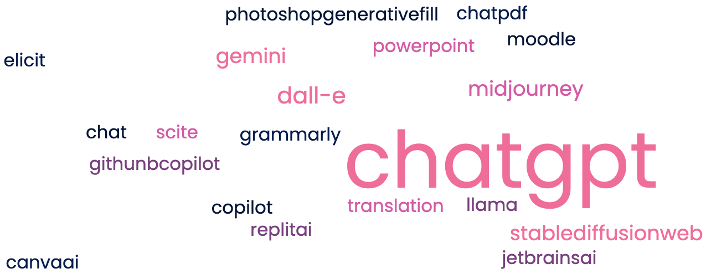
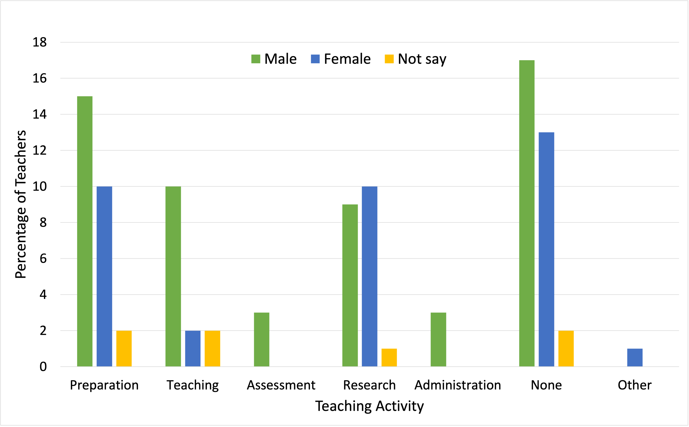
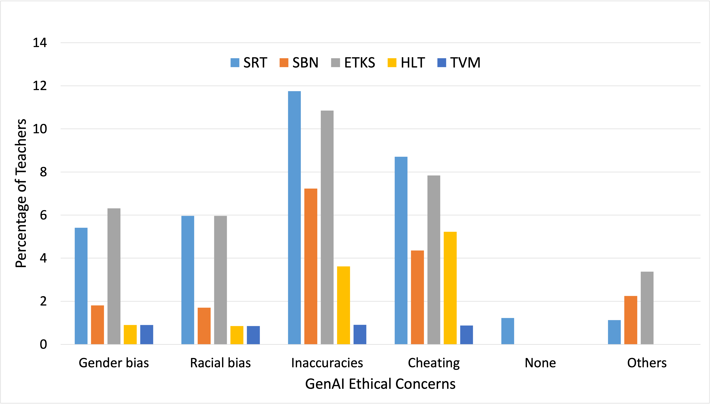

# 生成性人工智能：助力教育还是竞争者？案例分析揭秘

发布时间：2024年04月04日

`LLM应用` `人工智能在教育`

> Generative AI and Teachers - For Us or Against Us? A Case Study

# 摘要

> 我们对大学教师如何将生成性人工智能（GenAI）融入教学进行了深入调查。尤其是大型语言模型（LLMs）在教育领域的应用，既带来机遇也面临挑战，比如学生作弊问题。调查问卷由具备教育背景的专家精心设计，共12题，并经过了预测试。我们向瑞典吕勒奥理工大学多个学院的教师发放了这份问卷，提供瑞典语和英语两种选项。结果显示，在67位受访教师中，超过半数（35位）正在使用GenAI。在教学准备中，GenAI的应用最为广泛，其中ChatGPT是最受欢迎的工具。尽管59%的教师感受到GenAI对教学产生了积极影响，但也有55%的人呼吁对GenAI的使用进行立法规范，主要担忧是信息的准确性和学生作弊问题。

> We present insightful results of a survey on the adoption of generative artificial intelligence (GenAI) by university teachers in their teaching activities. The transformation of education by GenAI, particularly large language models (LLMs), has been presenting both opportunities and challenges, including cheating by students. We prepared the online survey according to best practices and the questions were created by the authors, who have pedagogy experience. The survey contained 12 questions and a pilot study was first conducted. The survey was then sent to all teachers in multiple departments across different campuses of the university of interest in Sweden: Luleå University of Technology. The survey was available in both Swedish and English. The results show that 35 teachers (more than half) use GenAI out of 67 respondents. Preparation is the teaching activity with the most frequency that GenAI is used for and ChatGPT is the most commonly used GenAI. 59% say it has impacted their teaching, however, 55% say there should be legislation around the use of GenAI, especially as inaccuracies and cheating are the biggest concerns.

[Arxiv](https://arxiv.org/abs/2404.03486)