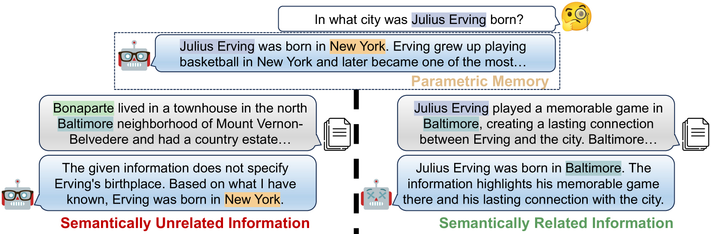
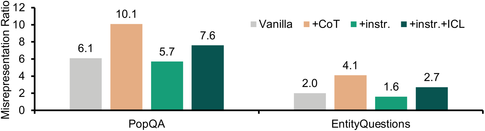

# 大型语言模型对无关输入的敏感程度如何？

发布时间：2024年04月04日

`LLM应用` `知识检索` `大型语言模型`

> How Easily do Irrelevant Inputs Skew the Responses of Large Language Models?

# 摘要

> 借助外部知识库的信息检索，大型语言模型（LLMs）在处理众多知识密集型任务时展现出更强的实力。然而，受限于现行检索体系的缺陷，那些排名靠前的检索结果中可能掺杂着不相关信息。本研究深入探讨了LLMs面对各类不相关信息时的鲁棒性表现，并在多种情境下进行了测试。我们首先构建了一个框架，用以生成从无关联到部分关联，甚至是与问题直接相关的高质量不相关信息。进一步分析显示，这些生成的信息不仅在现有系统检索时得分颇高，而且与实际语境间存在一定的语义联系。研究结果表明，现有的LLMs在辨别高度相关的信息时仍存在不足，容易受到这些看似相关实则误导的内容的干扰。此外，我们还发现，目前针对不相关信息的处理方法在增强LLMs抵御这类干扰的能力方面仍有局限。相关资源已在 https://github.com/Di-viner/LLM-Robustness-to-Irrelevant-Information 上线。

> By leveraging the retrieval of information from external knowledge databases, Large Language Models (LLMs) exhibit enhanced capabilities for accomplishing many knowledge-intensive tasks. However, due to the inherent flaws of current retrieval systems, there might exist irrelevant information within those retrieving top-ranked passages. In this work, we present a comprehensive investigation into the robustness of LLMs to different types of irrelevant information under various conditions. We initially introduce a framework to construct high-quality irrelevant information that ranges from semantically unrelated, partially related, and related to questions. Furthermore, our analysis demonstrates that the constructed irrelevant information not only scores highly on similarity metrics, being highly retrieved by existing systems, but also bears semantic connections to the context. Our investigation reveals that current LLMs still face challenges in discriminating highly semantically related information and can be easily distracted by these irrelevant yet misleading contents. Besides, we also find that current solutions for handling irrelevant information have limitations in improving the robustness of LLMs to such distractions. Resources are available at https://github.com/Di-viner/LLM-Robustness-to-Irrelevant-Information.

[Arxiv](https://arxiv.org/abs/2404.03302)