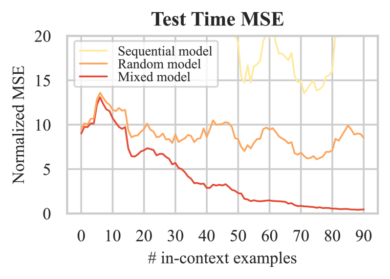
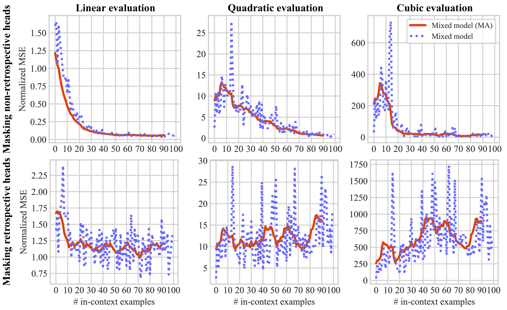
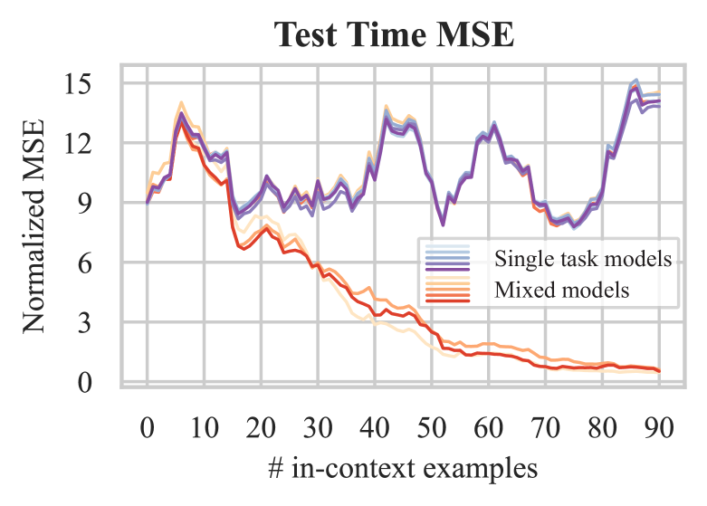
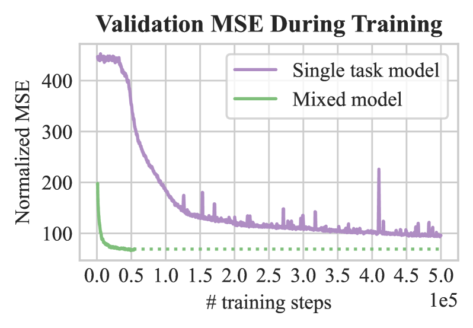
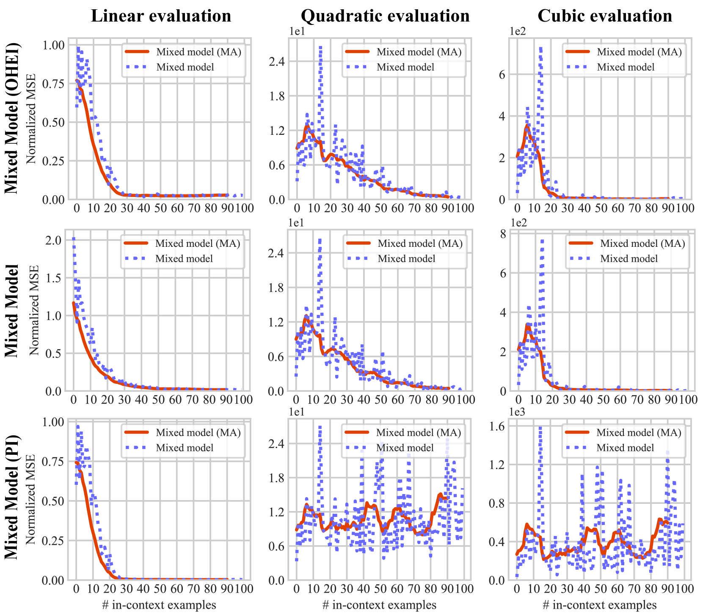
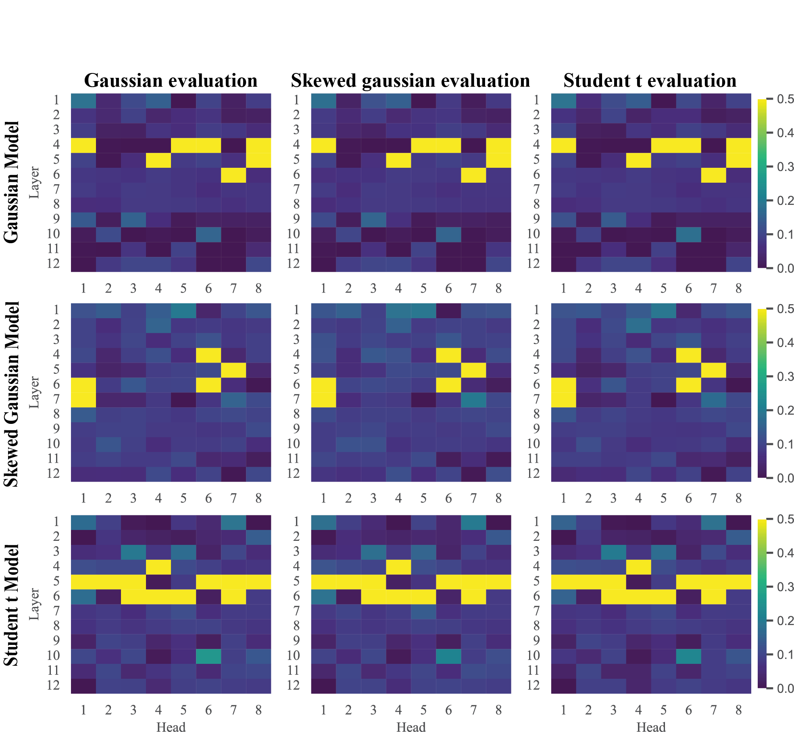
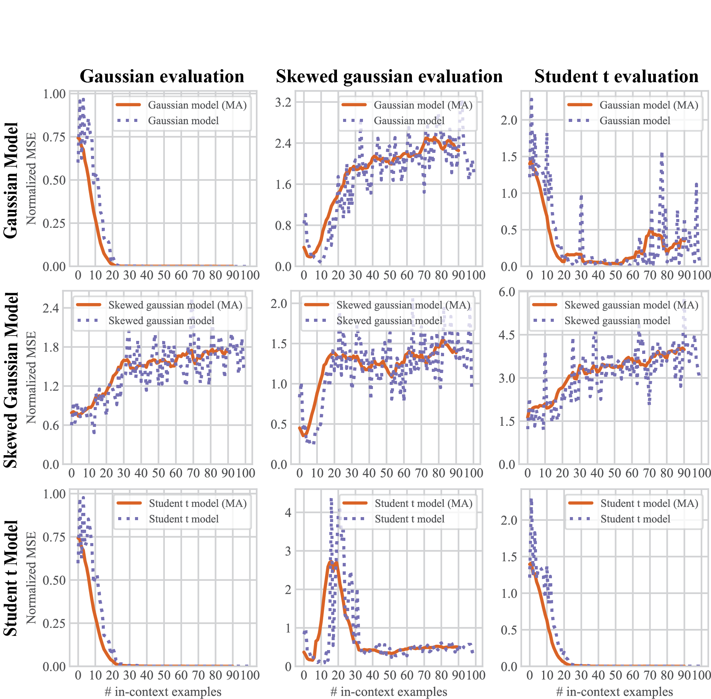
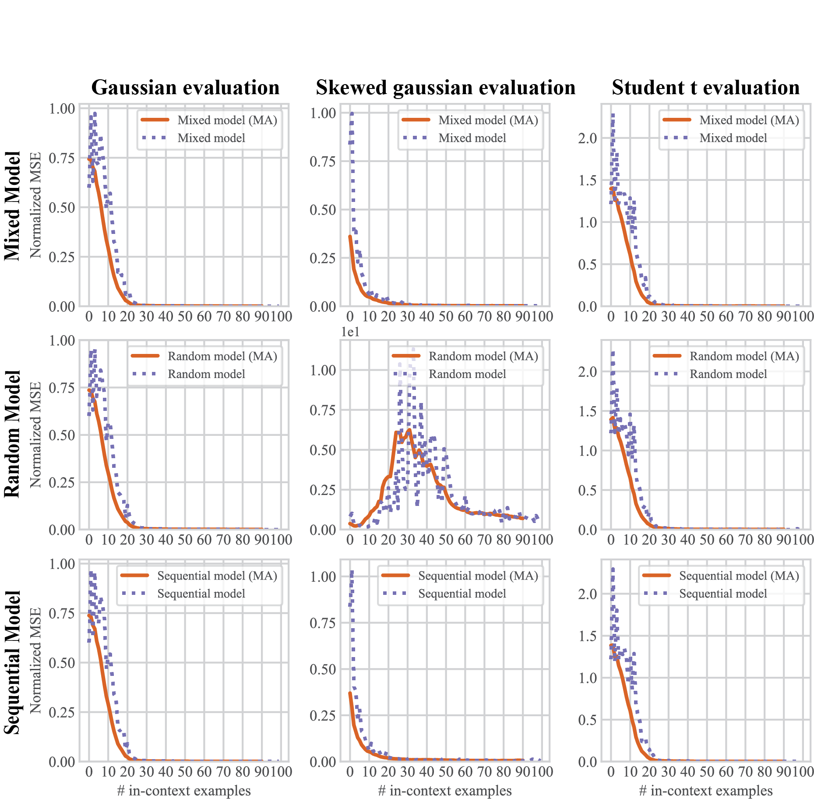

# 多任务训练对变换器模型的上下文理解能力有何影响？本研究通过探索不同函数类别，深入探讨了这一问题。

发布时间：2024年04月04日

`LLM理论` `机器学习` `人工智能`

> How does Multi-Task Training Affect Transformer In-Context Capabilities? Investigations with Function Classes

# 摘要

> 近期，大型语言模型（LLM）展现出了通过少量文本示例执行未见任务的非凡能力，这被称作上下文学习（ICL）。尽管已有研究试图剖析ICL背后的机理，但鲜少有研究聚焦于训练策略，以促使模型能够泛化至多种任务。多任务学习（MTL）为通用模型开辟了一条充满潜力的路径，它让大型模型能通过简化的、相关的任务进行训练。本研究探索了MTL与ICL的结合，旨在打造既能高效学习任务又能抵御分布外样本的模型。我们设计了若干高效的课程学习策略，助力ICL模型达成更优的数据利用效率和更稳健的收敛性。实验表明，ICL模型通过循序渐进地挑战更难的任务，并在此过程中穿插旧任务（本研究中称为混合课程），能够有效掌握复杂任务。相关代码和模型已在 https://github.com/harmonbhasin/curriculum_learning_icl 上发布。

> Large language models (LLM) have recently shown the extraordinary ability to perform unseen tasks based on few-shot examples provided as text, also known as in-context learning (ICL). While recent works have attempted to understand the mechanisms driving ICL, few have explored training strategies that incentivize these models to generalize to multiple tasks. Multi-task learning (MTL) for generalist models is a promising direction that offers transfer learning potential, enabling large parameterized models to be trained from simpler, related tasks. In this work, we investigate the combination of MTL with ICL to build models that efficiently learn tasks while being robust to out-of-distribution examples. We propose several effective curriculum learning strategies that allow ICL models to achieve higher data efficiency and more stable convergence. Our experiments reveal that ICL models can effectively learn difficult tasks by training on progressively harder tasks while mixing in prior tasks, denoted as mixed curriculum in this work. Our code and models are available at https://github.com/harmonbhasin/curriculum_learning_icl .

[Arxiv](https://arxiv.org/abs/2404.03558)