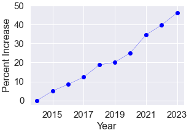
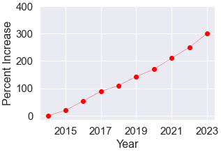
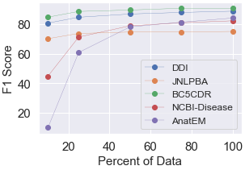
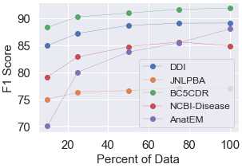

# 在生物医学文献中识别意图与抽取关键信息

发布时间：2024年04月04日

`LLM应用` `生物医学`

> Intent Detection and Entity Extraction from BioMedical Literature

# 摘要

> 随着人们对获取生物医学文献兴趣的增加，生物医学查询在网络搜索中变得越来越常见。尽管大型语言模型（LLMs）的研究取得了进展，旨在实现通用智能，但其在取代特定任务和领域的自然语言理解方法方面的有效性仍有待验证。本文通过深入评估生物医学文本的意图检测和命名实体识别（NER）任务，探讨了这一问题。研究结果表明，相较于通用的LLMs，监督式微调方法更为有效且依然适用。特别是PubMedBERT等生物医学变换模型，在仅有5个监督样本的情况下，其在NER任务上的表现已超越ChatGPT。

> Biomedical queries have become increasingly prevalent in web searches, reflecting the growing interest in accessing biomedical literature. Despite recent research on large-language models (LLMs) motivated by endeavours to attain generalized intelligence, their efficacy in replacing task and domain-specific natural language understanding approaches remains questionable. In this paper, we address this question by conducting a comprehensive empirical evaluation of intent detection and named entity recognition (NER) tasks from biomedical text. We show that Supervised Fine Tuned approaches are still relevant and more effective than general-purpose LLMs. Biomedical transformer models such as PubMedBERT can surpass ChatGPT on NER task with only 5 supervised examples.

[Arxiv](https://arxiv.org/abs/2404.03598)