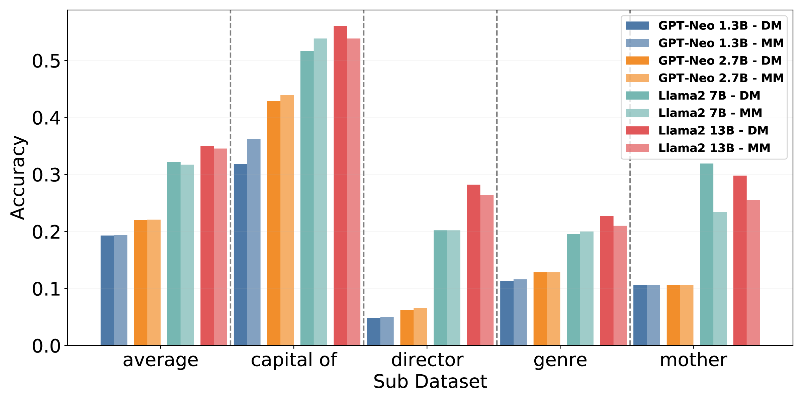
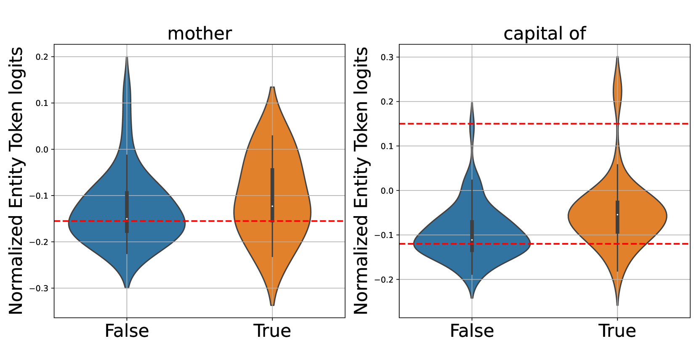

# 探索信任与否：一种以隐私为核心，适应性的语言模型感知策略

发布时间：2024年04月04日

`LLM理论` `隐私保护`

> Learn When (not) to Trust Language Models: A Privacy-Centric Adaptive Model-Aware Approach

# 摘要

> 检索增强的大型语言模型（LLMs）在众多自然语言处理任务中展现出卓越能力。然而，检索过程所提供的信息并非总是对提高模型预测准确性有益，因为在某些情况下，LLMs已经具备足够的知识，无需额外检索即可正确回答问题。为了降低检索成本，先前研究提出了一种基于数据的决策机制，用以判断何时执行或跳过检索过程。但这些方法可能引发隐私问题，并受限于内存容量，尤其是在处理敏感或大量预训练数据时。此外，这些方法在微调和持续学习环境下的适应性较差。我们认为，通过标记嵌入捕捉模型的固有知识，可以更安全、直接地评估检索需求，避免了访问预训练数据的隐私风险。同时，这种方法减少了对保留所有预训练数据的依赖，仅需维护标记嵌入。通过大量实验和深入分析，我们的模型感知方法显示出其优越性。

> Retrieval-augmented large language models (LLMs) have been remarkably competent in various NLP tasks. Despite their great success, the knowledge provided by the retrieval process is not always useful for improving the model prediction, since in some samples LLMs may already be quite knowledgeable and thus be able to answer the question correctly without retrieval. Aiming to save the cost of retrieval, previous work has proposed to determine when to do/skip the retrieval in a data-aware manner by analyzing the LLMs' pretraining data. However, these data-aware methods pose privacy risks and memory limitations, especially when requiring access to sensitive or extensive pretraining data. Moreover, these methods offer limited adaptability under fine-tuning or continual learning settings. We hypothesize that token embeddings are able to capture the model's intrinsic knowledge, which offers a safer and more straightforward way to judge the need for retrieval without the privacy risks associated with accessing pre-training data. Moreover, it alleviates the need to retain all the data utilized during model pre-training, necessitating only the upkeep of the token embeddings. Extensive experiments and in-depth analyses demonstrate the superiority of our model-aware approach.

[Arxiv](https://arxiv.org/abs/2404.03514)