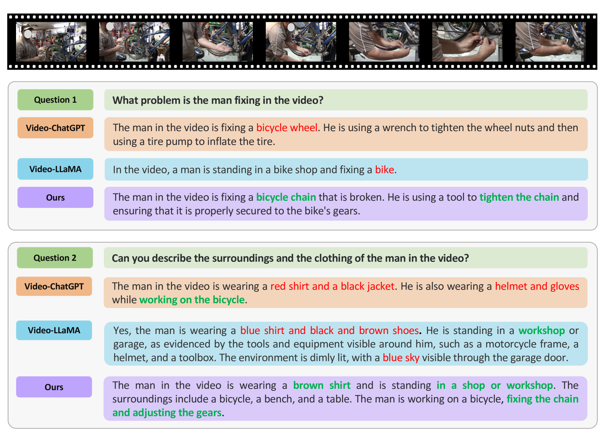
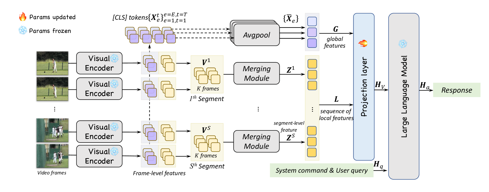
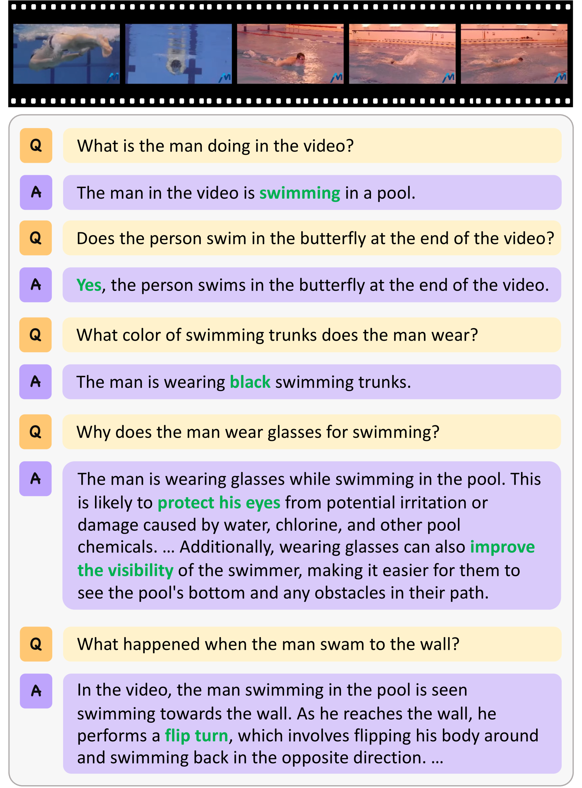
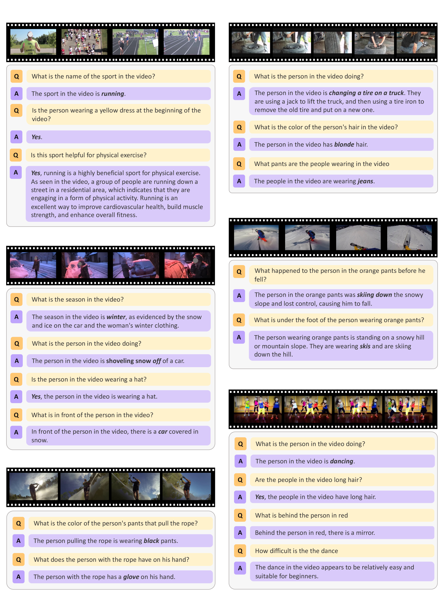

# LongVLM 通过运用大型语言模型，高效地解读长视频内容。

发布时间：2024年04月04日

`LLM应用` `视频理解` `长视频分析`

> LongVLM: Efficient Long Video Understanding via Large Language Models

# 摘要

> 借助大型语言模型（LLMs）的力量，视频理解领域最近取得了突破性进展。这些模型通过汇总大量视觉标记来编码视频信息，有效控制了计算和内存成本。然而，现有模型在深入理解长视频细节方面仍有不足，因为它们往往忽略了视频中的局部信息。为了解决这一问题，我们推出了LongVLM，它是一个针对长视频理解的高效模型，基于长视频通常由一系列关键事件、复杂动作和摄像机运动组成的洞察。我们提出的方法将长视频分割成多个短期片段，并通过一个分层标记合并模块对每个片段的局部特征进行编码。这些特征按时间顺序串联，确保故事情节的连贯性。我们还提出将全局语义整合到局部特征中，以增强对上下文的理解。这样，我们编码的视频表示既包含局部细节又融入全局语境，使LLM能够为长视频生成全面的回答。在VideoChatGPT基准测试和零次拍摄视频问答数据集上的实验结果显示，我们的模型在性能上超越了先前的技术。定性案例也表明，我们的模型能够为长视频理解提供更精确的答案。相关代码已在 \url{https://github.com/ziplab/LongVLM} 上发布。

> Empowered by Large Language Models (LLMs), recent advancements in VideoLLMs have driven progress in various video understanding tasks. These models encode video representations through pooling or query aggregation over a vast number of visual tokens, making computational and memory costs affordable. Despite successfully providing an overall comprehension of video content, existing VideoLLMs still face challenges in achieving detailed understanding in videos due to overlooking local information in long-term videos. To tackle this challenge, we introduce LongVLM, a straightforward yet powerful VideoLLM for long video understanding, building upon the observation that long videos often consist of sequential key events, complex actions, and camera movements. Our approach proposes to decompose long videos into multiple short-term segments and encode local features for each local segment via a hierarchical token merging module. These features are concatenated in temporal order to maintain the storyline across sequential short-term segments. Additionally, we propose to integrate global semantics into each local feature to enhance context understanding. In this way, we encode video representations that incorporate both local and global information, enabling the LLM to generate comprehensive responses for long-term videos. Experimental results on the VideoChatGPT benchmark and zero-shot video question-answering datasets demonstrate the superior capabilities of our model over the previous state-of-the-art methods. Qualitative examples demonstrate that our model produces more precise responses for long videos understanding. Code is available at \url{https://github.com/ziplab/LongVLM}.

[Arxiv](https://arxiv.org/abs/2404.03384)