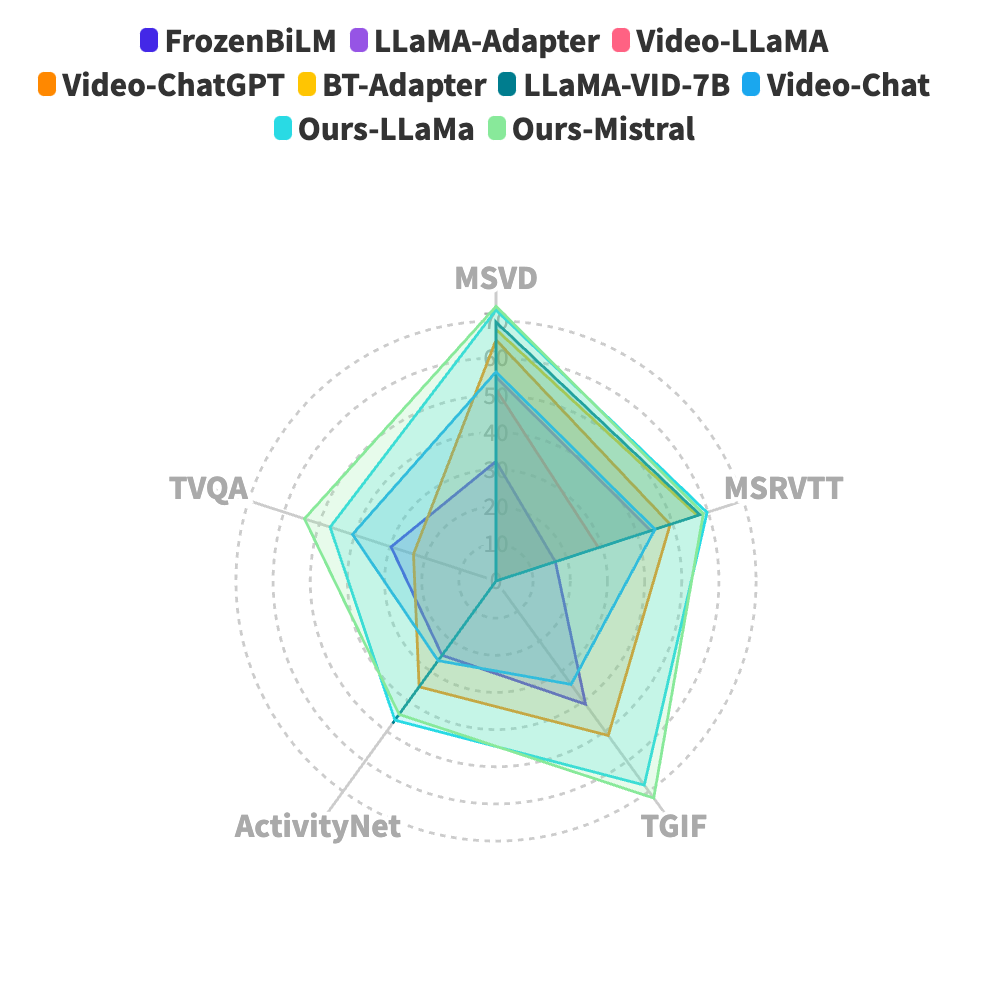
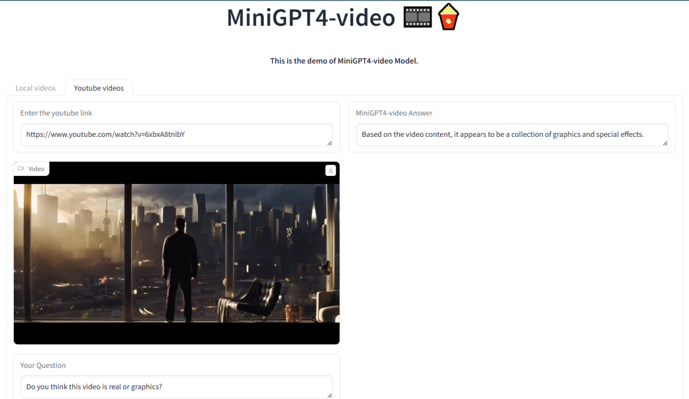
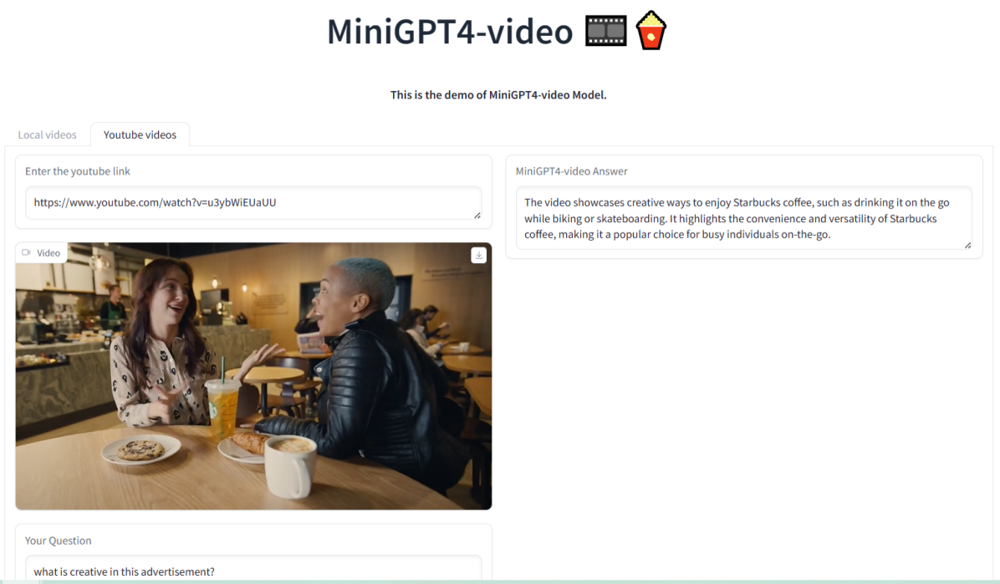
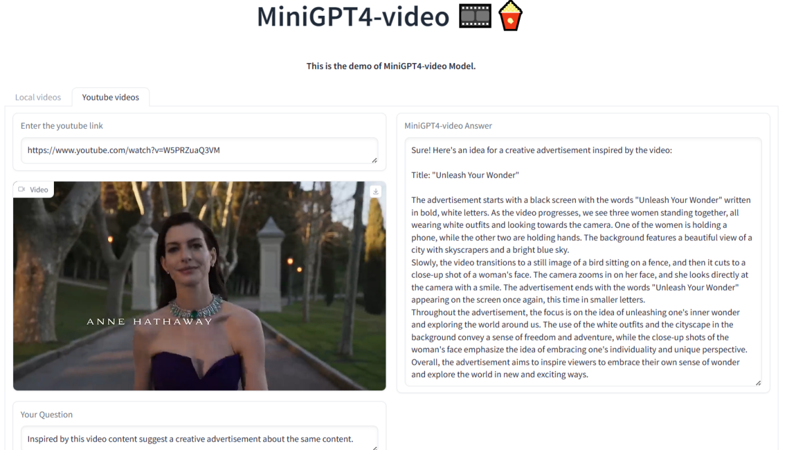
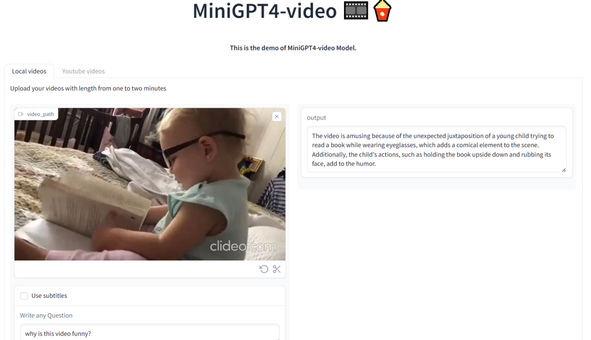
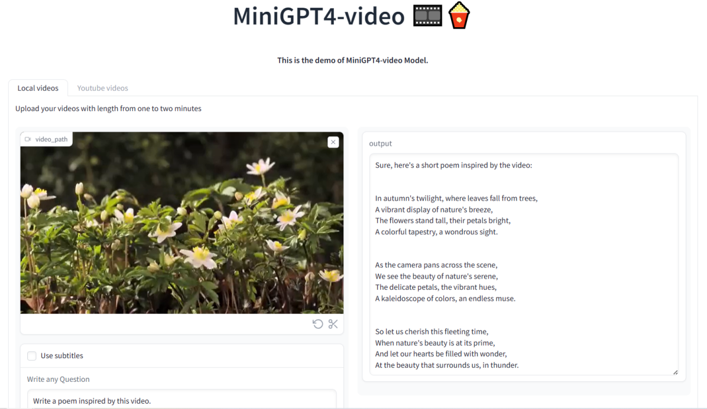
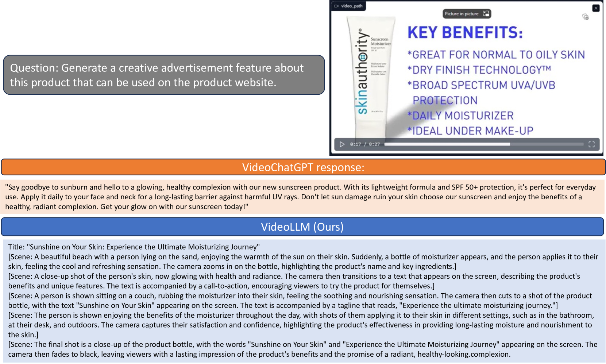
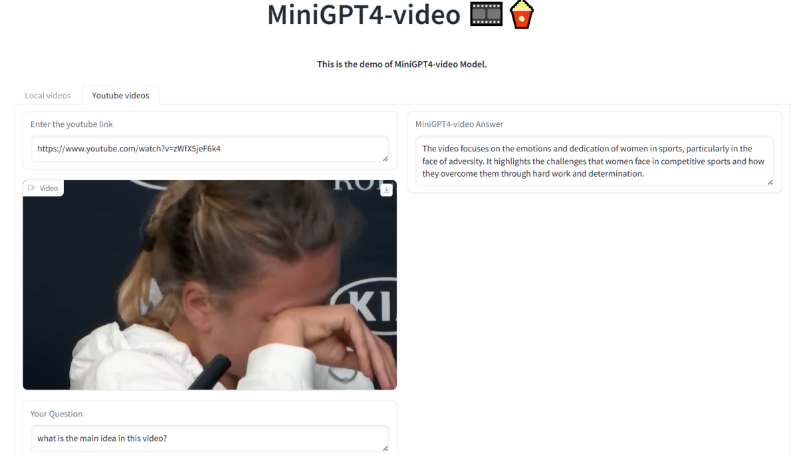

# MiniGPT4-Video：利用交错的视觉与文本元素，推动多模态大型语言模型在视频理解方面的发展。

发布时间：2024年04月04日

`LLM应用` `视频分析` `多模态学习`

> MiniGPT4-Video: Advancing Multimodal LLMs for Video Understanding with Interleaved Visual-Textual Tokens

# 摘要

> 本文隆重推出MiniGPT4-Video，这是一款专为深入剖析视频内容而量身打造的多模态大型语言模型。它能够同时处理视觉信息和文本数据，擅长捕捉视频内容的细微之处。继MiniGPT-v2在图像-文本转换领域取得卓越成就之后，我们进一步升级模型，使其能够分析连续帧序列，从而理解视频全貌。MiniGPT4-Video不仅关注视觉元素，还能融合文本交流，使得模型能够精准回应包含视觉与文本要素的问题。该模型在MSVD、MSRVTT、TGIF和TVQA等权威基准测试中均取得显著提升，分别达到了4.22%、1.13%、20.82%和13.1%的优化率，超越了当前的最先进方法。相关模型和代码已向公众开放，可通过以下链接获取：https://vision-cair.github.io/MiniGPT4-video/。

> This paper introduces MiniGPT4-Video, a multimodal Large Language Model (LLM) designed specifically for video understanding. The model is capable of processing both temporal visual and textual data, making it adept at understanding the complexities of videos. Building upon the success of MiniGPT-v2, which excelled in translating visual features into the LLM space for single images and achieved impressive results on various image-text benchmarks, this paper extends the model's capabilities to process a sequence of frames, enabling it to comprehend videos. MiniGPT4-video does not only consider visual content but also incorporates textual conversations, allowing the model to effectively answer queries involving both visual and text components. The proposed model outperforms existing state-of-the-art methods, registering gains of 4.22%, 1.13%, 20.82%, and 13.1% on the MSVD, MSRVTT, TGIF, and TVQA benchmarks respectively. Our models and code have been made publicly available here https://vision-cair.github.io/MiniGPT4-video/

[Arxiv](https://arxiv.org/abs/2404.03413)