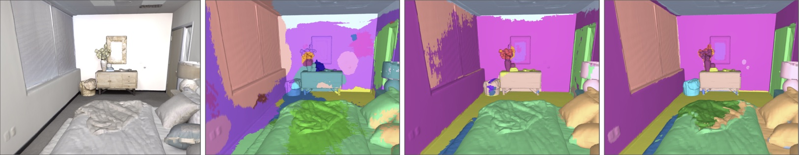
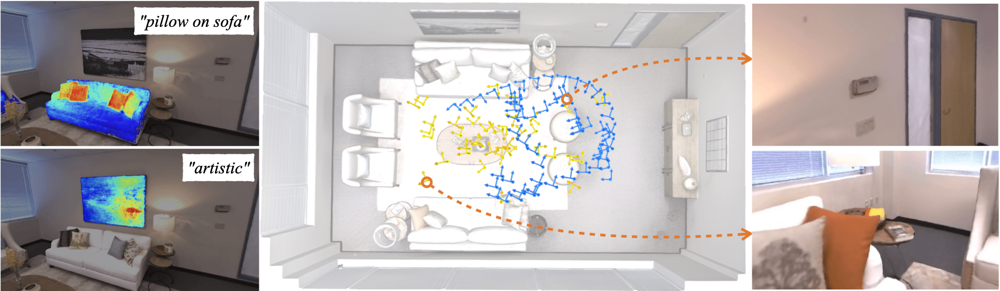
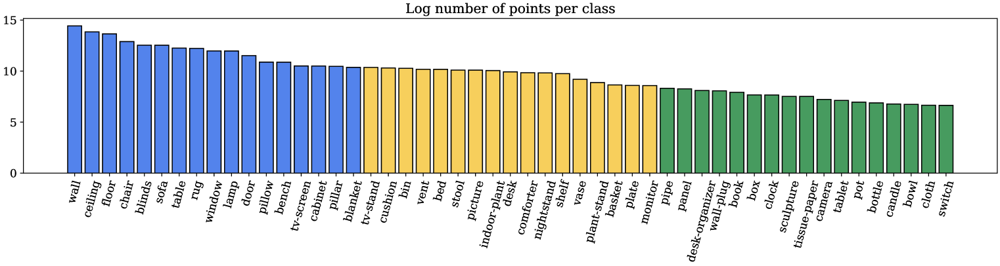
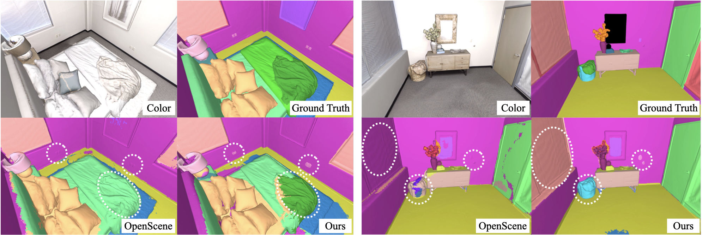
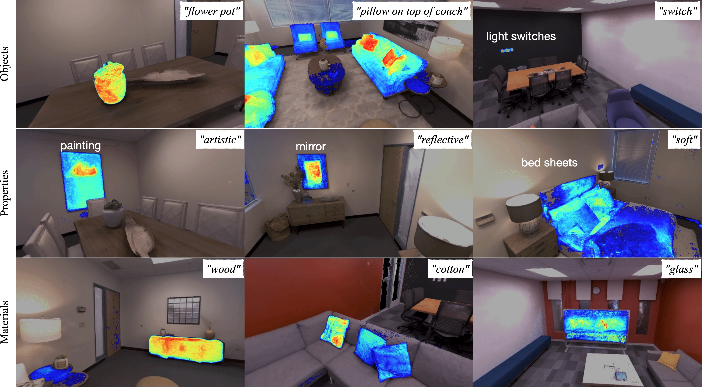
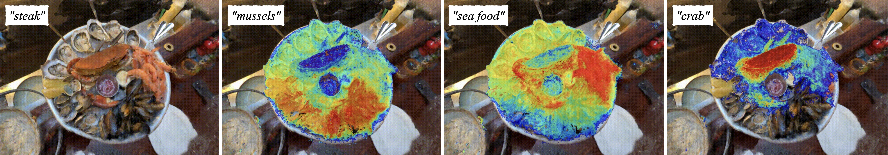

# OpenNeRF 通过利用像素级别的细节特征和渲染出全新的视角，实现了对3D场景的开放集神经分割，为三维场景理解提供了一种全新的方法。

发布时间：2024年04月04日

`LLM应用` `计算机视觉` `三维建模`

> OpenNeRF: Open Set 3D Neural Scene Segmentation with Pixel-Wise Features and Rendered Novel Views

# 摘要

> 像CLIP这样的大型视觉-语言模型（VLMs）能够以零样本的方式进行开放集图像分割，轻松识别图像中的任意概念，超越了传统模型仅限于预设类别的限制。近期，开放集分割的研究也开始拓展到3D场景。但现有的3D处理方法，如点云和多边形网格处理，与视觉-语言模型的图像特性并不吻合。针对这些问题，我们提出了OpenNeRF，它直接在图像上操作并内置VLM特征，避免了复杂的DINO正则化。OpenNeRF还能利用NeRF渲染新视角，从原始图像中不太明显的区域提取特征。在Replica数据集的3D点云分割任务中，OpenNeRF的表现至少比现有方法提高了4.9个mIoU，展现了其显著的优势。

> Large visual-language models (VLMs), like CLIP, enable open-set image segmentation to segment arbitrary concepts from an image in a zero-shot manner. This goes beyond the traditional closed-set assumption, i.e., where models can only segment classes from a pre-defined training set. More recently, first works on open-set segmentation in 3D scenes have appeared in the literature. These methods are heavily influenced by closed-set 3D convolutional approaches that process point clouds or polygon meshes. However, these 3D scene representations do not align well with the image-based nature of the visual-language models. Indeed, point cloud and 3D meshes typically have a lower resolution than images and the reconstructed 3D scene geometry might not project well to the underlying 2D image sequences used to compute pixel-aligned CLIP features. To address these challenges, we propose OpenNeRF which naturally operates on posed images and directly encodes the VLM features within the NeRF. This is similar in spirit to LERF, however our work shows that using pixel-wise VLM features (instead of global CLIP features) results in an overall less complex architecture without the need for additional DINO regularization. Our OpenNeRF further leverages NeRF's ability to render novel views and extract open-set VLM features from areas that are not well observed in the initial posed images. For 3D point cloud segmentation on the Replica dataset, OpenNeRF outperforms recent open-vocabulary methods such as LERF and OpenScene by at least +4.9 mIoU.

[Arxiv](https://arxiv.org/abs/2404.03650)