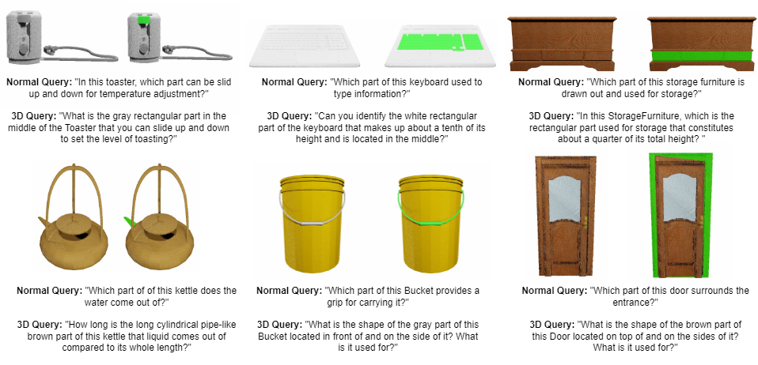
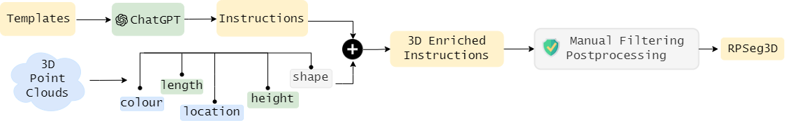
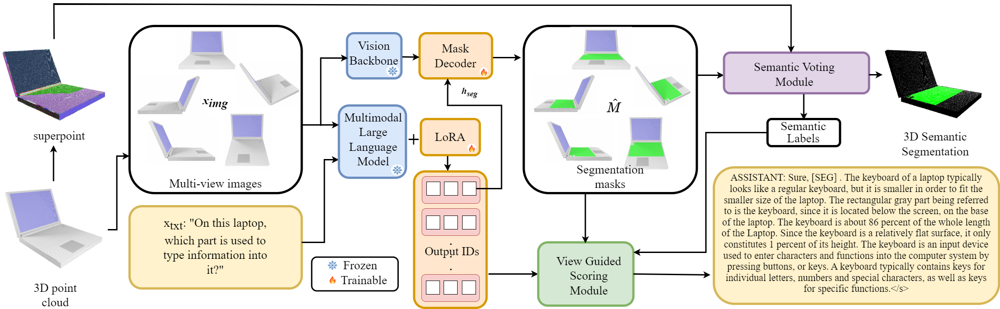
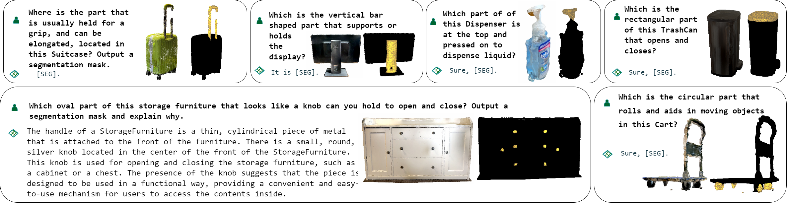

# PARIS3D：借助庞大的多模态模型，实现基于推理的三维部件识别。

发布时间：2024年04月04日

`RAG` `3D视觉`

> PARIS3D: Reasoning-based 3D Part Segmentation Using Large Multimodal Model

# 摘要

> 3D感知系统的最新进展虽然增强了其视觉识别，如分割任务的能力，但仍旧依赖明确的人类指导来识别目标物体或分类，未能主动理解用户的隐含意图。我们提出了一种创新的3D对象推理部分分割任务，目标是根据对3D对象特定部分的复杂隐含文本查询，生成分割掩码。为方便评估和建立基准，我们展示了一个包含逾60,000条指令和相应真实部分分割标注的大型3D数据集，专为推理型3D部分分割定制。我们设计的模型能够基于隐含文本查询对3D对象进行部分分割，并生成与3D对象分割请求相匹配的自然语言解释。实验结果显示，我们的方法在性能上与使用显式查询的模型相媲美，并且能够识别部分概念、进行推理，并结合世界知识进行补充。相关源代码、数据集和训练模型已在 https://github.com/AmrinKareem/PARIS3D 上发布。

> Recent advancements in 3D perception systems have significantly improved their ability to perform visual recognition tasks such as segmentation. However, these systems still heavily rely on explicit human instruction to identify target objects or categories, lacking the capability to actively reason and comprehend implicit user intentions. We introduce a novel segmentation task known as reasoning part segmentation for 3D objects, aiming to output a segmentation mask based on complex and implicit textual queries about specific parts of a 3D object. To facilitate evaluation and benchmarking, we present a large 3D dataset comprising over 60k instructions paired with corresponding ground-truth part segmentation annotations specifically curated for reasoning-based 3D part segmentation. We propose a model that is capable of segmenting parts of 3D objects based on implicit textual queries and generating natural language explanations corresponding to 3D object segmentation requests. Experiments show that our method achieves competitive performance to models that use explicit queries, with the additional abilities to identify part concepts, reason about them, and complement them with world knowledge. Our source code, dataset, and trained models are available at https://github.com/AmrinKareem/PARIS3D.

[Arxiv](https://arxiv.org/abs/2404.03836)