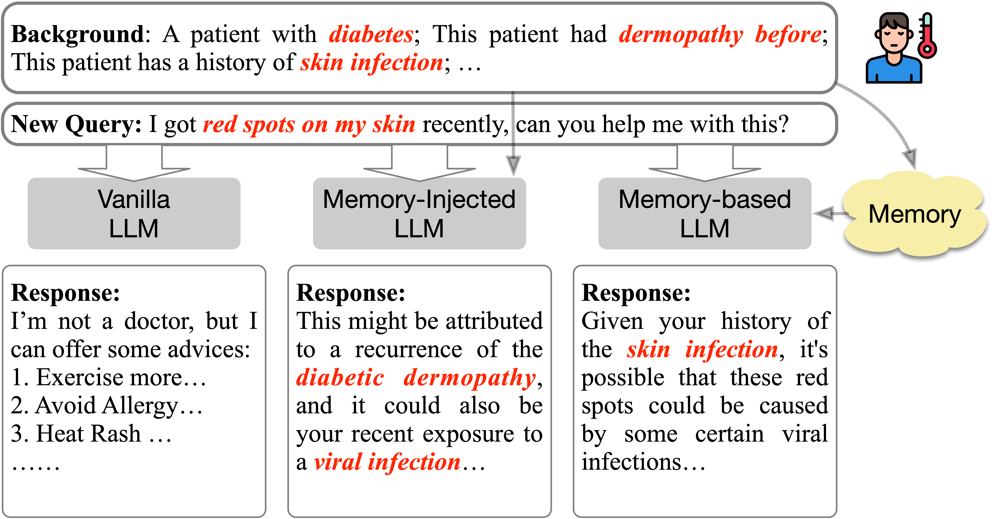
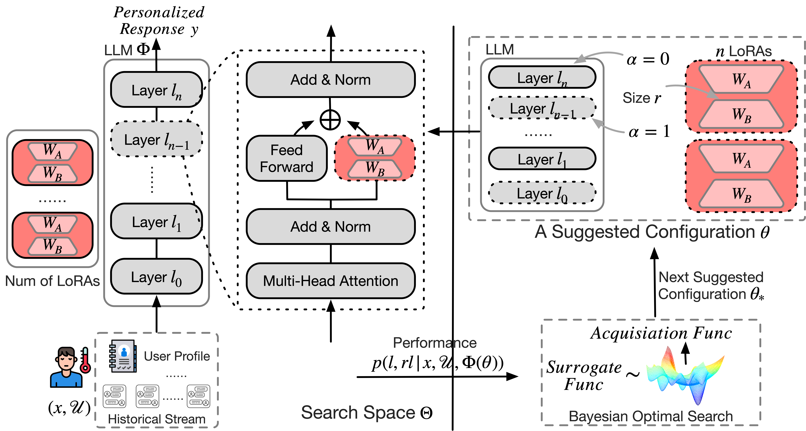
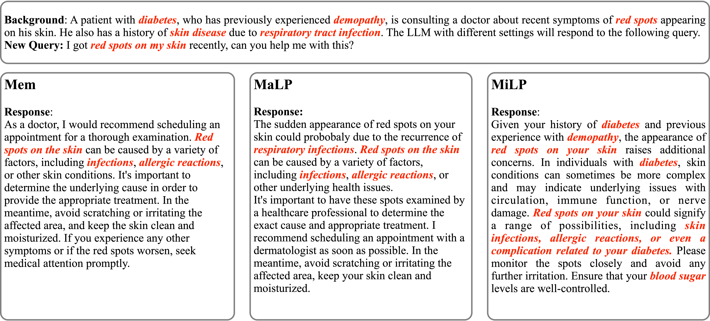

# 通过参数化记忆注入，实现大型语言模型（LLM）的个性化响应生成。

发布时间：2024年04月04日

`LLM应用` `个性化推荐`

> Personalized LLM Response Generation with Parameterized Memory Injection

# 摘要

> 大型语言模型（LLMs）展现出了在理解和创造自然语言方面的卓越才能。然而，在个性化LLM响应生成方面，尤其是在医疗等关键领域，现有研究尚未能充分捕捉到细微信息。本研究提出了一种创新的记忆注入方法，结合参数高效的微调和贝叶斯优化策略，以实现更精准的LLM个性化（MiLP）。

> Large Language Models (LLMs) have exhibited remarkable proficiency in comprehending and generating natural language. On the other hand, personalized LLM response generation holds the potential to offer substantial benefits for individuals in critical areas such as medical. Existing research has explored memory-augmented methods to prompt the LLM with pre-stored user-specific knowledge for personalized response generation in terms of new queries. We contend that such paradigm is unable to perceive fine-granularity information. In this study, we propose a novel \textbf{M}emory-\textbf{i}njected approach using parameter-efficient fine-tuning (PEFT) and along with a Bayesian Optimisation searching strategy to achieve \textbf{L}LM \textbf{P}ersonalization(\textbf{MiLP}).

[Arxiv](https://arxiv.org/abs/2404.03565)