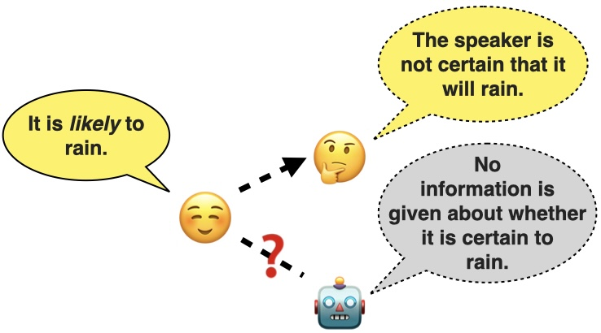
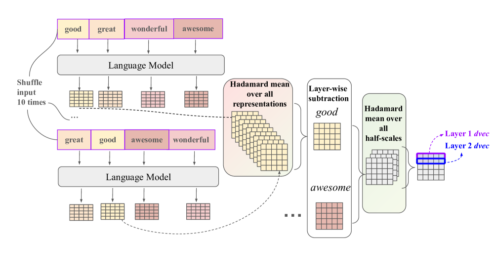
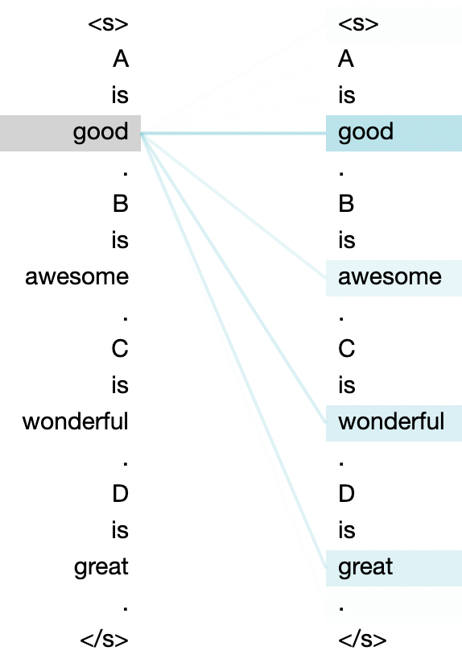
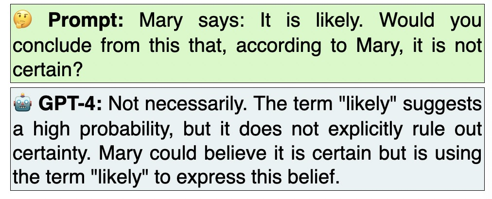

# 深入研究大型语言模型中的标量形容词词义和标量多样性语用现象。

发布时间：2024年04月04日

`LLM理论` `语言学` `人工智能`

> Probing Large Language Models for Scalar Adjective Lexical Semantics and Scalar Diversity Pragmatics

# 摘要

> 标量形容词关联着各种领域的程度尺度，其强度在同一尺度内也存在差异（例如，“certain”在可能性尺度上比“likely”表达得更为强烈）。标量含义源于对可能提出的其他陈述的考量，常由标量形容词引发，需要听者对这些形容词进行实际的语用推理。某些标量形容词更易触发标量含义，这种现象称作标量多样性。本研究深入探讨了大型语言模型（如 GPT-4）对标量形容词词汇语义及其语用学特性——标量多样性的认知程度。研究发现这些模型能够捕捉到关于标量形容词的丰富词汇语义信息，但这并不意味着它们能深刻理解标量多样性。我们还对比了不同规模和复杂性的现有模型，发现规模更大的模型未必就是更优的选择。最终，我们结合语言学直观和模型训练目标，对我们的探测结果进行了阐释。

> Scalar adjectives pertain to various domain scales and vary in intensity within each scale (e.g. certain is more intense than likely on the likelihood scale). Scalar implicatures arise from the consideration of alternative statements which could have been made. They can be triggered by scalar adjectives and require listeners to reason pragmatically about them. Some scalar adjectives are more likely to trigger scalar implicatures than others. This phenomenon is referred to as scalar diversity. In this study, we probe different families of Large Language Models such as GPT-4 for their knowledge of the lexical semantics of scalar adjectives and one specific aspect of their pragmatics, namely scalar diversity. We find that they encode rich lexical-semantic information about scalar adjectives. However, the rich lexical-semantic knowledge does not entail a good understanding of scalar diversity. We also compare current models of different sizes and complexities and find that larger models are not always better. Finally, we explain our probing results by leveraging linguistic intuitions and model training objectives.

[Arxiv](https://arxiv.org/abs/2404.03301)